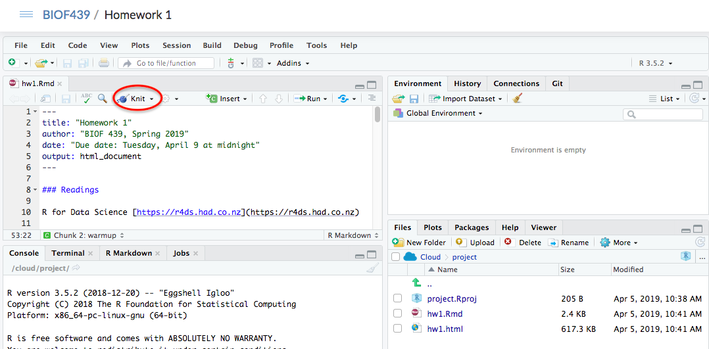

These instructions are based on the RStudio Cloud experience.

## Using R Markdown

Your homework will be provided as a R Markdown document, ending in `.Rmd`. To make a more readable copy of the homework, open the document (by clicking on it in the  Files pane in RStudio). This file will open in the script editor in the NW pane of RStudio. 

Start off by creating a more readable version of this file. This is a process called __knitting__. You will notice that there is a `Knit` button right above the pane where the R Markdown document opened. Press that to get an HTML version of the homework. 

First, go to the top of the Rmd file, and change the `author` field from the class name to your name.

Second, notice that the HTML file shows no results of the code. This is because there is an option in each R code chunk saying `eval = F`, for evaluation = FALSE. When you want to actually run the chunk during the knitting process, change that option to `eval = T`. 

> Note that you can always run the code line by line by taking your cursor to the line and then using the shortcut `Ctr/Cmd + Enter`. If you want to run all the code in the chunk, you can use `Ctr/Cmd + Shift + Enter`. 

When you're done with the homework, knit it a final time. The corresponding HTML file will automatically be saved. You don't have to submit anything; we will go into your project and check your homeworks after the due date. 
