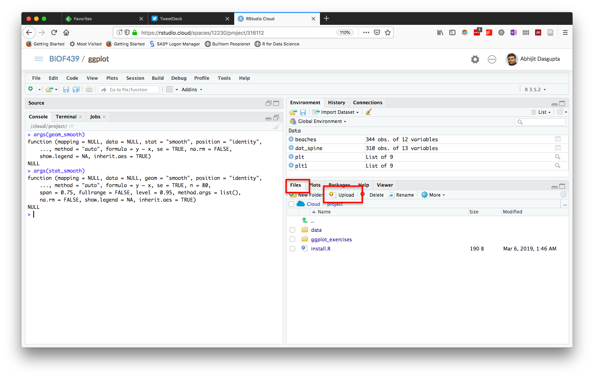
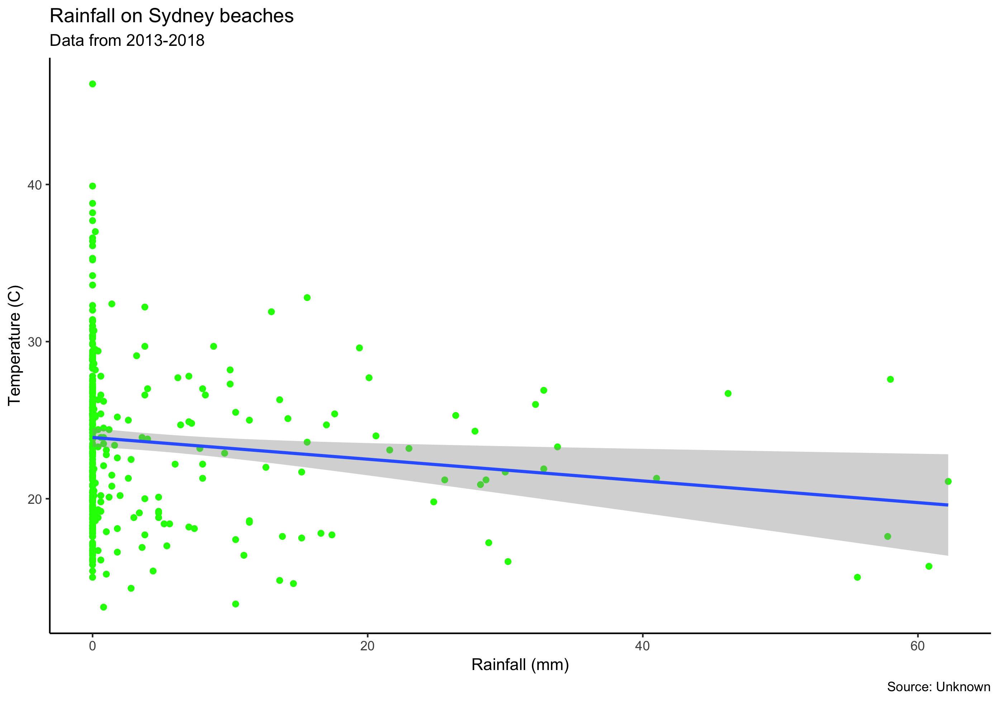
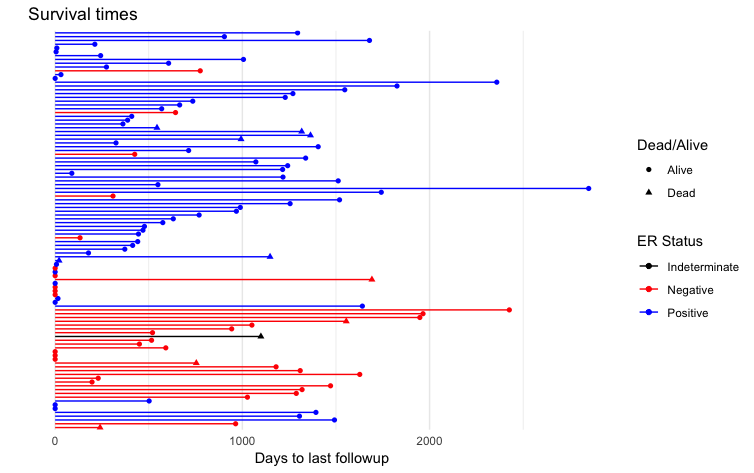

-----

## Readings

1. R4DS Chapter 3

------

## Instructions

Use the `ggplot` Project I had shared this week. Download the Rmd file (link below) to your computer and then upload it to the `ggplot` Project in RStudio Cloud, using the Upload button, as seen below:



#### Download link: [here](HW2.Rmd) (Right click this link, then use "Save as ..." to save to disk)

------

## Part 1: A bit of R

We used two datasets in class on Wednesday. One was a breast cancer dataset, stored in `data/clinical_data_breast_cancer_modified.csv`, which we had called `dat_brca`. The other was a dataset
about temperature, rainfall and bacteria in the water at beaches in Sydney, Autralia, stored in `data/sydneybeaches3.csv` which we called `beaches`. 

We loaded the data by (a) activating a package called `rio` by using the command `library(rio)`, (b) using a function `import` from that package to import the data (by giving it the file name as an argument) and (c) modifying the function with an option `check.names=TRUE` to ensure the column names were easy to type.

You might want to think of a package as a particular __book__ or manual which contains the actions you want to perform, the functions as __verbs__ that act on data ( __nouns__ ), which you can modify with options ( __adverbs__ ). In this case the data is the name of the file containing the data, the verb is the `import` function and the adverb is the `check.names=TRUE` option. 

_Question 1:_ Use the `import` function from the package `rio` to import the data from the file `data/sydneybeaches3.csv`.

__Answer__

```{r}
### Your answer here


###
```

_Question 2:_ You may have realized that if you did Question 1 literally, you saw the data on your console, but then it disappeared. That's because, when you import a dataset, you have to __assign__ (`<-`) it a name. Otherwise it doesn't "stick" in R, since R doesn't otherwise know what to call it. This time, 
when you import the file as in Question 1, immediately assign it a name (preferably `beaches`). Fill in the blanks below, change `eval=F` to `eval=T` in the chunk options (the part with `{r, eval=F}` below). 

__Answer__

```{r, eval = F}
__________(rio)
________ <- ___________ ("data/sydneybeaches3.csv", ___________ = TRUE)
```

_Question 3:_ Do the same thing as Question 2, but this time, import the breast cancer data set from the 
file `data/clinical_data_breast_cancer_modified.csv`. 

__Answer__

```{r}
### Your answer here


###
```


## Part 2: Making figures

First, let's remind ourselves of the basic paradigm that `ggplot` uses. We need (a) data, (b) aesthetic mappings (from data to picture) and (c) geometries (what to draw). We'll start with the `beaches` dataset. 

_Question 4:_ We want to do a scatter plot of temperature (y-axis) on rainfall (x-axis) from the `beaches` dataset. Fill in the blanks:

__Answer__

```{r, eval = F}
library(ggplot2) # You have to do this at least once per session to activate the package, so that R can find the ggplot function

ggplot(
  data = ____________,
  mapping = aes(x = _____________,
                y = _____________)) +
  geom__________()
```

Once you've run the filled code successfully, change `eval=F` to `eval=T`.

_Question 5:_ Suppose we want to change the color of the points to green. The following code is meant to do that:

```{r, eval = F}
ggplot (
  data = ___________,
  mapping = aes(x = ______________,
                y = ______________,
                color = "blue")) +
  geom_point()
```

Does this code do what's intended? Can you fix it? 

_Hint:_ Recall that only items coming from the data need to be inside the `aes` function

_Question 6:_ Instead of a single color, let's color the points differently for each month. 

```{r, eval = F}
plt <- ggplot (
  data = beaches,
  mapping = aes(x = rainfall,
                y = ______________,
                color = _________)) +
  geom_point()

plt
```

_Note:_ I assigned the plot to a name, `plt`, so I can re-use it later.

_Question 7:_ Let's add a best fitting line to this scatter plot

```{r, eval = F}
plt + geom___________()
```

_Question 8:_ Suppose you want a best-fitting __straight__ line. Fill in the blanks:

```{r, eval = F}
plt + geom_smooth(method = "____________")
```

_Hint:_ See the help page for `geom_smooth`, i.e. type `?geom_smooth` at the console

_Question 9:_ We'll take the last graph and clean it up to get closer to a publication-quality graph. This involes changing the `theme` of the plot, and adding some labels (using `labs`). Develop code that will reproduce the following plot:



```{r}
### Your answer here


###
```

_Question 10:_ Now, create a grid of 4 plots, similar to the one above, but for each season. The basic plot outline is given below. However, the complete answer will include proper titles and axis labels.

__Answer__

```{r, eval = F}
 ggplot (
  data = beaches,
  mapping = aes(x = rainfall,
                y = temperature)) +
  geom_point(color='green') + 
  geom_smooth(method = 'lm') + 
  facet______(~_______)
```

### Challenge question

The breast cancer data set provides survival times for breast cancer patients. These survival times are often displayed as straight lines from the start time to the last followup time, with the symbol at the last followup time denoting whether the person was dead or alive at the time of followup. This will need a bit of data manipulation, and then using the geometries `geom_point` and `geom_segment`. Use the help files for these to create the following plot:



This plot will require a bit of data manipulation. The code for that, and the starter code for the plot, is given below:

```{r, eval = F}
library(rio)
suppressPackageStartupMessages(library(tidyverse))

dat_brca <- import('data/clinical_data_breast_cancer_modified.csv', 
                   check.names=T)
dat_brca <- dat_brca %>% rownames_to_column(var = 'index') %>% 
  mutate(OS.event = factor(ifelse(OS.event==1, 'Dead', 'Alive')))

ggplot(data=dat_brca,
       mapping = aes(x = Days.to.Date.of.Last.Contact, y = index, 
                     xend = 0, yend = index)) +
  geom_point( aes(_______ = OS.event)) + 
  geom_segment(aes( _______ = OS.event)) + .... 
  
```

