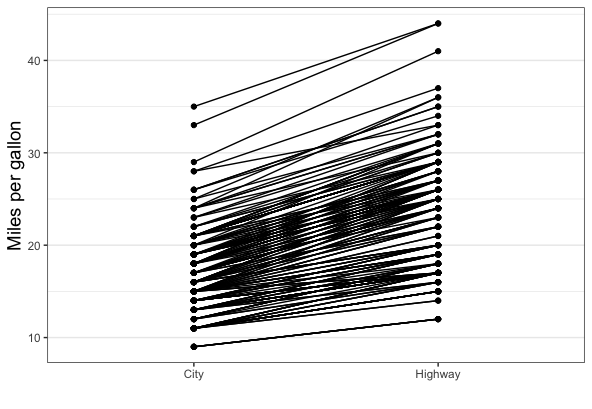

```{r , include=FALSE}
knitr::opts_chunk$set(echo = TRUE)
```

We're going to play with the dataset `mpg` (found in the `ggplot2` package). To access this dataset, you first will have to activate `ggplot2`. You'll also need the `ggpubr` package. 

Try and make your plots close to publication quality, in that all the writing on the graph should be proper English rather than variable names. This might include axis labels,
legend titles and legend levels. Ensure each plot has a title. Save each file as a PNG file as well, using code (just on RStudio Cloud). You may need to change (mutate) the data to do this, especially for labels.

I know you'll be using some data manipulation techniques that we covered rather quickly, so please use the R Help, the RStudio cheatsheets and any other resources you find (just state what you used). That's part of my reality as well, when I want to do something that I'm not 
really sure how to do. 

### Some possibly useful material

1. Each of the verbs `mutate`, `arrange`, `filter` and `summarize` have _scoped_ versions: `*_all`. `*_at` and `*_if`.

    > The variants suffixed with _if, _at or _all apply an expression (sometimes several) to all variables within a specified subset. This subset can contain all variables (_all variants), a vars() selection (_at variants), or variables selected with a predicate (_if variants).

1. You should create your own theme for all of the plots in this assignment. The way you 
do this is using the following template (take out or add in elements):

```{r, eval = F}
my_theme <- function(){
  theme_bw() + 
    theme(axis.title = element_text(size = 14))
}
```

Look at the documentation for `theme` (using `?theme`) . There are nice descriptions [here](https://bookdown.org/rdpeng/RProgDA/building-a-new-theme.html) and [here](https://www.datanovia.com/en/blog/ggplot-themes-gallery/).  You can also choose something from the [`ggthemes`]() package (which you may need to install). 

### Setup

```{r setup, include = F, eval = F}
library(_________)
library(_________) # read the intro above
```

### Questions

__Question 1:__ Let's start by creating some summaries from this data. We will use the function `summarize` from the tidyverse.

a. Find the average efficiencies for each manufacturer, separately for city and highway

```{r, eval = F}
mpg %>% 
  group_by(________) %>% 
  summarize______(___(cty, hwy), mean) 
```

b. Compute the average efficiencies by manufacturer and year

```{r, eval = F}
mpg %>% 
  group_by(______, ______) %>% 
  summarize_at(vars(cty, hwy), mean)
```

c. Create a frequency table of the different classes of vehicles by year

```{r, eval = F}
mpg %>% count(_______, _________) %>% 
  spread(_______, __________) # 1st argument goes to headers, 2nd becomes values
```


__Question 2:__ We'll do some data munging on this dataset

a. Check the data types for each variable using the `str` or `glimpse` function. They 
both do roughly the same thing, but provide a different output format. 

```{r, eval = F}
_____(mpg)
```

b. We already saw that there are only 2 years in this dataset. So it will be useful to
convert this into a `factor`, which is a type meant for categorical data. We'll do it in place, i.e., change the original data rather than make a copy.

```{r, eval=F}
mpg <- mpg %>% 
  ________(year = as.factor(year)) #reminder, we are changing a variable
```

c. Let's change all the character variables to factors too.

```{r, eval = F}
mpg <- mpg %>% 
  mutate____(is.character, as.factor) #if a column is a character, change to a factor
```

d. Create a new dataset from mpg, where all the efficiencies are in one column, and another
column denotes whether the data comes from city or highway mileage. We'll need these for some graphics later.

```{r, eval = F}
mpg1 <- mpg %>% 
  gather(______, _______, cty, hwy)
```

e. The variable you created to store whether data came from highway or city is not really 

__Question 3:__ Let's do some descriptive graphs

a. Draw a barplot of the frequencies of different classes of vehicles, with separate panels for 1999 and 2008. 

```{r, eval = F}
## Your code here


ggplot(mpg, aes(x = ________)) + 
  geom_________() + 
  facet______( ~ _________)

##
```

b. Now change this so that you have one plot, with stacked bars and year denoted by color

```{r, eval = F}
ggplot(mpg, aes(x = ________ )) + 
  geom_bar(aes(group = _________, fill = _________))
```

c. Change the above graph so that the bars aren't stacked, but side-by-side

```{r, eval = F}
ggplot(mpg, aes(x = ________ )) + 
  geom_bar(aes(group = _________, fill = _________), position = "_________")

```

d. Change the graph so that each bar goes from 0 to 1, and the color represents the relative proportion of total cars in the class were available in 1999 and 2008. (look at the different `position` options in ggplot2)

```{r, eval = F}
ggplot(mpg, aes(x = ________ )) + 
  geom_bar(aes(group = _________, fill = _________), position = "_________")

```


__Question 4:__ Show the relationship between displacement (`displ`) and fuel efficiency in one plot. This should be a scatter plot with a smooth line, with colors representing city and highway. Make sure the levels in the legend are "city" and "highway" rather than "cty" and "hwy". You'll have to modify the data to do this. One way is suggested below.

_Hint:_ This uses what I called one of my favorite or most used tricks in data manipulation.

```{r, eval = F}
## Your code here. Naming choices for 1 and 2 are yours

______ <- mpg %>% 
  gather(<____1___>, <____2____>, cty, hwy) %>%  # Both of those are fill-in-the-blank
  mutate(<____1___> = ifelse( <____1___> == 'cty', 'city','highway'))

ggplot(_____, aes(x = displ, y = ______)) + 
  geom_scatter(aes(color = _________))  +
  geom_smooth(aes(color = _________), se = F)

##
```

__Question 5:__ Compare the distributions of city mpg between 1999 and 2008 by manufacturer using boxplots or violin plots and facets. Add an annotation showing the result of a statistical test seeing if there is a difference between the two years (Hint: use `ggpubr::stat_compare_mean`)

## Challenge question

We want to see whether the difference between city and highway mileage within cars. We first create this plot, with one line per car. Note, to create this graph, you might have to create a new variable in your dataset.

```{r, eval = F}

```

Let's add some more depth to it. Color the lines and points by manufacturer.

This still seems rather messy, doesn't it. 

Let's just use the data from 1999, and then create this plot with different facets for different manufacturers. 


