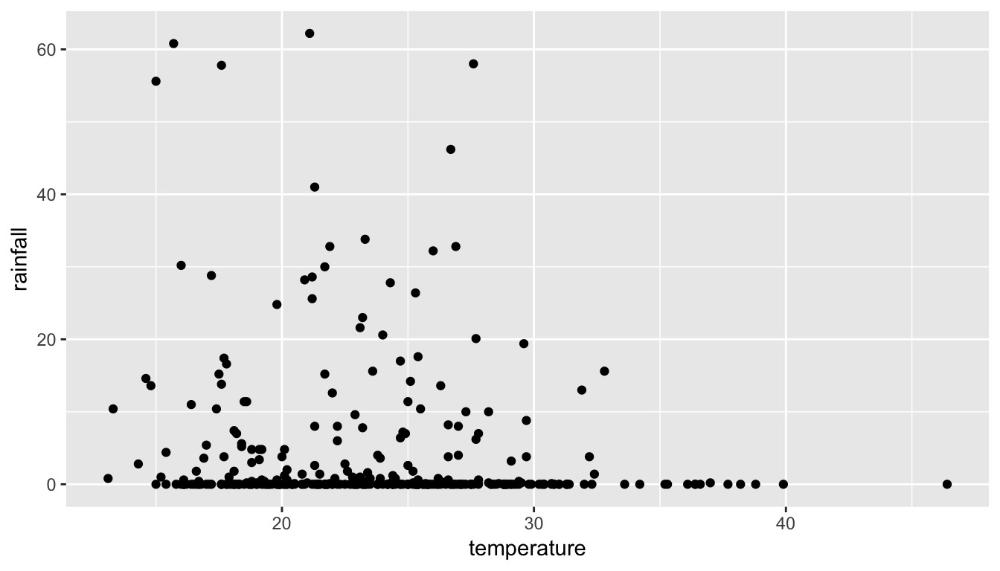
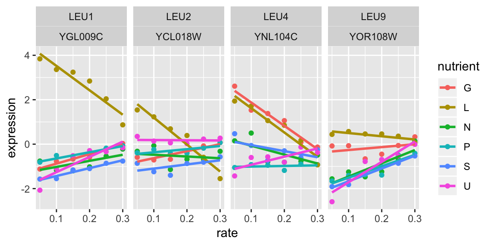
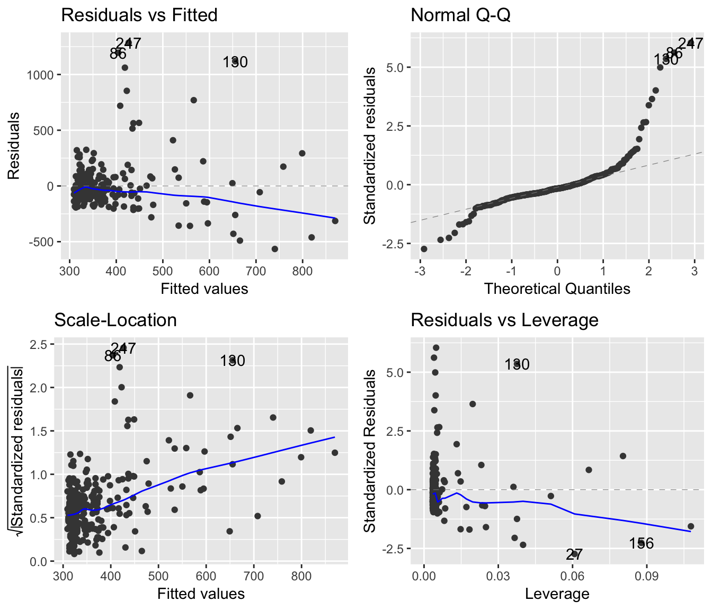
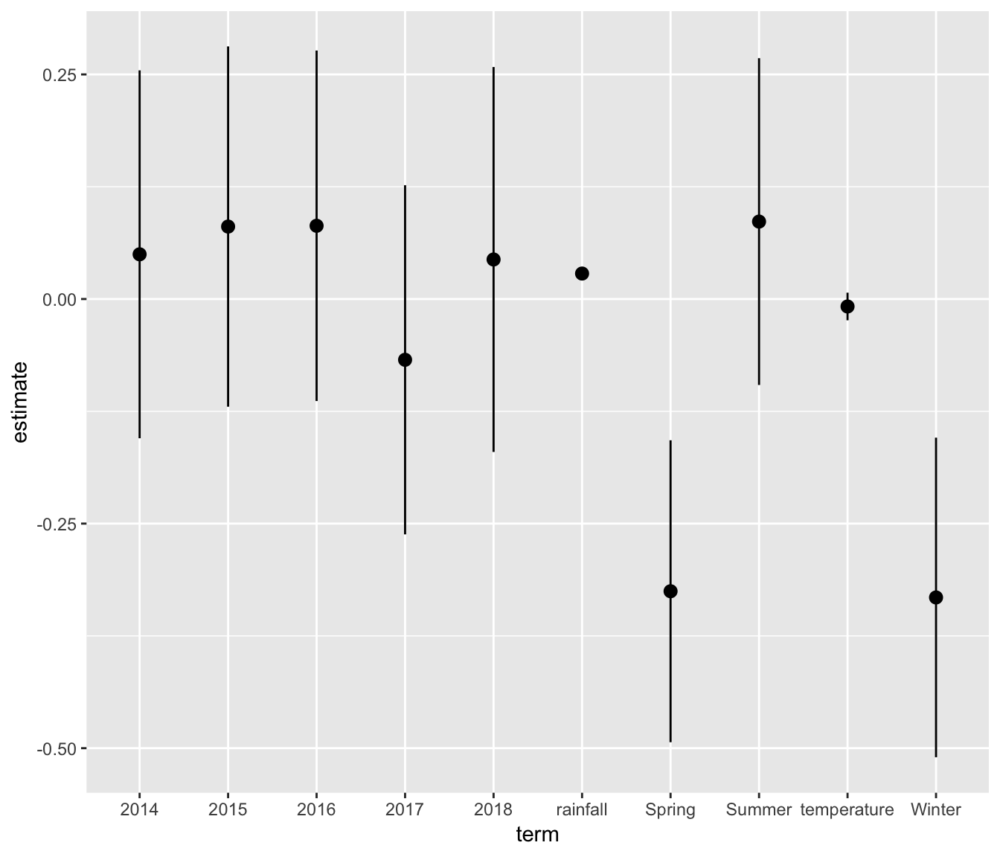
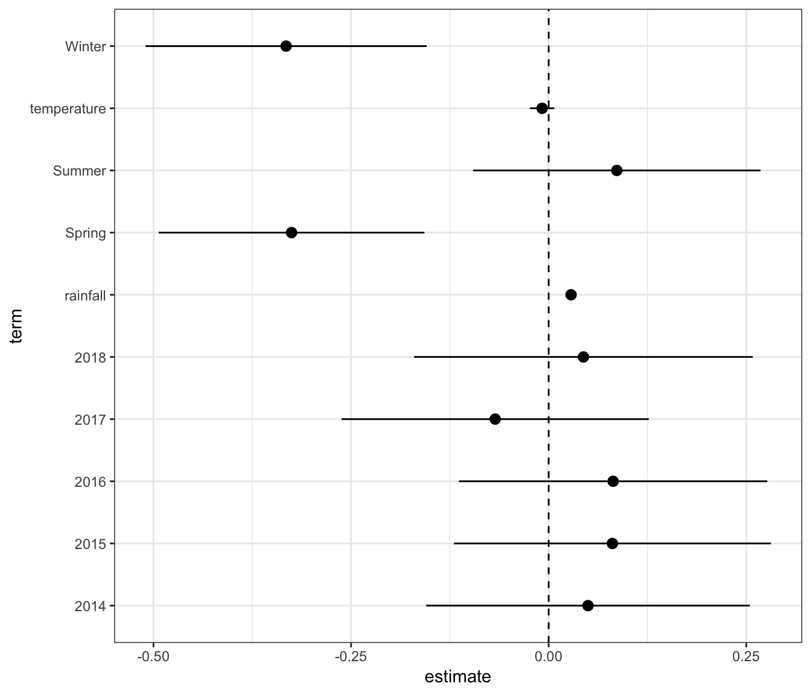

# A quick tour of R


### The bare essentials

- Everything in R is an object with a name
- Things are nouns
    - Nouns in R are _data objects_, like scalars, matrices, data.frames/tibbles, strings, vectors
- Nouns are acted upon by verbs
    - Verbs in R are _functions_, like `mean(x)`, `nrow(d)`, `dim(d)`, `ggplot` and so on
- You can modify verbs with adverbs
    - Adverbs in R are _function options_, like `mean(x, na.rm=T)`, `geom_point(color='green')`


### The bare essentials
- You have to name things to store them
    - This is done with the `<-` operator, e.g. 
        - `mn <- mean(x, na.rm=T)` stores the result of the average
        - `my_theme <- function() theme_bw() + theme(axis.title=element_text(size=14))` stores the function, which you'll call as `my_theme()`

> You can see the objects you have created either by typing `ls()` in the console, or looking in the Environment pane

> Note, built-in objects don't show up in the Environment pane or using `ls()`


### The bare essentials

There are three kinds of brackets in R

`[]` are used for extracting elements from arrays, matrices, data frames.

- `x[3]` is the 3rd element of an array `x`
- `d[1,3]` is the element in the 1st row and 3rd column of a matrix/data frame `d`
- `d[2,]` is the entire first __row__ of a matrix/data frame `d`
- `d[,4]` is the entire 4th __column__ of a matrix/data frame `d`
    

### The bare essentials

There are three kinds of brackets in R

`()` are used for specifying arguments to functions

- `mean(x)` gives the mean of an array of numbers `x`
- `summary(d)` gives a summary representation of a data frame `d`


### The bare essentials

There are three kinds of brackets in R

`{}` are used to contain groups of commands/statements

.pull-left[

A conditional statement


```r
if (age < 18){
   person <- 'Minor'
} else if (age > 65) {
  person <- 'Senior'
} else {
  person <- 'Adult'
}
```
]
.pull-right[

A function definition


```r
my_mean <- function(x, na.rm = T){
  if(na.rm){
    x <- x[!is.na(x)]
  }
  s <- sum(x)
  n <- length(x)
  mn <- s / n # There is a built-in function mean, so I don't use that word
  return(mn)
}
```

]


### Data types

A __scalar:__

- `29`
- `"cherry"`
- `TRUE`


### Data types

#### A __scalar:__

- `29` : _numeric_
- `"cherry"`: _character_
- `TRUE`: _logical_


### Data types

#### Vectors/Arrays

These are constructed using the `c()` function (for _concatenate_).


```r
c(1,2,5,6,7,8)
```

```
#>  [1] 1 2 5 6 7 8
```

```r
c('apple','berry','melon','citrus')
```

```
#>  [1] "apple"  "berry"  "melon"  "citrus"
```

> Vectors must all contain objects of the same type. Can't mix and match


### Data types

#### Matrices (2-d arrays)

These are typically built from vectors


```r
x <- c(1,2,4,5,6,7)
y <- 10:16  # Shortcut for c(10,11,12,13,14,15,16)
```

.pull-left[

```r
cbind(x, y) # Vectors as columns
```

```
#>       x  y
#>  [1,] 1 10
#>  [2,] 2 11
#>  [3,] 4 12
#>  [4,] 5 13
#>  [5,] 6 14
#>  [6,] 7 15
#>  [7,] 1 16
```
]
.pull-right[

```r
rbind(x, y) # Vectors as rows
```

```
#>    [,1] [,2] [,3] [,4] [,5] [,6] [,7]
#>  x    1    2    4    5    6    7    1
#>  y   10   11   12   13   14   15   16
```
]


### Data types

#### Lists

Lists are basically buckets or containers. Each element of a list can be anything, even other lists

.pull-left[

```r
my_list <- list('a', c(2,3,5,6), head(ggplot2::mpg))
my_list
```
]
.pull-right[

```
#>  [[1]]
#>  [1] "a"
#>  
#>  [[2]]
#>  [1] 2 3 5 6
#>  
#>  [[3]]
#>  # A tibble: 6 x 11
#>    manufacturer model displ  year   cyl trans  drv     cty   hwy fl    class
#>    <chr>        <chr> <dbl> <int> <int> <chr>  <chr> <int> <int> <chr> <chr>
#>  1 audi         a4      1.8  1999     4 auto(… f        18    29 p     comp…
#>  2 audi         a4      1.8  1999     4 manua… f        21    29 p     comp…
#>  3 audi         a4      2    2008     4 manua… f        20    31 p     comp…
#>  4 audi         a4      2    2008     4 auto(… f        21    30 p     comp…
#>  5 audi         a4      2.8  1999     6 auto(… f        16    26 p     comp…
#>  6 audi         a4      2.8  1999     6 manua… f        18    26 p     comp…
```
]


### Data types

#### data.frame/tibble

This is the typical container for tabular data

- must be rectangular
- each column can be of a different type
- elements within each column have to be of the same type


### Data types

#### data.frame/tibble


```r
beaches <- rio::import('data/sydneybeaches3.csv') # use the import function from the package rio
dim(beaches)
```

```
#>  [1] 344  12
```

```r
head(beaches)
```

```
#>          date year month day season rainfall temperature enterococci
#>  1 2013-01-02 2013     1   2      1      0.0        23.4         6.7
#>  2 2013-01-06 2013     1   6      1      0.0        30.3         2.0
#>  3 2013-01-12 2013     1  12      1      0.0        31.4        69.1
#>  4 2013-01-18 2013     1  18      1      0.0        46.4         9.0
#>  5 2013-01-24 2013     1  24      1      0.0        27.5        33.9
#>  6 2013-01-30 2013     1  30      1      0.6        26.6        26.5
#>    day_num month_num month_name season_name
#>  1       2         1    January      Summer
#>  2       6         1    January      Summer
#>  3      12         1    January      Summer
#>  4      18         1    January      Summer
#>  5      24         1    January      Summer
#>  6      30         1    January      Summer
```


### Data types

#### data.frame/tibble


```r
library(tidyverse) # Activate the tidyverse package
beaches_t <- as_tibble(beaches)
beaches_t
```

```
#>  # A tibble: 344 x 12
#>     date   year month   day season rainfall temperature enterococci day_num
#>     <chr> <int> <int> <int>  <int>    <dbl>       <dbl>       <dbl>   <int>
#>   1 2013…  2013     1     2      1      0          23.4         6.7       2
#>   2 2013…  2013     1     6      1      0          30.3         2         6
#>   3 2013…  2013     1    12      1      0          31.4        69.1      12
#>   4 2013…  2013     1    18      1      0          46.4         9        18
#>   5 2013…  2013     1    24      1      0          27.5        33.9      24
#>   6 2013…  2013     1    30      1      0.6        26.6        26.5      30
#>   7 2013…  2013     2     5      1      0.1        25.7        66.9      36
#>   8 2013…  2013     2    11      1      8          22.2       118.       42
#>   9 2013…  2013     2    17      1     13.6        26.3        75        48
#>  10 2013…  2013     2    23      1      7.2        24.8       311.       54
#>  # … with 334 more rows, and 3 more variables: month_num <int>,
#>  #   month_name <chr>, season_name <chr>
```


### Data types

#### data.frame/tibble

Extracting columns from a data frame:

1. `beaches$temperature`
1. `beaches[,'temperature']`
1. `beaches[['temperature']]`
1. `beaches[,7]`
1. `beaches[[7]]`

### Packages in R

R is a modular environment with some base functionality that is augmented by __packages__ (think of them as modules)

- Packages can contain _functions_ and _data_
- There are over 15K packages on CRAN, the Comprehensive R Archive Network
- There are over 1600 packages on Bioconductor, the main repository for bioinformatics resources
    - Analytic, Annotation, Experimental data and Workflow packages

--

##### Finding packages

1. CRAN [Task views](https://cran.r-project.org/web/views/){target=_blank}
1. Bioconductor [BiocViews](http://bioconductor.org/packages/release/BiocViews.html){target=_blank}
1. GitHub (open source collaboration and version control environment)


### Installing packages

.pull-left[
#### From CRAN

```r
install.packages("tidyverse")
```

#### From Bioconductor

```r
install.packages("BiocManager") # do once 
BioManager::install('limma')
```

#### From GitHub


```r
install.packages('remotes') # do once
remotes::install_github("rstudio/rmarkdown") # usual format is username/packagename
```
]
.pull-right[
> GitHub often hosts development version of packages published on CRAN or Bioconductor

> Both CRAN and Bioconductor have stringent checks to make sure packages can run properly, with no obvious program flaws. There are typically no
  guarantees about analytic or theoretical correctness, but most packages have been crowd-validated and there are several reliable developer groups
  including RStudio
]


### Using packages

You have to first "activate" the package in your current working session using the `library` function.


.pull-left[

```r
ggplot(beaches, aes(temperature, rainfall)) +
  geom_point()
```

```
#>  Error in ggplot(beaches, aes(temperature, rainfall)): could not find function "ggplot"
```
]

--

.pull-right[

```r
library(ggplot2) # or library(tidyverse)
ggplot(beaches, aes(temperature, rainfall)) +
  geom_point()
```



]


## Tidying data using the tidyverse


### What is the ["Tidyverse"](http://www.tidyverse.org)?


<div style="display:flex;align-items:center;font-size:30pt;font-family:serif;width:100%;height:300px;background-color:wheat;text-align:center; border: 1px solid red; position: relative;">

The tidyverse is an opinionated collection of R packages designed for data science. All packages share an underlying design philosophy, grammar, and data structures

</div>


### What is the ["Tidyverse"](http://www.tidyverse.org)?

A set of R packages that:

<ul>
  <li> help make data more computer-friendly
  <li>while making your code more human-friendly
</ul>

- Most of these packages are (co-)written by Dr. Hadley Wickham, who has rockstar status in the R world
- They are supported by the company RStudio


## Tidying data


### Tidy data

<div style="display:flex;align-items:center;font-size:30pt;font-family:sans-serif;width:100%;height:300px;background-color:wheat;text-align:center; padding-left:30px;border: 1px solid red; position: relative;">

Tidy datasets are all alike, <br/>
but every messy data is messy in its own way

</div>


### Tidy data

Tidy data is a **computer-friendly** format based on the following characteristics:

- Each row is one observation
- Each column is one variable
- Each set of observational unit forms a table

All other forms of data can be considered **messy data**.


### Let us count the ways

There are many ways data can be messy. An incomplete list....

+ Column headers are values, not variables
+ Multiple variables are stored in a single column
+ Variables are stored in both rows and columns
+ Multiple types of observational units are saved in the same table
+ A single observational unit is stored in multiple tables


### Ways to have messy (i.e. not tidy) data

1. Column headers contain values

Country   |   < $10K    | $10-20K    | $20-50K   | $50-100K    | > $100K
India     |   40        |  25        |   25      |  9          |  1
USA       |   20        |  20        |  20       | 30          |  10


### Ways to have messy (i.e. not tidy) data

Column headers contain values

Country   |   Income  | Percentage
India     |  < $10K   |  40
USA       |  < $10K   | 20

This is a case of reshaping or melting 


### Ways to have messy (i.e. not tidy) data

Multiple variables in one column

Country  | Year   | M_0-14  | F_0-14  | M_ 15-60  | F_15-60  | M_60+  | F_60+
UK       |  2010  |         |         |           |          |        | 
UK       |  2011  |         |         |           |          |        | 

<p>
Separating columns into different variables

Country  | Year   | Gender  | Age    | Count


### Tidying data

The typical steps are 

+ Transforming data from wide to tall (*gather*) and from tall to wide (*spread*)
+ Separating columns into different columns
+ Putting columns together into new variables


## Cleaning data


### Some actions on data

+ Creating new variables (*mutate*)
+ Choose some columns (*select*)
+ Selecting rows based on some criteria (*filter*)
+ Sort data based on some variables (*arrange*)


### Example data


```r
head(mtcars, 3)
```

```
#>                 mpg cyl disp  hp drat    wt  qsec vs am gear carb
#>  Mazda RX4     21.0   6  160 110 3.90 2.620 16.46  0  1    4    4
#>  Mazda RX4 Wag 21.0   6  160 110 3.90 2.875 17.02  0  1    4    4
#>  Datsun 710    22.8   4  108  93 3.85 2.320 18.61  1  1    4    1
```


- Car names are in an attribute of the data.frame called `rownames`. So it's not in a column
- We might want to convert fuel economy to metric 
- We might just want to look at the relationship between displacement and fuel economy based on number of cylinders


### Example data ([link](https://dl.dropboxusercontent.com/s/pqavhcckshqxtjm/brca.csv))


```r
link <- 'https://dl.dropboxusercontent.com/s/pqavhcckshqxtjm/brca.csv'
brca_data <- rio::import(link)
```
</img>


### The `tidyverse` package

The `tidyverse` package is a meta-package that installs a set of packages that are useful for data 
cleaning, data tidying and data munging (manipulating data to get a computationally "attractive" 
dataset)


### The `tidyverse` package


```r
## install.packages('tidyverse')
library(tidyverse)
```


> You can specify a function from a particular package as `dplyr::filter`. Note there
are two colons there


### Core `tidyverse` packages

<table>
 <thead>
  <tr>
   <th style="text-align:left;"> Package </th>
   <th style="text-align:left;"> Description </th>
  </tr>
 </thead>
<tbody>
  <tr>
   <td style="text-align:left;"> ggplot2 </td>
   <td style="text-align:left;"> Data visualization </td>
  </tr>
  <tr>
   <td style="text-align:left;"> tibble </td>
   <td style="text-align:left;"> data.frame on steroids </td>
  </tr>
  <tr>
   <td style="text-align:left;"> tidyr </td>
   <td style="text-align:left;"> Data tidying (today) </td>
  </tr>
  <tr>
   <td style="text-align:left;"> readr </td>
   <td style="text-align:left;"> Reading text files (CSV) </td>
  </tr>
  <tr>
   <td style="text-align:left;"> purrr </td>
   <td style="text-align:left;"> Applying functions to data iteratively </td>
  </tr>
  <tr>
   <td style="text-align:left;"> dplyr </td>
   <td style="text-align:left;"> Data cleaning and munging (today) </td>
  </tr>
  <tr>
   <td style="text-align:left;"> stringr </td>
   <td style="text-align:left;"> String (character) manipulation </td>
  </tr>
  <tr>
   <td style="text-align:left;"> forcats </td>
   <td style="text-align:left;"> Manipulating categorical variables </td>
  </tr>
</tbody>
</table>


### Additional `tidyverse` packages

<table>
 <thead>
  <tr>
   <th style="text-align:left;"> Package </th>
   <th style="text-align:left;"> Description </th>
  </tr>
 </thead>
<tbody>
  <tr>
   <td style="text-align:left;"> readxl </td>
   <td style="text-align:left;"> Read Excel files </td>
  </tr>
  <tr>
   <td style="text-align:left;"> haven </td>
   <td style="text-align:left;"> Read SAS, SPSS, Stata files </td>
  </tr>
  <tr>
   <td style="text-align:left;"> lubridate </td>
   <td style="text-align:left;"> Deal with dates and times </td>
  </tr>
  <tr>
   <td style="text-align:left;"> magrittr </td>
   <td style="text-align:left;"> Provides the pipe operator %&gt;% </td>
  </tr>
  <tr>
   <td style="text-align:left;"> glue </td>
   <td style="text-align:left;"> Makes pasting text and data easier </td>
  </tr>
</tbody>
</table>

#### Additional useful packages

<table>
 <thead>
  <tr>
   <th style="text-align:left;"> Package </th>
   <th style="text-align:left;"> Description </th>
  </tr>
 </thead>
<tbody>
  <tr>
   <td style="text-align:left;"> broom </td>
   <td style="text-align:left;"> Turns the results of models or analysis into tidy datasets </td>
  </tr>
  <tr>
   <td style="text-align:left;"> fs </td>
   <td style="text-align:left;"> Allows directory and file manipulation in OS-agnostic manner </td>
  </tr>
  <tr>
   <td style="text-align:left;"> here </td>
   <td style="text-align:left;"> Allows robust specification of directory structure in a Project </td>
  </tr>
</tbody>
</table>


## Pipes


### Pipes

Pipes (denoted `%>%`, spoken as "then") are to analytic pipelines as `+` is to `ggplot` layers


```r
mpg1 <- mpg %>% mutate(id=1:n()) %>% select(id, year, trans, cty, hwy)
mpg_metric <- mpg1 %>% 
  mutate_at(vars(cty, hwy), function(x) {x * 1.6/3.8})
```

.pull-left[

Original data

<table>
 <thead>
  <tr>
   <th style="text-align:right;"> id </th>
   <th style="text-align:right;"> year </th>
   <th style="text-align:left;"> trans </th>
   <th style="text-align:right;"> cty </th>
   <th style="text-align:right;"> hwy </th>
  </tr>
 </thead>
<tbody>
  <tr>
   <td style="text-align:right;"> 1 </td>
   <td style="text-align:right;"> 1999 </td>
   <td style="text-align:left;"> auto(l5) </td>
   <td style="text-align:right;"> 18 </td>
   <td style="text-align:right;"> 29 </td>
  </tr>
  <tr>
   <td style="text-align:right;"> 2 </td>
   <td style="text-align:right;"> 1999 </td>
   <td style="text-align:left;"> manual(m5) </td>
   <td style="text-align:right;"> 21 </td>
   <td style="text-align:right;"> 29 </td>
  </tr>
  <tr>
   <td style="text-align:right;"> 3 </td>
   <td style="text-align:right;"> 2008 </td>
   <td style="text-align:left;"> manual(m6) </td>
   <td style="text-align:right;"> 20 </td>
   <td style="text-align:right;"> 31 </td>
  </tr>
  <tr>
   <td style="text-align:right;"> 4 </td>
   <td style="text-align:right;"> 2008 </td>
   <td style="text-align:left;"> auto(av) </td>
   <td style="text-align:right;"> 21 </td>
   <td style="text-align:right;"> 30 </td>
  </tr>
  <tr>
   <td style="text-align:right;"> 5 </td>
   <td style="text-align:right;"> 1999 </td>
   <td style="text-align:left;"> auto(l5) </td>
   <td style="text-align:right;"> 16 </td>
   <td style="text-align:right;"> 26 </td>
  </tr>
</tbody>
</table>

]
.pull-right[

Transformed data
<table>
 <thead>
  <tr>
   <th style="text-align:right;"> id </th>
   <th style="text-align:right;"> year </th>
   <th style="text-align:left;"> trans </th>
   <th style="text-align:right;"> cty </th>
   <th style="text-align:right;"> hwy </th>
  </tr>
 </thead>
<tbody>
  <tr>
   <td style="text-align:right;"> 1 </td>
   <td style="text-align:right;"> 1999 </td>
   <td style="text-align:left;"> auto(l5) </td>
   <td style="text-align:right;"> 7.578947 </td>
   <td style="text-align:right;"> 12.21053 </td>
  </tr>
  <tr>
   <td style="text-align:right;"> 2 </td>
   <td style="text-align:right;"> 1999 </td>
   <td style="text-align:left;"> manual(m5) </td>
   <td style="text-align:right;"> 8.842105 </td>
   <td style="text-align:right;"> 12.21053 </td>
  </tr>
  <tr>
   <td style="text-align:right;"> 3 </td>
   <td style="text-align:right;"> 2008 </td>
   <td style="text-align:left;"> manual(m6) </td>
   <td style="text-align:right;"> 8.421053 </td>
   <td style="text-align:right;"> 13.05263 </td>
  </tr>
  <tr>
   <td style="text-align:right;"> 4 </td>
   <td style="text-align:right;"> 2008 </td>
   <td style="text-align:left;"> auto(av) </td>
   <td style="text-align:right;"> 8.842105 </td>
   <td style="text-align:right;"> 12.63158 </td>
  </tr>
  <tr>
   <td style="text-align:right;"> 5 </td>
   <td style="text-align:right;"> 1999 </td>
   <td style="text-align:left;"> auto(l5) </td>
   <td style="text-align:right;"> 6.736842 </td>
   <td style="text-align:right;"> 10.94737 </td>
  </tr>
</tbody>
</table>

]

--

> Note I'm assigning a name to the transformed data. Otherwise it'll be lost


### Verbs to use in pipes

The verbs in `tidyverse` are specially useful in pipes

<table>
 <thead>
  <tr>
   <th style="text-align:left;"> Verb </th>
   <th style="text-align:left;"> Functionality </th>
  </tr>
 </thead>
<tbody>
  <tr>
   <td style="text-align:left;"> mutate </td>
   <td style="text-align:left;"> Transform a column with some function </td>
  </tr>
  <tr>
   <td style="text-align:left;"> select </td>
   <td style="text-align:left;"> Select some columns in the data </td>
  </tr>
  <tr>
   <td style="text-align:left;"> arrange </td>
   <td style="text-align:left;"> Order the data frame by values of a column(s) </td>
  </tr>
  <tr>
   <td style="text-align:left;"> filter </td>
   <td style="text-align:left;"> Keep only rows that meet some data criterion </td>
  </tr>
  <tr>
   <td style="text-align:left;"> group_by </td>
   <td style="text-align:left;"> Group by levels of a variable </td>
  </tr>
  <tr>
   <td style="text-align:left;"> gather </td>
   <td style="text-align:left;"> Transform a wide dataset to a long dataset </td>
  </tr>
  <tr>
   <td style="text-align:left;"> spread </td>
   <td style="text-align:left;"> Transform a long dataset to a wide dataset </td>
  </tr>
  <tr>
   <td style="text-align:left;"> separate </td>
   <td style="text-align:left;"> Separate one column into several columns </td>
  </tr>
  <tr>
   <td style="text-align:left;"> unite </td>
   <td style="text-align:left;"> Concatenate several columns into 1 column </td>
  </tr>
</tbody>
</table>

Pipes almost always start with a data.frame/tibble object, and then "pipes" that data through different transformations (functions)

At each `%>%`, the results of the previous step are used as input for the next step.


## A complicated example


### Grab the raw data


```r
url <- "http://varianceexplained.org/files/Brauer2008_DataSet1.tds"
raw_data <- read_delim(url, delim='\t')
head(raw_data)
```

```
#>  # A tibble: 6 x 40
#>    GID   YORF  NAME  GWEIGHT G0.05  G0.1 G0.15  G0.2 G0.25  G0.3 N0.05  N0.1
#>    <chr> <chr> <chr>   <dbl> <dbl> <dbl> <dbl> <dbl> <dbl> <dbl> <dbl> <dbl>
#>  1 GENE… A_06… SFB2…       1 -0.24 -0.13 -0.21 -0.15 -0.05 -0.05  0.2   0.24
#>  2 GENE… A_06… "   …       1  0.28  0.13 -0.4  -0.48 -0.11  0.17  0.31  0   
#>  3 GENE… A_06… QRI7…       1 -0.02 -0.27 -0.27 -0.02  0.24  0.25  0.23  0.06
#>  4 GENE… A_06… CFT2…       1 -0.33 -0.41 -0.24 -0.03 -0.03  0     0.2  -0.25
#>  5 GENE… A_06… SSO2…       1  0.05  0.02  0.4   0.34 -0.13 -0.14 -0.35 -0.09
#>  6 GENE… A_06… PSP2…       1 -0.69 -0.03  0.23  0.2   0    -0.27  0.17 -0.4 
#>  # … with 28 more variables: N0.15 <dbl>, N0.2 <dbl>, N0.25 <dbl>,
#>  #   N0.3 <dbl>, P0.05 <dbl>, P0.1 <dbl>, P0.15 <dbl>, P0.2 <dbl>,
#>  #   P0.25 <dbl>, P0.3 <dbl>, S0.05 <dbl>, S0.1 <dbl>, S0.15 <dbl>,
#>  #   S0.2 <dbl>, S0.25 <dbl>, S0.3 <dbl>, L0.05 <dbl>, L0.1 <dbl>,
#>  #   L0.15 <dbl>, L0.2 <dbl>, L0.25 <dbl>, L0.3 <dbl>, U0.05 <dbl>,
#>  #   U0.1 <dbl>, U0.15 <dbl>, U0.2 <dbl>, U0.25 <dbl>, U0.3 <dbl>
```


### Look at the annotation data


```r
head(raw_data$NAME)
```

```
#>  [1] "SFB2       || ER to Golgi transport || molecular function unknown || YNL049C || 1082129"          
#>  [2] "          || biological process unknown || molecular function unknown || YNL095C || 1086222"      
#>  [3] "QRI7       || proteolysis and peptidolysis || metalloendopeptidase activity || YDL104C || 1085955"
#>  [4] "CFT2       || mRNA polyadenylylation* || RNA binding || YLR115W || 1081958"                       
#>  [5] "SSO2       || vesicle fusion* || t-SNARE activity || YMR183C || 1081214"                          
#>  [6] "PSP2       || biological process unknown || molecular function unknown || YML017W || 1083036"
```


### Separate annotation into columns


```r
cleaned_data <- raw_data %>% 
  separate(NAME, c("name", "BP", "MF", "systematic_name", "number"), #<<
           sep = "\\|\\|")#<<
head(cleaned_data)
```

```
#>  # A tibble: 6 x 44
#>    GID   YORF  name  BP    MF    systematic_name number GWEIGHT G0.05  G0.1
#>    <chr> <chr> <chr> <chr> <chr> <chr>           <chr>    <dbl> <dbl> <dbl>
#>  1 GENE… A_06… "SFB… " ER… " mo… " YNL049C "     " 108…       1 -0.24 -0.13
#>  2 GENE… A_06… "   … " bi… " mo… " YNL095C "     " 108…       1  0.28  0.13
#>  3 GENE… A_06… "QRI… " pr… " me… " YDL104C "     " 108…       1 -0.02 -0.27
#>  4 GENE… A_06… "CFT… " mR… " RN… " YLR115W "     " 108…       1 -0.33 -0.41
#>  5 GENE… A_06… "SSO… " ve… " t-… " YMR183C "     " 108…       1  0.05  0.02
#>  6 GENE… A_06… "PSP… " bi… " mo… " YML017W "     " 108…       1 -0.69 -0.03
#>  # … with 34 more variables: G0.15 <dbl>, G0.2 <dbl>, G0.25 <dbl>,
#>  #   G0.3 <dbl>, N0.05 <dbl>, N0.1 <dbl>, N0.15 <dbl>, N0.2 <dbl>,
#>  #   N0.25 <dbl>, N0.3 <dbl>, P0.05 <dbl>, P0.1 <dbl>, P0.15 <dbl>,
#>  #   P0.2 <dbl>, P0.25 <dbl>, P0.3 <dbl>, S0.05 <dbl>, S0.1 <dbl>,
#>  #   S0.15 <dbl>, S0.2 <dbl>, S0.25 <dbl>, S0.3 <dbl>, L0.05 <dbl>,
#>  #   L0.1 <dbl>, L0.15 <dbl>, L0.2 <dbl>, L0.25 <dbl>, L0.3 <dbl>,
#>  #   U0.05 <dbl>, U0.1 <dbl>, U0.15 <dbl>, U0.2 <dbl>, U0.25 <dbl>,
#>  #   U0.3 <dbl>
```


### Get rid of padding in annotation


```r
cleaned_data <- raw_data %>% 
  separate(NAME, c("name", "BP", "MF", "systematic_name", "number"), 
           sep = "\\|\\|") %>% 
  mutate_at(vars(name:systematic_name), funs(stringr::str_trim)) #<<
head(cleaned_data)
```

```
#>  # A tibble: 6 x 44
#>    GID   YORF  name  BP    MF    systematic_name number GWEIGHT G0.05  G0.1
#>    <chr> <chr> <chr> <chr> <chr> <chr>           <chr>    <dbl> <dbl> <dbl>
#>  1 GENE… A_06… SFB2  ER t… mole… YNL049C         " 108…       1 -0.24 -0.13
#>  2 GENE… A_06… ""    biol… mole… YNL095C         " 108…       1  0.28  0.13
#>  3 GENE… A_06… QRI7  prot… meta… YDL104C         " 108…       1 -0.02 -0.27
#>  4 GENE… A_06… CFT2  mRNA… RNA … YLR115W         " 108…       1 -0.33 -0.41
#>  5 GENE… A_06… SSO2  vesi… t-SN… YMR183C         " 108…       1  0.05  0.02
#>  6 GENE… A_06… PSP2  biol… mole… YML017W         " 108…       1 -0.69 -0.03
#>  # … with 34 more variables: G0.15 <dbl>, G0.2 <dbl>, G0.25 <dbl>,
#>  #   G0.3 <dbl>, N0.05 <dbl>, N0.1 <dbl>, N0.15 <dbl>, N0.2 <dbl>,
#>  #   N0.25 <dbl>, N0.3 <dbl>, P0.05 <dbl>, P0.1 <dbl>, P0.15 <dbl>,
#>  #   P0.2 <dbl>, P0.25 <dbl>, P0.3 <dbl>, S0.05 <dbl>, S0.1 <dbl>,
#>  #   S0.15 <dbl>, S0.2 <dbl>, S0.25 <dbl>, S0.3 <dbl>, L0.05 <dbl>,
#>  #   L0.1 <dbl>, L0.15 <dbl>, L0.2 <dbl>, L0.25 <dbl>, L0.3 <dbl>,
#>  #   U0.05 <dbl>, U0.1 <dbl>, U0.15 <dbl>, U0.2 <dbl>, U0.25 <dbl>,
#>  #   U0.3 <dbl>
```


### Get rid of some columns


```r
cleaned_data <- raw_data %>% 
  separate(NAME, c("name", "BP", "MF", "systematic_name", "number"), 
           sep = "\\|\\|") %>% 
  mutate_at(vars(name:systematic_name), funs(stringr::str_trim)) %>% 
  select(-number, -GID, -YORF, -GWEIGHT) #<<
head(cleaned_data)
```

```
#>  # A tibble: 6 x 40
#>    name  BP    MF    systematic_name G0.05  G0.1 G0.15  G0.2 G0.25  G0.3
#>    <chr> <chr> <chr> <chr>           <dbl> <dbl> <dbl> <dbl> <dbl> <dbl>
#>  1 SFB2  ER t… mole… YNL049C         -0.24 -0.13 -0.21 -0.15 -0.05 -0.05
#>  2 ""    biol… mole… YNL095C          0.28  0.13 -0.4  -0.48 -0.11  0.17
#>  3 QRI7  prot… meta… YDL104C         -0.02 -0.27 -0.27 -0.02  0.24  0.25
#>  4 CFT2  mRNA… RNA … YLR115W         -0.33 -0.41 -0.24 -0.03 -0.03  0   
#>  5 SSO2  vesi… t-SN… YMR183C          0.05  0.02  0.4   0.34 -0.13 -0.14
#>  6 PSP2  biol… mole… YML017W         -0.69 -0.03  0.23  0.2   0    -0.27
#>  # … with 30 more variables: N0.05 <dbl>, N0.1 <dbl>, N0.15 <dbl>,
#>  #   N0.2 <dbl>, N0.25 <dbl>, N0.3 <dbl>, P0.05 <dbl>, P0.1 <dbl>,
#>  #   P0.15 <dbl>, P0.2 <dbl>, P0.25 <dbl>, P0.3 <dbl>, S0.05 <dbl>,
#>  #   S0.1 <dbl>, S0.15 <dbl>, S0.2 <dbl>, S0.25 <dbl>, S0.3 <dbl>,
#>  #   L0.05 <dbl>, L0.1 <dbl>, L0.15 <dbl>, L0.2 <dbl>, L0.25 <dbl>,
#>  #   L0.3 <dbl>, U0.05 <dbl>, U0.1 <dbl>, U0.15 <dbl>, U0.2 <dbl>,
#>  #   U0.25 <dbl>, U0.3 <dbl>
```


### Make data tidy


```r
cleaned_data <- raw_data %>% 
  separate(NAME, c("name", "BP", "MF", "systematic_name", "number"), 
           sep = "\\|\\|") %>% 
  mutate_at(vars(name:systematic_name), funs(stringr::str_trim)) %>% 
  select(-number, -GID, -YORF, -GWEIGHT) %>% 
  tidyr::gather(sample, expression, G0.05:U0.3) #<<
head(cleaned_data)
```

```
#>  # A tibble: 6 x 6
#>    name  BP               MF               systematic_name sample expression
#>    <chr> <chr>            <chr>            <chr>           <chr>       <dbl>
#>  1 SFB2  ER to Golgi tra… molecular funct… YNL049C         G0.05       -0.24
#>  2 ""    biological proc… molecular funct… YNL095C         G0.05        0.28
#>  3 QRI7  proteolysis and… metalloendopept… YDL104C         G0.05       -0.02
#>  4 CFT2  mRNA polyadenyl… RNA binding      YLR115W         G0.05       -0.33
#>  5 SSO2  vesicle fusion*  t-SNARE activity YMR183C         G0.05        0.05
#>  6 PSP2  biological proc… molecular funct… YML017W         G0.05       -0.69
```


### Split columns


```r
cleaned_data <- raw_data %>% 
  separate(NAME, c("name", "BP", "MF", "systematic_name", "number"), 
           sep = "\\|\\|") %>% 
  mutate_at(vars(name:systematic_name), funs(stringr::str_trim)) %>% 
  select(-number, -GID, -YORF, -GWEIGHT) %>% 
  tidyr::gather(sample, expression, G0.05:U0.3) %>% 
  separate(sample, c("nutrient", "rate"), sep=1, convert = TRUE) #<<
head(cleaned_data)
```

```
#>  # A tibble: 6 x 7
#>    name  BP           MF           systematic_name nutrient  rate expression
#>    <chr> <chr>        <chr>        <chr>           <chr>    <dbl>      <dbl>
#>  1 SFB2  ER to Golgi… molecular f… YNL049C         G         0.05      -0.24
#>  2 ""    biological … molecular f… YNL095C         G         0.05       0.28
#>  3 QRI7  proteolysis… metalloendo… YDL104C         G         0.05      -0.02
#>  4 CFT2  mRNA polyad… RNA binding  YLR115W         G         0.05      -0.33
#>  5 SSO2  vesicle fus… t-SNARE act… YMR183C         G         0.05       0.05
#>  6 PSP2  biological … molecular f… YML017W         G         0.05      -0.69
```


### Get rid of rows with missing expression or name


```r
cleaned_data <- raw_data %>% 
  separate(NAME, c("name", "BP", "MF", "systematic_name", "number"), 
           sep = "\\|\\|") %>% 
  mutate_at(vars(name:systematic_name), funs(stringr::str_trim)) %>% 
  select(-number, -GID, -YORF, -GWEIGHT) %>% 
  tidyr::gather(sample, expression, G0.05:U0.3) %>% 
  separate(sample, c("nutrient", "rate"), sep=1, convert = TRUE) %>% 
  filter(!is.na(expression), systematic_name != '') #<<
head(cleaned_data)
```

```
#>  # A tibble: 6 x 7
#>    name  BP           MF           systematic_name nutrient  rate expression
#>    <chr> <chr>        <chr>        <chr>           <chr>    <dbl>      <dbl>
#>  1 SFB2  ER to Golgi… molecular f… YNL049C         G         0.05      -0.24
#>  2 ""    biological … molecular f… YNL095C         G         0.05       0.28
#>  3 QRI7  proteolysis… metalloendo… YDL104C         G         0.05      -0.02
#>  4 CFT2  mRNA polyad… RNA binding  YLR115W         G         0.05      -0.33
#>  5 SSO2  vesicle fus… t-SNARE act… YMR183C         G         0.05       0.05
#>  6 PSP2  biological … molecular f… YML017W         G         0.05      -0.69
```


### Visualize


```r
cleaned_data %>%
  filter(BP == "leucine biosynthesis") %>%
  ggplot(aes(rate, expression, color = nutrient)) + #<<
  geom_point() +#<<
  geom_smooth(method = "lm", se = FALSE) + #<<
  facet_wrap(~name + systematic_name, nrow=1) + #<<
  theme(legend.position='right') #<<
```




## Modeling and the broom package


## Representing model relationships

In R, there is a particularly convenient way to express models, where you have

- one dependent variable
- one or more independent variables, with possible transformations and interactions

```
y ~ x1 + x2 + x1:x2 + I(x3^2) + x4*x5
```

--

`y` depends on ...
--

- `x1` and `x2` linearly
--

- the interaction of `x1` and `x2` (represented as `x1:x2`)
--

- the square of `x3` (the `I()` notation ensures that the `^` symbol is interpreted correctly)
--

- `x4`, `x5` and their interaction (same as `x4 + x5 + x4:x5`)


## Representing model relationships

```
y ~ x1 + x2 + x1:x2 + I(x3^2) + x4*x5
```

This interpretation holds for the vast majority of statistical models in R

- For decision trees and random forests and neural networks, don't add interactions or transformations, since the model will try to figure those out on their own


## Our first model


```r
library(survival)
data(pbc)
myLinearModel <- lm(chol ~ bili, data = pbc)
```

Note that everything in R is an **object**, so you can store a model in a variable name.

This statement runs the model and stored the fitted model in `myLinearModel`

R does not interpret the model, evaluate the adequacy or appropriateness of the model, or comment on whether looking at the relationship between cholesterol and bilirubin makes any kind of sense.


## Our first model


```r
myLinearModel
```

```
#>  
#>  Call:
#>  lm(formula = chol ~ bili, data = pbc)
#>  
#>  Coefficients:
#>  (Intercept)         bili  
#>       303.20        20.24
```

> Not very informative, is it?


## Our first model


```r
summary(myLinearModel)
```

```
#>  
#>  Call:
#>  lm(formula = chol ~ bili, data = pbc)
#>  
#>  Residuals:
#>      Min      1Q  Median      3Q     Max 
#>  -565.39  -89.90  -35.36   44.92 1285.33 
#>  
#>  Coefficients:
#>              Estimate Std. Error t value Pr(>|t|)    
#>  (Intercept)  303.204     15.601  19.435  < 2e-16 ***
#>  bili          20.240      2.785   7.267 3.63e-12 ***
#>  ---
#>  Signif. codes:  0 '***' 0.001 '**' 0.01 '*' 0.05 '.' 0.1 ' ' 1
#>  
#>  Residual standard error: 213.2 on 282 degrees of freedom
#>    (134 observations deleted due to missingness)
#>  Multiple R-squared:  0.1577,	Adjusted R-squared:  0.1547 
#>  F-statistic:  52.8 on 1 and 282 DF,  p-value: 3.628e-12
```

> A little better

???

Talk about the different metrics in this slide


## Our first model


```r
broom::tidy(myLinearModel)
```

```
#>  # A tibble: 2 x 5
#>    term        estimate std.error statistic  p.value
#>    <chr>          <dbl>     <dbl>     <dbl>    <dbl>
#>  1 (Intercept)    303.      15.6      19.4  5.65e-54
#>  2 bili            20.2      2.79      7.27 3.63e-12
```


```r
broom::glance(myLinearModel)
```

```
#>  # A tibble: 1 x 11
#>    r.squared adj.r.squared sigma statistic  p.value    df logLik   AIC   BIC
#>        <dbl>         <dbl> <dbl>     <dbl>    <dbl> <int>  <dbl> <dbl> <dbl>
#>  1     0.158         0.155  213.      52.8 3.63e-12     2 -1925. 3856. 3867.
#>  # … with 2 more variables: deviance <dbl>, df.residual <int>
```


## Our first model

We do need some sense as to how well this model fit the data

.pull-left[

```r
## install.packages('ggfortify')
library(ggfortify)
autoplot(myLinearModel)
```
]
.pull-right[

]


### Displaying model results

Let's start with this model:


```r
myModel <- lm(log10(enterococci) ~ rainfall + temperature + season_name + factor(year), data = beaches)
broom::tidy(myModel)
```

```
#>  # A tibble: 11 x 5
#>     term              estimate std.error statistic  p.value
#>     <chr>                <dbl>     <dbl>     <dbl>    <dbl>
#>   1 (Intercept)        1.23      0.208       5.92  8.39e- 9
#>   2 rainfall           0.0284    0.00296     9.58  2.72e-19
#>   3 temperature       -0.00830   0.00769    -1.08  2.81e- 1
#>   4 season_nameSpring -0.325     0.0840     -3.87  1.31e- 4
#>   5 season_nameSummer  0.0862    0.0909      0.948 3.44e- 1
#>   6 season_nameWinter -0.332     0.0889     -3.74  2.22e- 4
#>   7 factor(year)2014   0.0498    0.102       0.486 6.27e- 1
#>   8 factor(year)2015   0.0807    0.100       0.804 4.22e- 1
#>   9 factor(year)2016   0.0815    0.0975      0.836 4.04e- 1
#>  10 factor(year)2017  -0.0676    0.0972     -0.696 4.87e- 1
#>  11 factor(year)2018   0.0440    0.107       0.411 6.81e- 1
```


## Displaying model results

Let's start with this model:


```r
plt_data <- broom::tidy(myModel)
plt_data <- plt_data %>% filter(term != '(Intercept)') %>% #<<
  mutate(term = str_replace(term, 'season_name','')) #<<
plt_data
```

```
#>  # A tibble: 10 x 5
#>     term             estimate std.error statistic  p.value
#>     <chr>               <dbl>     <dbl>     <dbl>    <dbl>
#>   1 rainfall          0.0284    0.00296     9.58  2.72e-19
#>   2 temperature      -0.00830   0.00769    -1.08  2.81e- 1
#>   3 Spring           -0.325     0.0840     -3.87  1.31e- 4
#>   4 Summer            0.0862    0.0909      0.948 3.44e- 1
#>   5 Winter           -0.332     0.0889     -3.74  2.22e- 4
#>   6 factor(year)2014  0.0498    0.102       0.486 6.27e- 1
#>   7 factor(year)2015  0.0807    0.100       0.804 4.22e- 1
#>   8 factor(year)2016  0.0815    0.0975      0.836 4.04e- 1
#>   9 factor(year)2017 -0.0676    0.0972     -0.696 4.87e- 1
#>  10 factor(year)2018  0.0440    0.107       0.411 6.81e- 1
```


## Displaying model results

Let's start with this model:


```r
plt_data <- broom::tidy(myModel)
plt_data <- plt_data %>% filter(term != '(Intercept)') %>% 
  mutate(term = str_replace(term, 'season_name','')) %>% 
  mutate(term = str_replace(term, 'factor\\(year\\)','')) # Brackets are "escaped" using \\ #<< 
plt_data
```

```
#>  # A tibble: 10 x 5
#>     term        estimate std.error statistic  p.value
#>     <chr>          <dbl>     <dbl>     <dbl>    <dbl>
#>   1 rainfall     0.0284    0.00296     9.58  2.72e-19
#>   2 temperature -0.00830   0.00769    -1.08  2.81e- 1
#>   3 Spring      -0.325     0.0840     -3.87  1.31e- 4
#>   4 Summer       0.0862    0.0909      0.948 3.44e- 1
#>   5 Winter      -0.332     0.0889     -3.74  2.22e- 4
#>   6 2014         0.0498    0.102       0.486 6.27e- 1
#>   7 2015         0.0807    0.100       0.804 4.22e- 1
#>   8 2016         0.0815    0.0975      0.836 4.04e- 1
#>   9 2017        -0.0676    0.0972     -0.696 4.87e- 1
#>  10 2018         0.0440    0.107       0.411 6.81e- 1
```


## Displaying model results

Let's start with this model:

.pull-left[

```r
plt_data <- broom::tidy(myModel)
plt_data %>% filter(term != '(Intercept)') %>% 
  mutate(term = str_replace(term, 'season_name','')) %>% 
  mutate(term = str_replace(term, 'factor\\(year\\)','')) %>% # Brackets need to be "escaped" using \\
  ggplot(aes(x = term, y = estimate, 
             ymin = estimate - 2 * std.error, 
             ymax = estimate + 2 * std.error))+
    geom_pointrange()
```
]
.pull-right[


]


## Displaying model results

Let's start with this model:

.pull-left[

```r
plt_data <- broom::tidy(myModel)
plt_data %>% filter(term != '(Intercept)') %>% 
  mutate(term = str_replace(term, 'season_name','')) %>% 
  mutate(term = str_replace(term, 'factor\\(year\\)','')) %>% # Brackets need to be "escaped" using \\
  ggplot(aes(x = term, y = estimate, 
             ymin = estimate - 2 * std.error, 
             ymax = estimate + 2 * std.error))+
    geom_pointrange() + 
    geom_hline(yintercept = 0, linetype=2) + 
    theme_bw() + 
    coord_flip()
```
]
.pull-right[


]

## Displaying model results

Let's start with this model:

.pull-left[

```r
plt_data <- broom::tidy(myModel)
plt_data %>% filter(term != '(Intercept)') %>% 
  mutate(term = str_replace(term, 'season_name','')) %>% 
  mutate(term = str_replace(term, 'factor\\(year\\)','')) %>% # Brackets need to be "escaped" using \\
  ggplot(aes(x = term, y = estimate, 
             ymin = estimate - 2 * std.error, 
             ymax = estimate + 2 * std.error))+
    geom_pointrange() + 
    geom_hline(yintercept = 0, linetype=2) + 
    theme_bw() + 
    coord_flip()

ggsave('results.png') # ggsave knows format from file
```

You can also save the graph from the RStudio Plots pane, but coding it using `ggsave` is more reproducible

If you need to get a high-definition TIFF, your best bet is to save your graph as a PDF and then convert it using Acrobat or other scripts (ask me if interested). The TIFF printer in R only creates 72 DPI TIFF files
]
.pull-right[


]


### Showing group differences ("Figure 1")

The package `ggpubr`, which extends `ggplot2`, makes this very easy. It provides the function `stat_compare_means`


### Showing group differences ("Figure 1")

.pull-left[

```r
library(ggpubr)
theme_viz <- function(){ #<<
  theme_bw() + #<<
    theme(axis.title = element_text(size=16),#<<
          axis.text = element_text(size=14),#<<
          text = element_text(size = 14)) #<<
} #<<
ggplot(
  data=beaches, 
  mapping= aes(x = season_name, y = log10(enterococci), color = season_name)) +
  geom_boxplot()+geom_jitter()+
  labs(x = 'Season', y = expression(paste('log'['10'],'(enterococci)')), color='Season') +
  theme_viz()
```
]
.pull-right[


]


### Showing group differences ("Figure 1")

.pull-left[

```r
library(ggpubr)
plt <- ggplot(
  data=beaches, 
  mapping= aes(x = season_name, y = log10(enterococci), color = season_name)) +
  geom_boxplot() + 
  geom_jitter(width=0.1) +
  labs(x = 'Season', y = expression(paste('log'['10'],'(enterococci)')), color='Season')+
  theme_viz()
my_comparisons <- list(c('Autumn','Spring'),
                       c('Spring','Summer'),
                       c('Summer','Winter'),
                       c('Spring','Winter'))
plt + stat_compare_means() #<<
```
]
.pull-right[


]


### Showing group differences ("Figure 1")

.pull-left[

```r
library(ggpubr)
plt <- ggplot(
  data=beaches, 
  mapping= aes(x = season_name, y = log10(enterococci), color = season_name)) +
  geom_boxplot() + 
  geom_jitter(width=0.1)+
    labs(x = 'Season', y = expression(paste('log'['10'],'(enterococci)')), 
         color='Season') +
  theme_viz()
my_comparisons <- list(c('Autumn','Spring'),
                       c('Spring','Summer'),
                       c('Summer','Winter'),
                       c('Spring','Winter'))
plt + stat_compare_means() +
  stat_compare_means(comparisons = my_comparisons) #<<
```
]
.pull-right[


]


### Showing group differences ("Figure 1")

.pull-left[

```r
library(ggpubr)
plt <- ggplot(
  data=beaches, 
  mapping= aes(x = season_name, y = log10(enterococci), color = season_name)) +
  geom_boxplot() + 
  geom_jitter(width=0.1)+
  labs(x = 'Season', y = expression(paste('log'['10'],'(enterococci)')), color='Season')+
  theme_viz()
my_comparisons <- list(c('Autumn','Spring'),
                       c('Spring','Summer'),
                       c('Summer','Winter'),
                       c('Spring','Winter'))
plt + stat_compare_means(label.y = 6) + 
  stat_compare_means(comparisons = my_comparisons) 
```
]
.pull-right[


]


### Manipulating data for plotting

We would like to get density plots of all the variables

.pull-left[

```r
dat_spine <- rio::import('data/Dataset_spine.csv', check.names=T)
head(dat_spine)
```

```
#>    Pelvic.incidence Pelvic.tilt Lumbar.lordosis.angle Sacral.slope
#>  1         63.02782   22.552586              39.60912     40.47523
#>  2         39.05695   10.060991              25.01538     28.99596
#>  3         68.83202   22.218482              50.09219     46.61354
#>  4         69.29701   24.652878              44.31124     44.64413
#>  5         49.71286    9.652075              28.31741     40.06078
#>  6         40.25020   13.921907              25.12495     26.32829
#>    Pelvic.radius Degree.spondylolisthesis Pelvic.slope Direct.tilt
#>  1      98.67292                -0.254400    0.7445035     12.5661
#>  2     114.40543                 4.564259    0.4151857     12.8874
#>  3     105.98514                -3.530317    0.4748892     26.8343
#>  4     101.86850                11.211523    0.3693453     23.5603
#>  5     108.16872                 7.918501    0.5433605     35.4940
#>  6     130.32787                 2.230652    0.7899929     29.3230
#>    Thoracic.slope Cervical.tilt Sacrum.angle Scoliosis.slope
#>  1        14.5386      15.30468   -28.658501         43.5123
#>  2        17.5323      16.78486   -25.530607         16.1102
#>  3        17.4861      16.65897   -29.031888         19.2221
#>  4        12.7074      11.42447   -30.470246         18.8329
#>  5        15.9546       8.87237   -16.378376         24.9171
#>  6        12.0036      10.40462    -1.512209          9.6548
#>    Class.attribute
#>  1        Abnormal
#>  2        Abnormal
#>  3        Abnormal
#>  4        Abnormal
#>  5        Abnormal
#>  6        Abnormal
```
]
.pull-right[
Facets only work by grouping on a variable. Here we have data in several columns
]


### Manipulating data for plotting

We would like to get density plots of all the variables. 

.pull-left[

```r
dat_spine %>% 
  tidyr::gather(variable, value, everything())
```

```
#>                       variable        value
#>  1            Pelvic.incidence   63.0278175
#>  2            Pelvic.incidence  39.05695098
#>  3            Pelvic.incidence  68.83202098
#>  4            Pelvic.incidence  69.29700807
#>  5            Pelvic.incidence  49.71285934
#>  6            Pelvic.incidence  40.25019968
#>  7            Pelvic.incidence  53.43292815
#>  8            Pelvic.incidence  45.36675362
#>  9            Pelvic.incidence  43.79019026
#>  10           Pelvic.incidence  36.68635286
#>  11           Pelvic.incidence  49.70660953
#>  12           Pelvic.incidence  31.23238734
#>  13           Pelvic.incidence  48.91555137
#>  14           Pelvic.incidence   53.5721702
#>  15           Pelvic.incidence  57.30022656
#>  16           Pelvic.incidence  44.31890674
#>  17           Pelvic.incidence  63.83498162
#>  18           Pelvic.incidence  31.27601184
#>  19           Pelvic.incidence  38.69791243
#>  20           Pelvic.incidence  41.72996308
#>  21           Pelvic.incidence  43.92283983
#>  22           Pelvic.incidence  54.91944259
#>  23           Pelvic.incidence  63.07361096
#>  24           Pelvic.incidence  45.54078988
#>  25           Pelvic.incidence  36.12568347
#>  26           Pelvic.incidence  54.12492019
#>  27           Pelvic.incidence  26.14792141
#>  28           Pelvic.incidence  43.58096394
#>  29           Pelvic.incidence   44.5510115
#>  30           Pelvic.incidence  66.87921138
#>  31           Pelvic.incidence  50.81926781
#>  32           Pelvic.incidence  46.39026008
#>  33           Pelvic.incidence  44.93667457
#>  34           Pelvic.incidence  38.66325708
#>  35           Pelvic.incidence  59.59554032
#>  36           Pelvic.incidence  31.48421834
#>  37           Pelvic.incidence  32.09098679
#>  38           Pelvic.incidence  35.70345781
#>  39           Pelvic.incidence  55.84328595
#>  40           Pelvic.incidence  52.41938511
#>  41           Pelvic.incidence  35.49244617
#>  42           Pelvic.incidence  46.44207842
#>  43           Pelvic.incidence  53.85479842
#>  44           Pelvic.incidence  66.28539377
#>  45           Pelvic.incidence  56.03021778
#>  46           Pelvic.incidence  50.91244034
#>  47           Pelvic.incidence    48.332638
#>  48           Pelvic.incidence  41.35250407
#>  49           Pelvic.incidence  40.55735663
#>  50           Pelvic.incidence  41.76773173
#>  51           Pelvic.incidence  55.28585178
#>  52           Pelvic.incidence  74.43359316
#>  53           Pelvic.incidence  50.20966979
#>  54           Pelvic.incidence  30.14993632
#>  55           Pelvic.incidence  41.17167989
#>  56           Pelvic.incidence  47.65772963
#>  57           Pelvic.incidence  43.34960621
#>  58           Pelvic.incidence  46.85578065
#>  59           Pelvic.incidence  43.20318499
#>  60           Pelvic.incidence  48.10923638
#>  61           Pelvic.incidence  74.37767772
#>  62           Pelvic.incidence  89.68056731
#>  63           Pelvic.incidence    44.529051
#>  64           Pelvic.incidence  77.69057712
#>  65           Pelvic.incidence   76.1472121
#>  66           Pelvic.incidence  83.93300857
#>  67           Pelvic.incidence  78.49173027
#>  68           Pelvic.incidence  75.64973136
#>  69           Pelvic.incidence  72.07627839
#>  70           Pelvic.incidence  58.59952852
#>  71           Pelvic.incidence  72.56070163
#>  72           Pelvic.incidence  86.90079431
#>  73           Pelvic.incidence  84.97413208
#>  74           Pelvic.incidence    55.512212
#>  75           Pelvic.incidence   72.2223343
#>  76           Pelvic.incidence  70.22145219
#>  77           Pelvic.incidence  86.75360946
#>  78           Pelvic.incidence  58.78254775
#>  79           Pelvic.incidence  67.41253785
#>  80           Pelvic.incidence  47.74467877
#>  81           Pelvic.incidence  77.10657122
#>  82           Pelvic.incidence  74.00554124
#>  83           Pelvic.incidence  88.62390839
#>  84           Pelvic.incidence  81.10410039
#>  85           Pelvic.incidence  76.32600187
#>  86           Pelvic.incidence  45.44374959
#>  87           Pelvic.incidence  59.78526526
#>  88           Pelvic.incidence  44.91414916
#>  89           Pelvic.incidence  56.60577127
#>  90           Pelvic.incidence  71.18681115
#>  91           Pelvic.incidence  81.65603206
#>  92           Pelvic.incidence  70.95272771
#>  93           Pelvic.incidence  85.35231529
#>  94           Pelvic.incidence  58.10193455
#>  95           Pelvic.incidence  94.17482232
#>  96           Pelvic.incidence  57.52235608
#>  97           Pelvic.incidence  96.65731511
#>  98           Pelvic.incidence  74.72074622
#>  99           Pelvic.incidence  77.65511874
#>  100          Pelvic.incidence  58.52162283
#>  101          Pelvic.incidence   84.5856071
#>  102          Pelvic.incidence  79.93857026
#>  103          Pelvic.incidence  70.39930842
#>  104          Pelvic.incidence  49.78212054
#>  105          Pelvic.incidence  77.40933294
#>  106          Pelvic.incidence  65.00796426
#>  107          Pelvic.incidence  65.01377322
#>  108          Pelvic.incidence  78.42595126
#>  109          Pelvic.incidence  63.17298709
#>  110          Pelvic.incidence  68.61300092
#>  111          Pelvic.incidence  63.90063261
#>  112          Pelvic.incidence  84.99895554
#>  113          Pelvic.incidence  42.02138603
#>  114          Pelvic.incidence  69.75666532
#>  115          Pelvic.incidence  80.98807441
#>  116          Pelvic.incidence  129.8340406
#>  117          Pelvic.incidence  70.48410444
#>  118          Pelvic.incidence  86.04127982
#>  119          Pelvic.incidence  65.53600255
#>  120          Pelvic.incidence   60.7538935
#>  121          Pelvic.incidence  54.74177518
#>  122          Pelvic.incidence  83.87994081
#>  123          Pelvic.incidence  80.07491418
#>  124          Pelvic.incidence  65.66534698
#>  125          Pelvic.incidence  74.71722805
#>  126          Pelvic.incidence  48.06062649
#>  127          Pelvic.incidence  70.67689818
#>  128          Pelvic.incidence  80.43342782
#>  129          Pelvic.incidence  90.51396072
#>  130          Pelvic.incidence  77.23689752
#>  131          Pelvic.incidence  50.06678595
#>  132          Pelvic.incidence  69.78100617
#>  133          Pelvic.incidence  69.62628302
#>  134          Pelvic.incidence  81.75441933
#>  135          Pelvic.incidence  52.20469309
#>  136          Pelvic.incidence  77.12134424
#>  137          Pelvic.incidence   88.0244989
#>  138          Pelvic.incidence  83.39660609
#>  139          Pelvic.incidence  72.05403412
#>  140          Pelvic.incidence  85.09550254
#>  141          Pelvic.incidence  69.56348614
#>  142          Pelvic.incidence   89.5049473
#>  143          Pelvic.incidence  85.29017283
#>  144          Pelvic.incidence  60.62621697
#>  145          Pelvic.incidence  60.04417717
#>  146          Pelvic.incidence  85.64378664
#>  147          Pelvic.incidence  85.58171024
#>  148          Pelvic.incidence  55.08076562
#>  149          Pelvic.incidence  65.75567895
#>  150          Pelvic.incidence  79.24967118
#>  151          Pelvic.incidence  81.11260488
#>  152          Pelvic.incidence   48.0306238
#>  153          Pelvic.incidence  63.40448058
#>  154          Pelvic.incidence  57.28694488
#>  155          Pelvic.incidence  41.18776972
#>  156          Pelvic.incidence  66.80479632
#>  157          Pelvic.incidence   79.4769781
#>  158          Pelvic.incidence  44.21646446
#>  159          Pelvic.incidence  57.03509717
#>  160          Pelvic.incidence  64.27481758
#>  161          Pelvic.incidence  92.02630795
#>  162          Pelvic.incidence  67.26314926
#>  163          Pelvic.incidence  118.1446548
#>  164          Pelvic.incidence  115.9232606
#>  165          Pelvic.incidence  53.94165809
#>  166          Pelvic.incidence   83.7031774
#>  167          Pelvic.incidence  56.99140382
#>  168          Pelvic.incidence  72.34359434
#>  169          Pelvic.incidence  95.38259648
#>  170          Pelvic.incidence  44.25347645
#>  171          Pelvic.incidence  64.80954139
#>  172          Pelvic.incidence  78.40125389
#>  173          Pelvic.incidence  56.66829282
#>  174          Pelvic.incidence  50.82502875
#>  175          Pelvic.incidence  61.41173702
#>  176          Pelvic.incidence  56.56382381
#>  177          Pelvic.incidence  67.02766447
#>  178          Pelvic.incidence  80.81777144
#>  179          Pelvic.incidence  80.65431956
#>  180          Pelvic.incidence  68.72190982
#>  181          Pelvic.incidence  37.90391014
#>  182          Pelvic.incidence  64.62400798
#>  183          Pelvic.incidence  75.43774787
#>  184          Pelvic.incidence  71.00194076
#>  185          Pelvic.incidence  81.05661087
#>  186          Pelvic.incidence  91.46874146
#>  187          Pelvic.incidence  81.08232025
#>  188          Pelvic.incidence    60.419932
#>  189          Pelvic.incidence  85.68094951
#>  190          Pelvic.incidence   82.4065243
#>  191          Pelvic.incidence   43.7182623
#>  192          Pelvic.incidence    86.472905
#>  193          Pelvic.incidence  74.46908181
#>  194          Pelvic.incidence  70.25043628
#>  195          Pelvic.incidence  72.64385013
#>  196          Pelvic.incidence  71.24176388
#>  197          Pelvic.incidence   63.7723908
#>  198          Pelvic.incidence  58.82837872
#>  199          Pelvic.incidence  74.85448008
#>  200          Pelvic.incidence  75.29847847
#>  201          Pelvic.incidence  63.36433898
#>  202          Pelvic.incidence  67.51305267
#>  203          Pelvic.incidence  76.31402766
#>  204          Pelvic.incidence  73.63596236
#>  205          Pelvic.incidence  56.53505139
#>  206          Pelvic.incidence  80.11157156
#>  207          Pelvic.incidence  95.48022873
#>  208          Pelvic.incidence  74.09473084
#>  209          Pelvic.incidence  87.67908663
#>  210          Pelvic.incidence  48.25991962
#>  211          Pelvic.incidence  38.50527283
#>  212          Pelvic.incidence  54.92085752
#>  213          Pelvic.incidence  44.36249017
#>  214          Pelvic.incidence   48.3189305
#>  215          Pelvic.incidence  45.70178875
#>  216          Pelvic.incidence  30.74193812
#>  217          Pelvic.incidence  50.91310144
#>  218          Pelvic.incidence  38.12658854
#>  219          Pelvic.incidence  51.62467183
#>  220          Pelvic.incidence  64.31186727
#>  221          Pelvic.incidence  44.48927476
#>  222          Pelvic.incidence   54.9509702
#>  223          Pelvic.incidence  56.10377352
#>  224          Pelvic.incidence   69.3988184
#>  225          Pelvic.incidence  89.83467631
#>  226          Pelvic.incidence  59.72614016
#>  227          Pelvic.incidence  63.95952166
#>  228          Pelvic.incidence  61.54059876
#>  229          Pelvic.incidence  38.04655072
#>  230          Pelvic.incidence  43.43645061
#>  231          Pelvic.incidence  65.61180231
#>  232          Pelvic.incidence  53.91105429
#>  233          Pelvic.incidence  43.11795103
#>  234          Pelvic.incidence   40.6832291
#>  235          Pelvic.incidence   37.7319919
#>  236          Pelvic.incidence  63.92947003
#>  237          Pelvic.incidence  61.82162717
#>  238          Pelvic.incidence  62.14080535
#>  239          Pelvic.incidence  69.00491277
#>  240          Pelvic.incidence  56.44702568
#>  241          Pelvic.incidence   41.6469159
#>  242          Pelvic.incidence  51.52935759
#>  243          Pelvic.incidence  39.08726449
#>  244          Pelvic.incidence  34.64992241
#>  245          Pelvic.incidence  63.02630005
#>  246          Pelvic.incidence  47.80555887
#>  247          Pelvic.incidence  46.63786363
#>  248          Pelvic.incidence  49.82813487
#>  249          Pelvic.incidence  47.31964755
#>  250          Pelvic.incidence  50.75329025
#>  251          Pelvic.incidence  36.15782981
#>  252          Pelvic.incidence  40.74699612
#>  253          Pelvic.incidence  42.91804052
#>  254          Pelvic.incidence  63.79242525
#>  255          Pelvic.incidence  72.95564397
#>  256          Pelvic.incidence  67.53818154
#>  257          Pelvic.incidence  54.75251965
#>  258          Pelvic.incidence  50.16007802
#>  259          Pelvic.incidence  40.34929637
#>  260          Pelvic.incidence  63.61919213
#>  261          Pelvic.incidence  54.14240778
#>  262          Pelvic.incidence  74.97602148
#>  263          Pelvic.incidence  42.51727249
#>  264          Pelvic.incidence  33.78884314
#>  265          Pelvic.incidence   54.5036853
#>  266          Pelvic.incidence  48.17074627
#>  267          Pelvic.incidence  46.37408781
#>  268          Pelvic.incidence  52.86221391
#>  269          Pelvic.incidence   57.1458515
#>  270          Pelvic.incidence  37.14014978
#>  271          Pelvic.incidence  51.31177106
#>  272          Pelvic.incidence  42.51561014
#>  273          Pelvic.incidence  39.35870531
#>  274          Pelvic.incidence   35.8775708
#>  275          Pelvic.incidence   43.1919153
#>  276          Pelvic.incidence  67.28971201
#>  277          Pelvic.incidence  51.32546366
#>  278          Pelvic.incidence   65.7563482
#>  279          Pelvic.incidence  40.41336566
#>  280          Pelvic.incidence  48.80190855
#>  281          Pelvic.incidence  50.08615264
#>  282          Pelvic.incidence  64.26150724
#>  283          Pelvic.incidence  53.68337998
#>  284          Pelvic.incidence  48.99595771
#>  285          Pelvic.incidence  59.16761171
#>  286          Pelvic.incidence  67.80469442
#>  287          Pelvic.incidence  61.73487533
#>  288          Pelvic.incidence  33.04168754
#>  289          Pelvic.incidence  74.56501543
#>  290          Pelvic.incidence  44.43070103
#>  291          Pelvic.incidence  36.42248549
#>  292          Pelvic.incidence  51.07983294
#>  293          Pelvic.incidence  34.75673809
#>  294          Pelvic.incidence  48.90290434
#>  295          Pelvic.incidence  46.23639915
#>  296          Pelvic.incidence  46.42636614
#>  297          Pelvic.incidence  39.65690201
#>  298          Pelvic.incidence  45.57548229
#>  299          Pelvic.incidence  66.50717865
#>  300          Pelvic.incidence  82.90535054
#>  301          Pelvic.incidence  50.67667667
#>  302          Pelvic.incidence  89.01487529
#>  303          Pelvic.incidence  54.60031622
#>  304          Pelvic.incidence  34.38229939
#>  305          Pelvic.incidence  45.07545026
#>  306          Pelvic.incidence  47.90356517
#>  307          Pelvic.incidence  53.93674778
#>  308          Pelvic.incidence  61.44659663
#>  309          Pelvic.incidence  45.25279209
#>  310          Pelvic.incidence  33.84164075
#>  311               Pelvic.tilt  22.55258597
#>  312               Pelvic.tilt  10.06099147
#>  313               Pelvic.tilt  22.21848205
#>  314               Pelvic.tilt  24.65287791
#>  315               Pelvic.tilt  9.652074879
#>  316               Pelvic.tilt  13.92190658
#>  317               Pelvic.tilt  15.86433612
#>  318               Pelvic.tilt  10.75561143
#>  319               Pelvic.tilt   13.5337531
#>  320               Pelvic.tilt  5.010884121
#>  321               Pelvic.tilt  13.04097405
#>  322               Pelvic.tilt  17.71581923
#>  323               Pelvic.tilt  19.96455616
#>  324               Pelvic.tilt  20.46082824
#>  325               Pelvic.tilt   24.1888846
#>  326               Pelvic.tilt  12.53799164
#>  327               Pelvic.tilt  20.36250706
#>  328               Pelvic.tilt   3.14466948
#>  329               Pelvic.tilt  13.44474904
#>  330               Pelvic.tilt  12.25407408
#>  331               Pelvic.tilt  14.17795853
#>  332               Pelvic.tilt  21.06233245
#>  333               Pelvic.tilt  24.41380271
#>  334               Pelvic.tilt  13.06959759
#>  335               Pelvic.tilt  22.75875277
#>  336               Pelvic.tilt  26.65048856
#>  337               Pelvic.tilt  10.75945357
#>  338               Pelvic.tilt   16.5088837
#>  339               Pelvic.tilt  21.93114655
#>  340               Pelvic.tilt  24.89199889
#>  341               Pelvic.tilt  15.40221253
#>  342               Pelvic.tilt  11.07904664
#>  343               Pelvic.tilt  17.44383762
#>  344               Pelvic.tilt  12.98644139
#>  345               Pelvic.tilt  31.99824445
#>  346               Pelvic.tilt   7.82622134
#>  347               Pelvic.tilt  6.989378081
#>  348               Pelvic.tilt  19.44325311
#>  349               Pelvic.tilt  28.84744756
#>  350               Pelvic.tilt  19.01156052
#>  351               Pelvic.tilt   11.7016723
#>  352               Pelvic.tilt   8.39503589
#>  353               Pelvic.tilt  19.23064334
#>  354               Pelvic.tilt  26.32784484
#>  355               Pelvic.tilt   16.2979149
#>  356               Pelvic.tilt  23.01516931
#>  357               Pelvic.tilt  22.22778399
#>  358               Pelvic.tilt  16.57736351
#>  359               Pelvic.tilt  17.97778407
#>  360               Pelvic.tilt  17.89940172
#>  361               Pelvic.tilt  20.44011836
#>  362               Pelvic.tilt  41.55733141
#>  363               Pelvic.tilt  29.76012218
#>  364               Pelvic.tilt  11.91744524
#>  365               Pelvic.tilt  17.32120599
#>  366               Pelvic.tilt  13.27738491
#>  367               Pelvic.tilt  7.467468964
#>  368               Pelvic.tilt  15.35151393
#>  369               Pelvic.tilt  19.66314572
#>  370               Pelvic.tilt  14.93072472
#>  371               Pelvic.tilt  32.05310438
#>  372               Pelvic.tilt  32.70443487
#>  373               Pelvic.tilt  9.433234213
#>  374               Pelvic.tilt  21.38064464
#>  375               Pelvic.tilt  21.93618556
#>  376               Pelvic.tilt  41.28630543
#>  377               Pelvic.tilt   22.1817978
#>  378               Pelvic.tilt  19.33979889
#>  379               Pelvic.tilt  18.94617604
#>  380               Pelvic.tilt -0.261499046
#>  381               Pelvic.tilt  17.38519079
#>  382               Pelvic.tilt   32.9281677
#>  383               Pelvic.tilt  33.02117462
#>  384               Pelvic.tilt  20.09515673
#>  385               Pelvic.tilt  23.07771056
#>  386               Pelvic.tilt  39.82272448
#>  387               Pelvic.tilt  36.04301632
#>  388               Pelvic.tilt  7.667044186
#>  389               Pelvic.tilt  17.44279712
#>  390               Pelvic.tilt  12.08935067
#>  391               Pelvic.tilt  30.46999418
#>  392               Pelvic.tilt  21.12240192
#>  393               Pelvic.tilt  29.08945331
#>  394               Pelvic.tilt  24.79416792
#>  395               Pelvic.tilt  42.39620445
#>  396               Pelvic.tilt  9.906071798
#>  397               Pelvic.tilt  17.87932332
#>  398               Pelvic.tilt  10.21899563
#>  399               Pelvic.tilt  16.80020017
#>  400               Pelvic.tilt  23.89620111
#>  401               Pelvic.tilt  28.74886935
#>  402               Pelvic.tilt  20.15993121
#>  403               Pelvic.tilt  15.84491006
#>  404               Pelvic.tilt  14.83763914
#>  405               Pelvic.tilt  15.38076983
#>  406               Pelvic.tilt  33.64707522
#>  407               Pelvic.tilt  19.46158117
#>  408               Pelvic.tilt  19.75694203
#>  409               Pelvic.tilt   22.4329501
#>  410               Pelvic.tilt  13.92228609
#>  411               Pelvic.tilt  30.36168482
#>  412               Pelvic.tilt   18.7740711
#>  413               Pelvic.tilt  13.46998624
#>  414               Pelvic.tilt   6.46680486
#>  415               Pelvic.tilt  29.39654543
#>  416               Pelvic.tilt  27.60260762
#>  417               Pelvic.tilt  9.838262375
#>  418               Pelvic.tilt  33.42595126
#>  419               Pelvic.tilt  6.330910974
#>  420               Pelvic.tilt   15.0822353
#>  421               Pelvic.tilt   13.7062037
#>  422               Pelvic.tilt  29.61009772
#>  423               Pelvic.tilt -6.554948347
#>  424               Pelvic.tilt  19.27929659
#>  425               Pelvic.tilt  36.84317181
#>  426               Pelvic.tilt  8.404475005
#>  427               Pelvic.tilt  12.48948765
#>  428               Pelvic.tilt  38.75066978
#>  429               Pelvic.tilt  24.15748726
#>  430               Pelvic.tilt   15.7538935
#>  431               Pelvic.tilt  12.09507205
#>  432               Pelvic.tilt  23.07742686
#>  433               Pelvic.tilt  48.06953097
#>  434               Pelvic.tilt  10.54067533
#>  435               Pelvic.tilt  14.32167879
#>  436               Pelvic.tilt  5.687032126
#>  437               Pelvic.tilt  21.70440224
#>  438               Pelvic.tilt    16.998479
#>  439               Pelvic.tilt  28.27250132
#>  440               Pelvic.tilt  16.73762214
#>  441               Pelvic.tilt  9.120340183
#>  442               Pelvic.tilt  13.77746531
#>  443               Pelvic.tilt  21.12275138
#>  444               Pelvic.tilt  20.12346562
#>  445               Pelvic.tilt  17.21267289
#>  446               Pelvic.tilt   30.3498745
#>  447               Pelvic.tilt  39.84466878
#>  448               Pelvic.tilt  34.31098931
#>  449               Pelvic.tilt  24.70073725
#>  450               Pelvic.tilt  21.06989651
#>  451               Pelvic.tilt   15.4011391
#>  452               Pelvic.tilt  48.90365265
#>  453               Pelvic.tilt  18.27888963
#>  454               Pelvic.tilt   20.5959577
#>  455               Pelvic.tilt  14.30965614
#>  456               Pelvic.tilt  42.68919513
#>  457               Pelvic.tilt  30.45703858
#>  458               Pelvic.tilt -3.759929872
#>  459               Pelvic.tilt  9.832874231
#>  460               Pelvic.tilt  23.94482471
#>  461               Pelvic.tilt  20.69044356
#>  462               Pelvic.tilt  3.969814743
#>  463               Pelvic.tilt  14.11532726
#>  464               Pelvic.tilt   15.1493501
#>  465               Pelvic.tilt  5.792973871
#>  466               Pelvic.tilt  14.55160171
#>  467               Pelvic.tilt  26.73226755
#>  468               Pelvic.tilt  1.507074501
#>  469               Pelvic.tilt   0.34572799
#>  470               Pelvic.tilt  12.50864276
#>  471               Pelvic.tilt  35.39267395
#>  472               Pelvic.tilt  7.194661096
#>  473               Pelvic.tilt  38.44950127
#>  474               Pelvic.tilt  37.51543601
#>  475               Pelvic.tilt  9.306594428
#>  476               Pelvic.tilt  20.26822858
#>  477               Pelvic.tilt   6.87408897
#>  478               Pelvic.tilt  16.42078962
#>  479               Pelvic.tilt  24.82263131
#>  480               Pelvic.tilt  1.101086714
#>  481               Pelvic.tilt  15.17407796
#>  482               Pelvic.tilt  14.04225971
#>  483               Pelvic.tilt  13.45820343
#>  484               Pelvic.tilt  9.064729049
#>  485               Pelvic.tilt  25.38436364
#>  486               Pelvic.tilt  8.961261611
#>  487               Pelvic.tilt  13.28150221
#>  488               Pelvic.tilt  19.23898066
#>  489               Pelvic.tilt  26.34437939
#>  490               Pelvic.tilt   49.4318636
#>  491               Pelvic.tilt   4.47909896
#>  492               Pelvic.tilt  15.22530262
#>  493               Pelvic.tilt  31.53945399
#>  494               Pelvic.tilt  37.51577195
#>  495               Pelvic.tilt  20.80149217
#>  496               Pelvic.tilt  24.50817744
#>  497               Pelvic.tilt  21.25584028
#>  498               Pelvic.tilt  5.265665422
#>  499               Pelvic.tilt  38.65003527
#>  500               Pelvic.tilt  29.27642195
#>  501               Pelvic.tilt  9.811985315
#>  502               Pelvic.tilt  40.30376567
#>  503               Pelvic.tilt  33.28315665
#>  504               Pelvic.tilt  10.34012252
#>  505               Pelvic.tilt  18.92911726
#>  506               Pelvic.tilt  5.268270454
#>  507               Pelvic.tilt  12.76338484
#>  508               Pelvic.tilt  37.57787321
#>  509               Pelvic.tilt  13.90908417
#>  510               Pelvic.tilt  16.67148361
#>  511               Pelvic.tilt  20.02462134
#>  512               Pelvic.tilt   33.2755899
#>  513               Pelvic.tilt  41.93368293
#>  514               Pelvic.tilt  9.711317947
#>  515               Pelvic.tilt  14.37718927
#>  516               Pelvic.tilt  33.94243223
#>  517               Pelvic.tilt  46.55005318
#>  518               Pelvic.tilt  18.82372712
#>  519               Pelvic.tilt  20.36561331
#>  520               Pelvic.tilt  16.41746236
#>  521               Pelvic.tilt  16.96429691
#>  522               Pelvic.tilt  18.96842952
#>  523               Pelvic.tilt  8.945434892
#>  524               Pelvic.tilt  17.45212105
#>  525               Pelvic.tilt  10.65985935
#>  526               Pelvic.tilt  13.35496594
#>  527               Pelvic.tilt    6.6769999
#>  528               Pelvic.tilt  6.557617408
#>  529               Pelvic.tilt  15.96934373
#>  530               Pelvic.tilt  26.32836901
#>  531               Pelvic.tilt  21.78643263
#>  532               Pelvic.tilt  5.865353416
#>  533               Pelvic.tilt  13.10630665
#>  534               Pelvic.tilt  18.89840693
#>  535               Pelvic.tilt  22.63921678
#>  536               Pelvic.tilt  7.724872599
#>  537               Pelvic.tilt  16.06094486
#>  538               Pelvic.tilt  19.67695713
#>  539               Pelvic.tilt   8.30166942
#>  540               Pelvic.tilt  10.09574326
#>  541               Pelvic.tilt  23.13791922
#>  542               Pelvic.tilt  12.93931796
#>  543               Pelvic.tilt  13.81574355
#>  544               Pelvic.tilt  9.148437195
#>  545               Pelvic.tilt  9.386298276
#>  546               Pelvic.tilt  19.97109671
#>  547               Pelvic.tilt  13.59710457
#>  548               Pelvic.tilt  13.96097523
#>  549               Pelvic.tilt  13.29178975
#>  550               Pelvic.tilt  19.44449915
#>  551               Pelvic.tilt  8.835549101
#>  552               Pelvic.tilt  13.51784732
#>  553               Pelvic.tilt  5.536602477
#>  554               Pelvic.tilt  7.514782784
#>  555               Pelvic.tilt  27.33624023
#>  556               Pelvic.tilt  10.68869819
#>  557               Pelvic.tilt  15.85371711
#>  558               Pelvic.tilt  16.73643493
#>  559               Pelvic.tilt  8.573680295
#>  560               Pelvic.tilt  20.23505957
#>  561               Pelvic.tilt -0.810514093
#>  562               Pelvic.tilt  1.835524271
#>  563               Pelvic.tilt -5.845994341
#>  564               Pelvic.tilt  21.34532339
#>  565               Pelvic.tilt  19.57697146
#>  566               Pelvic.tilt  14.65504222
#>  567               Pelvic.tilt  9.752519649
#>  568               Pelvic.tilt -2.970024337
#>  569               Pelvic.tilt  10.19474845
#>  570               Pelvic.tilt  16.93450781
#>  571               Pelvic.tilt  11.93511014
#>  572               Pelvic.tilt  14.92170492
#>  573               Pelvic.tilt  14.37567126
#>  574               Pelvic.tilt  3.675109986
#>  575               Pelvic.tilt  6.819910138
#>  576               Pelvic.tilt  9.594216702
#>  577               Pelvic.tilt  10.21590237
#>  578               Pelvic.tilt  9.410371613
#>  579               Pelvic.tilt  16.48909145
#>  580               Pelvic.tilt  16.48123972
#>  581               Pelvic.tilt  8.875541276
#>  582               Pelvic.tilt  16.54121618
#>  583               Pelvic.tilt  7.011261806
#>  584               Pelvic.tilt  1.112373561
#>  585               Pelvic.tilt  9.976663803
#>  586               Pelvic.tilt   16.7175142
#>  587               Pelvic.tilt  13.63122319
#>  588               Pelvic.tilt  13.20692644
#>  589               Pelvic.tilt -1.329412398
#>  590               Pelvic.tilt  18.01776202
#>  591               Pelvic.tilt  13.43004422
#>  592               Pelvic.tilt  14.49786554
#>  593               Pelvic.tilt  13.44702168
#>  594               Pelvic.tilt  13.11382047
#>  595               Pelvic.tilt  14.56274875
#>  596               Pelvic.tilt  16.55066167
#>  597               Pelvic.tilt  17.11431203
#>  598               Pelvic.tilt -0.324678459
#>  599               Pelvic.tilt  15.72431994
#>  600               Pelvic.tilt  14.17426387
#>  601               Pelvic.tilt  13.87942449
#>  602               Pelvic.tilt  14.20993529
#>  603               Pelvic.tilt  2.631739646
#>  604               Pelvic.tilt  5.587588658
#>  605               Pelvic.tilt   10.0627701
#>  606               Pelvic.tilt  6.620795049
#>  607               Pelvic.tilt  16.20883944
#>  608               Pelvic.tilt  18.75913544
#>  609               Pelvic.tilt  20.89767207
#>  610               Pelvic.tilt  29.89411893
#>  611               Pelvic.tilt  6.461501271
#>  612               Pelvic.tilt  26.07598143
#>  613               Pelvic.tilt  21.48897426
#>  614               Pelvic.tilt  2.062682882
#>  615               Pelvic.tilt  12.30695118
#>  616               Pelvic.tilt  13.61668819
#>  617               Pelvic.tilt  20.72149628
#>  618               Pelvic.tilt   22.6949683
#>  619               Pelvic.tilt  8.693157364
#>  620               Pelvic.tilt  5.073991409
#>  621     Lumbar.lordosis.angle  39.60911701
#>  622     Lumbar.lordosis.angle  25.01537822
#>  623     Lumbar.lordosis.angle  50.09219357
#>  624     Lumbar.lordosis.angle  44.31123813
#>  625     Lumbar.lordosis.angle    28.317406
#>  626     Lumbar.lordosis.angle   25.1249496
#>  627     Lumbar.lordosis.angle  37.16593387
#>  628     Lumbar.lordosis.angle  29.03834896
#>  629     Lumbar.lordosis.angle  42.69081398
#>  630     Lumbar.lordosis.angle   41.9487509
#>  631     Lumbar.lordosis.angle  31.33450009
#>  632     Lumbar.lordosis.angle         15.5
#>  633     Lumbar.lordosis.angle  40.26379358
#>  634     Lumbar.lordosis.angle         33.1
#>  635     Lumbar.lordosis.angle  46.99999999
#>  636     Lumbar.lordosis.angle    36.098763
#>  637     Lumbar.lordosis.angle  54.55243367
#>  638     Lumbar.lordosis.angle  32.56299592
#>  639     Lumbar.lordosis.angle           31
#>  640     Lumbar.lordosis.angle  30.12258646
#>  641     Lumbar.lordosis.angle   37.8325467
#>  642     Lumbar.lordosis.angle  42.19999999
#>  643     Lumbar.lordosis.angle  53.99999999
#>  644     Lumbar.lordosis.angle  30.29832059
#>  645     Lumbar.lordosis.angle           29
#>  646     Lumbar.lordosis.angle  35.32974693
#>  647     Lumbar.lordosis.angle           14
#>  648     Lumbar.lordosis.angle  46.99999999
#>  649     Lumbar.lordosis.angle  26.78591597
#>  650     Lumbar.lordosis.angle  49.27859673
#>  651     Lumbar.lordosis.angle  42.52893886
#>  652     Lumbar.lordosis.angle  32.13655345
#>  653     Lumbar.lordosis.angle  27.78057555
#>  654     Lumbar.lordosis.angle  39.99999999
#>  655     Lumbar.lordosis.angle  46.56025198
#>  656     Lumbar.lordosis.angle  24.28481815
#>  657     Lumbar.lordosis.angle  35.99819848
#>  658     Lumbar.lordosis.angle         20.7
#>  659     Lumbar.lordosis.angle  47.69054322
#>  660     Lumbar.lordosis.angle  35.87265953
#>  661     Lumbar.lordosis.angle  15.59036345
#>  662     Lumbar.lordosis.angle   29.0372302
#>  663     Lumbar.lordosis.angle  32.77905978
#>  664     Lumbar.lordosis.angle  47.49999999
#>  665     Lumbar.lordosis.angle  62.27527456
#>  666     Lumbar.lordosis.angle  46.99999999
#>  667     Lumbar.lordosis.angle  36.18199318
#>  668     Lumbar.lordosis.angle  30.70619135
#>  669     Lumbar.lordosis.angle           34
#>  670     Lumbar.lordosis.angle   20.0308863
#>  671     Lumbar.lordosis.angle           34
#>  672     Lumbar.lordosis.angle         27.7
#>  673     Lumbar.lordosis.angle  36.10400731
#>  674     Lumbar.lordosis.angle           34
#>  675     Lumbar.lordosis.angle  33.46940277
#>  676     Lumbar.lordosis.angle  36.67998541
#>  677     Lumbar.lordosis.angle  28.06548279
#>  678     Lumbar.lordosis.angle           38
#>  679     Lumbar.lordosis.angle           35
#>  680     Lumbar.lordosis.angle  35.56468278
#>  681     Lumbar.lordosis.angle  78.77201304
#>  682     Lumbar.lordosis.angle  83.13073216
#>  683     Lumbar.lordosis.angle  51.99999999
#>  684     Lumbar.lordosis.angle  64.42944191
#>  685     Lumbar.lordosis.angle  82.96150249
#>  686     Lumbar.lordosis.angle  61.99999999
#>  687     Lumbar.lordosis.angle  59.99999999
#>  688     Lumbar.lordosis.angle  64.14868477
#>  689     Lumbar.lordosis.angle  50.99999999
#>  690     Lumbar.lordosis.angle  51.49999999
#>  691     Lumbar.lordosis.angle  51.99999999
#>  692     Lumbar.lordosis.angle  47.79434664
#>  693     Lumbar.lordosis.angle  60.85987263
#>  694     Lumbar.lordosis.angle  43.99999999
#>  695     Lumbar.lordosis.angle  90.99999999
#>  696     Lumbar.lordosis.angle  68.11840309
#>  697     Lumbar.lordosis.angle  69.22104479
#>  698     Lumbar.lordosis.angle  53.33894082
#>  699     Lumbar.lordosis.angle  60.14464036
#>  700     Lumbar.lordosis.angle  38.99999999
#>  701     Lumbar.lordosis.angle  69.48062839
#>  702     Lumbar.lordosis.angle  57.37950226
#>  703     Lumbar.lordosis.angle  47.56426247
#>  704     Lumbar.lordosis.angle  77.88702048
#>  705     Lumbar.lordosis.angle  57.19999999
#>  706     Lumbar.lordosis.angle  44.99999999
#>  707     Lumbar.lordosis.angle  59.20646143
#>  708     Lumbar.lordosis.angle  44.63091389
#>  709     Lumbar.lordosis.angle  41.99999999
#>  710     Lumbar.lordosis.angle   43.6966651
#>  711     Lumbar.lordosis.angle  58.23282055
#>  712     Lumbar.lordosis.angle  62.85910914
#>  713     Lumbar.lordosis.angle  71.66865979
#>  714     Lumbar.lordosis.angle  79.64983825
#>  715     Lumbar.lordosis.angle  67.70572132
#>  716     Lumbar.lordosis.angle  50.90985841
#>  717     Lumbar.lordosis.angle  90.21149828
#>  718     Lumbar.lordosis.angle  82.73535954
#>  719     Lumbar.lordosis.angle  93.89277881
#>  720     Lumbar.lordosis.angle  41.46785522
#>  721     Lumbar.lordosis.angle  65.47948563
#>  722     Lumbar.lordosis.angle  63.31183486
#>  723     Lumbar.lordosis.angle  61.19999999
#>  724     Lumbar.lordosis.angle  52.99999999
#>  725     Lumbar.lordosis.angle  63.23230243
#>  726     Lumbar.lordosis.angle  50.94751899
#>  727     Lumbar.lordosis.angle  57.73583722
#>  728     Lumbar.lordosis.angle  76.27743927
#>  729     Lumbar.lordosis.angle  62.99999999
#>  730     Lumbar.lordosis.angle  63.01469619
#>  731     Lumbar.lordosis.angle  62.12433389
#>  732     Lumbar.lordosis.angle  83.35219438
#>  733     Lumbar.lordosis.angle  67.89999999
#>  734     Lumbar.lordosis.angle  48.49999999
#>  735     Lumbar.lordosis.angle  86.96060151
#>  736     Lumbar.lordosis.angle  48.38405705
#>  737     Lumbar.lordosis.angle  62.41714208
#>  738     Lumbar.lordosis.angle  47.87140494
#>  739     Lumbar.lordosis.angle  45.77516991
#>  740     Lumbar.lordosis.angle  43.19915768
#>  741     Lumbar.lordosis.angle  40.99999999
#>  742     Lumbar.lordosis.angle  87.14151223
#>  743     Lumbar.lordosis.angle  52.40343873
#>  744     Lumbar.lordosis.angle  56.48913545
#>  745     Lumbar.lordosis.angle         32.5
#>  746     Lumbar.lordosis.angle  57.05716117
#>  747     Lumbar.lordosis.angle  59.18116082
#>  748     Lumbar.lordosis.angle  66.53601753
#>  749     Lumbar.lordosis.angle   69.8139423
#>  750     Lumbar.lordosis.angle  49.77553438
#>  751     Lumbar.lordosis.angle  32.16846267
#>  752     Lumbar.lordosis.angle  57.99999999
#>  753     Lumbar.lordosis.angle  52.76659472
#>  754     Lumbar.lordosis.angle  70.56044038
#>  755     Lumbar.lordosis.angle  78.09496877
#>  756     Lumbar.lordosis.angle  77.48108264
#>  757     Lumbar.lordosis.angle  81.77447308
#>  758     Lumbar.lordosis.angle  78.42329287
#>  759     Lumbar.lordosis.angle  79.87401586
#>  760     Lumbar.lordosis.angle  91.73479193
#>  761     Lumbar.lordosis.angle  74.43849743
#>  762     Lumbar.lordosis.angle   72.0034229
#>  763     Lumbar.lordosis.angle  100.7442198
#>  764     Lumbar.lordosis.angle  64.53526221
#>  765     Lumbar.lordosis.angle  58.03886519
#>  766     Lumbar.lordosis.angle   78.7506635
#>  767     Lumbar.lordosis.angle  78.23137949
#>  768     Lumbar.lordosis.angle  55.99999999
#>  769     Lumbar.lordosis.angle  50.82289501
#>  770     Lumbar.lordosis.angle  40.79669829
#>  771     Lumbar.lordosis.angle  60.68700588
#>  772     Lumbar.lordosis.angle  58.34451924
#>  773     Lumbar.lordosis.angle  48.13680562
#>  774     Lumbar.lordosis.angle  63.99999999
#>  775     Lumbar.lordosis.angle  42.86739151
#>  776     Lumbar.lordosis.angle  72.08491177
#>  777     Lumbar.lordosis.angle  70.65098189
#>  778     Lumbar.lordosis.angle  46.11033909
#>  779     Lumbar.lordosis.angle  49.19800263
#>  780     Lumbar.lordosis.angle  68.70237672
#>  781     Lumbar.lordosis.angle  77.41696348
#>  782     Lumbar.lordosis.angle  51.69688681
#>  783     Lumbar.lordosis.angle  50.83851954
#>  784     Lumbar.lordosis.angle  76.79999999
#>  785     Lumbar.lordosis.angle  43.10049819
#>  786     Lumbar.lordosis.angle   77.1105979
#>  787     Lumbar.lordosis.angle  57.00900516
#>  788     Lumbar.lordosis.angle  59.86901238
#>  789     Lumbar.lordosis.angle  95.15763273
#>  790     Lumbar.lordosis.angle           38
#>  791     Lumbar.lordosis.angle  58.83999352
#>  792     Lumbar.lordosis.angle  79.69426258
#>  793     Lumbar.lordosis.angle  43.76970978
#>  794     Lumbar.lordosis.angle  56.29999999
#>  795     Lumbar.lordosis.angle  39.09686927
#>  796     Lumbar.lordosis.angle  52.57784639
#>  797     Lumbar.lordosis.angle  66.15040334
#>  798     Lumbar.lordosis.angle  61.64245116
#>  799     Lumbar.lordosis.angle  60.89811835
#>  800     Lumbar.lordosis.angle   68.0560124
#>  801     Lumbar.lordosis.angle  24.71027447
#>  802     Lumbar.lordosis.angle  67.63216653
#>  803     Lumbar.lordosis.angle  89.59999999
#>  804     Lumbar.lordosis.angle  84.53709256
#>  805     Lumbar.lordosis.angle  91.78449512
#>  806     Lumbar.lordosis.angle  84.62027202
#>  807     Lumbar.lordosis.angle  78.76675639
#>  808     Lumbar.lordosis.angle   59.8142356
#>  809     Lumbar.lordosis.angle  82.68097744
#>  810     Lumbar.lordosis.angle  77.05456489
#>  811     Lumbar.lordosis.angle  51.99999999
#>  812     Lumbar.lordosis.angle  61.14101155
#>  813     Lumbar.lordosis.angle  66.94210105
#>  814     Lumbar.lordosis.angle  76.37007032
#>  815     Lumbar.lordosis.angle  67.99999999
#>  816     Lumbar.lordosis.angle  85.99958417
#>  817     Lumbar.lordosis.angle  65.36052425
#>  818     Lumbar.lordosis.angle  125.7423855
#>  819     Lumbar.lordosis.angle  62.69325884
#>  820     Lumbar.lordosis.angle  61.29620362
#>  821     Lumbar.lordosis.angle  67.49870507
#>  822     Lumbar.lordosis.angle  96.28306169
#>  823     Lumbar.lordosis.angle   93.2848628
#>  824     Lumbar.lordosis.angle  62.99999999
#>  825     Lumbar.lordosis.angle  44.99154663
#>  826     Lumbar.lordosis.angle  85.10160773
#>  827     Lumbar.lordosis.angle  58.99999999
#>  828     Lumbar.lordosis.angle  76.03215571
#>  829     Lumbar.lordosis.angle  93.82241589
#>  830     Lumbar.lordosis.angle  36.32913708
#>  831     Lumbar.lordosis.angle  35.11281407
#>  832     Lumbar.lordosis.angle  51.60145541
#>  833     Lumbar.lordosis.angle  46.90209626
#>  834     Lumbar.lordosis.angle  47.99999999
#>  835     Lumbar.lordosis.angle   42.5778464
#>  836     Lumbar.lordosis.angle  35.90352597
#>  837     Lumbar.lordosis.angle  30.89652243
#>  838     Lumbar.lordosis.angle  50.44507473
#>  839     Lumbar.lordosis.angle           35
#>  840     Lumbar.lordosis.angle  50.95896417
#>  841     Lumbar.lordosis.angle  31.47415392
#>  842     Lumbar.lordosis.angle  52.99999999
#>  843     Lumbar.lordosis.angle  62.63701952
#>  844     Lumbar.lordosis.angle  75.96636144
#>  845     Lumbar.lordosis.angle  90.56346144
#>  846     Lumbar.lordosis.angle  55.34348527
#>  847     Lumbar.lordosis.angle  63.12373633
#>  848     Lumbar.lordosis.angle  52.89222856
#>  849     Lumbar.lordosis.angle  26.23683004
#>  850     Lumbar.lordosis.angle  36.03222439
#>  851     Lumbar.lordosis.angle  62.58217893
#>  852     Lumbar.lordosis.angle  38.99999999
#>  853     Lumbar.lordosis.angle  40.34738779
#>  854     Lumbar.lordosis.angle  31.02159252
#>  855     Lumbar.lordosis.angle  41.99999999
#>  856     Lumbar.lordosis.angle  40.17704963
#>  857     Lumbar.lordosis.angle  63.99999999
#>  858     Lumbar.lordosis.angle  57.99999999
#>  859     Lumbar.lordosis.angle   55.5701429
#>  860     Lumbar.lordosis.angle   43.5778464
#>  861     Lumbar.lordosis.angle  36.03197484
#>  862     Lumbar.lordosis.angle           35
#>  863     Lumbar.lordosis.angle  26.93203835
#>  864     Lumbar.lordosis.angle  42.99999999
#>  865     Lumbar.lordosis.angle  51.60501665
#>  866     Lumbar.lordosis.angle  53.99999999
#>  867     Lumbar.lordosis.angle  39.99999999
#>  868     Lumbar.lordosis.angle           28
#>  869     Lumbar.lordosis.angle  35.56025198
#>  870     Lumbar.lordosis.angle           37
#>  871     Lumbar.lordosis.angle  33.62731353
#>  872     Lumbar.lordosis.angle  49.99999999
#>  873     Lumbar.lordosis.angle  57.99999999
#>  874     Lumbar.lordosis.angle  65.99999999
#>  875     Lumbar.lordosis.angle  61.00707117
#>  876     Lumbar.lordosis.angle  58.00142908
#>  877     Lumbar.lordosis.angle  47.99999999
#>  878     Lumbar.lordosis.angle  41.99999999
#>  879     Lumbar.lordosis.angle  37.96774659
#>  880     Lumbar.lordosis.angle  49.34926218
#>  881     Lumbar.lordosis.angle  42.99999999
#>  882     Lumbar.lordosis.angle  53.73007172
#>  883     Lumbar.lordosis.angle  25.32356538
#>  884     Lumbar.lordosis.angle         25.5
#>  885     Lumbar.lordosis.angle  46.99999999
#>  886     Lumbar.lordosis.angle  39.71092029
#>  887     Lumbar.lordosis.angle  42.69999999
#>  888     Lumbar.lordosis.angle  46.98805181
#>  889     Lumbar.lordosis.angle  42.84214764
#>  890     Lumbar.lordosis.angle           24
#>  891     Lumbar.lordosis.angle  56.99999999
#>  892     Lumbar.lordosis.angle  41.99999999
#>  893     Lumbar.lordosis.angle           37
#>  894     Lumbar.lordosis.angle  43.45725694
#>  895     Lumbar.lordosis.angle  28.93814927
#>  896     Lumbar.lordosis.angle  50.99999999
#>  897     Lumbar.lordosis.angle  33.25857782
#>  898     Lumbar.lordosis.angle  43.99999999
#>  899     Lumbar.lordosis.angle  30.98276809
#>  900     Lumbar.lordosis.angle  51.99999999
#>  901     Lumbar.lordosis.angle  34.45754051
#>  902     Lumbar.lordosis.angle  43.90250363
#>  903     Lumbar.lordosis.angle  41.58429713
#>  904     Lumbar.lordosis.angle  51.87351997
#>  905     Lumbar.lordosis.angle  43.19915768
#>  906     Lumbar.lordosis.angle  43.25680184
#>  907     Lumbar.lordosis.angle  46.89999999
#>  908     Lumbar.lordosis.angle   19.0710746
#>  909     Lumbar.lordosis.angle  58.61858244
#>  910     Lumbar.lordosis.angle   32.2434952
#>  911     Lumbar.lordosis.angle  20.24256187
#>  912     Lumbar.lordosis.angle  35.95122893
#>  913     Lumbar.lordosis.angle  29.50438112
#>  914     Lumbar.lordosis.angle  55.49999999
#>  915     Lumbar.lordosis.angle           37
#>  916     Lumbar.lordosis.angle  48.09999999
#>  917     Lumbar.lordosis.angle  36.67485694
#>  918     Lumbar.lordosis.angle  33.77414297
#>  919     Lumbar.lordosis.angle  31.72747138
#>  920     Lumbar.lordosis.angle  58.25054221
#>  921     Lumbar.lordosis.angle           35
#>  922     Lumbar.lordosis.angle  69.02125897
#>  923     Lumbar.lordosis.angle  29.36021618
#>  924     Lumbar.lordosis.angle  32.39081996
#>  925     Lumbar.lordosis.angle  44.58317718
#>  926     Lumbar.lordosis.angle           36
#>  927     Lumbar.lordosis.angle  29.22053381
#>  928     Lumbar.lordosis.angle  46.17034732
#>  929     Lumbar.lordosis.angle   41.5831264
#>  930     Lumbar.lordosis.angle  36.64123294
#>  931              Sacral.slope  40.47523153
#>  932              Sacral.slope  28.99595951
#>  933              Sacral.slope  46.61353893
#>  934              Sacral.slope  44.64413017
#>  935              Sacral.slope  40.06078446
#>  936              Sacral.slope  26.32829311
#>  937              Sacral.slope  37.56859203
#>  938              Sacral.slope  34.61114218
#>  939              Sacral.slope  30.25643716
#>  940              Sacral.slope  31.67546874
#>  941              Sacral.slope  36.66563548
#>  942              Sacral.slope  13.51656811
#>  943              Sacral.slope  28.95099521
#>  944              Sacral.slope  33.11134196
#>  945              Sacral.slope  33.11134196
#>  946              Sacral.slope  31.78091509
#>  947              Sacral.slope  43.47247456
#>  948              Sacral.slope  28.13134236
#>  949              Sacral.slope  25.25316339
#>  950              Sacral.slope    29.475889
#>  951              Sacral.slope   29.7448813
#>  952              Sacral.slope  33.85711014
#>  953              Sacral.slope  38.65980825
#>  954              Sacral.slope  32.47119229
#>  955              Sacral.slope   13.3669307
#>  956              Sacral.slope  27.47443163
#>  957              Sacral.slope  15.38846783
#>  958              Sacral.slope  27.07208024
#>  959              Sacral.slope  22.61986495
#>  960              Sacral.slope   41.9872125
#>  961              Sacral.slope  35.41705528
#>  962              Sacral.slope  35.31121344
#>  963              Sacral.slope  27.49283695
#>  964              Sacral.slope  25.67681568
#>  965              Sacral.slope  27.59729587
#>  966              Sacral.slope    23.657997
#>  967              Sacral.slope  25.10160871
#>  968              Sacral.slope  16.26020471
#>  969              Sacral.slope  26.99583839
#>  970              Sacral.slope  33.40782459
#>  971              Sacral.slope  23.79077387
#>  972              Sacral.slope  38.04704253
#>  973              Sacral.slope  34.62415508
#>  974              Sacral.slope  39.95754893
#>  975              Sacral.slope  39.73230287
#>  976              Sacral.slope  27.89727103
#>  977              Sacral.slope  26.10485401
#>  978              Sacral.slope  24.77514057
#>  979              Sacral.slope  22.57957256
#>  980              Sacral.slope  23.86833001
#>  981              Sacral.slope  34.84573342
#>  982              Sacral.slope  32.87626175
#>  983              Sacral.slope  20.44954761
#>  984              Sacral.slope  18.23249108
#>  985              Sacral.slope  23.85047391
#>  986              Sacral.slope  34.38034472
#>  987              Sacral.slope  35.88213725
#>  988              Sacral.slope  31.50426672
#>  989              Sacral.slope  23.54003927
#>  990              Sacral.slope  33.17851166
#>  991              Sacral.slope  42.32457334
#>  992              Sacral.slope  56.97613244
#>  993              Sacral.slope  35.09581679
#>  994              Sacral.slope  56.30993248
#>  995              Sacral.slope  54.21102654
#>  996              Sacral.slope  42.64670314
#>  997              Sacral.slope  56.30993248
#>  998              Sacral.slope  56.30993248
#>  999              Sacral.slope  53.13010236
#>  1000             Sacral.slope  58.86102756
#>  1001             Sacral.slope  55.17551084
#>  1002             Sacral.slope  53.97262661
#>  1003             Sacral.slope  51.95295747
#>  1004             Sacral.slope  35.41705528
#>  1005             Sacral.slope  49.14462374
#>  1006             Sacral.slope  30.39872771
#>  1007             Sacral.slope  50.71059314
#>  1008             Sacral.slope  51.11550357
#>  1009             Sacral.slope  49.96974073
#>  1010             Sacral.slope   35.6553281
#>  1011             Sacral.slope  46.63657704
#>  1012             Sacral.slope  52.88313932
#>  1013             Sacral.slope  59.53445508
#>  1014             Sacral.slope  56.30993247
#>  1015             Sacral.slope  33.92979742
#>  1016             Sacral.slope  35.53767779
#>  1017             Sacral.slope  41.90594194
#>  1018             Sacral.slope  34.69515353
#>  1019             Sacral.slope  39.80557109
#>  1020             Sacral.slope  47.29061004
#>  1021             Sacral.slope   52.9071627
#>  1022             Sacral.slope   50.7927965
#>  1023             Sacral.slope  69.50740523
#>  1024             Sacral.slope  43.26429541
#>  1025             Sacral.slope  78.79405249
#>  1026             Sacral.slope  23.87528085
#>  1027             Sacral.slope  77.19573393
#>  1028             Sacral.slope  54.96380419
#>  1029             Sacral.slope  55.22216863
#>  1030             Sacral.slope  44.59933674
#>  1031             Sacral.slope  54.22392228
#>  1032             Sacral.slope  61.16449915
#>  1033             Sacral.slope  56.92932218
#>  1034             Sacral.slope  43.31531568
#>  1035             Sacral.slope   48.0127875
#>  1036             Sacral.slope  37.40535663
#>  1037             Sacral.slope  55.17551084
#>  1038             Sacral.slope           45
#>  1039             Sacral.slope  56.84207612
#>  1040             Sacral.slope  53.53076561
#>  1041             Sacral.slope  50.19442891
#>  1042             Sacral.slope  55.38885782
#>  1043             Sacral.slope  48.57633437
#>  1044             Sacral.slope  50.47736873
#>  1045             Sacral.slope   44.1449026
#>  1046             Sacral.slope  121.4295656
#>  1047             Sacral.slope  57.99461679
#>  1048             Sacral.slope  47.29061004
#>  1049             Sacral.slope   41.3785153
#>  1050             Sacral.slope           45
#>  1051             Sacral.slope  42.64670314
#>  1052             Sacral.slope  60.80251395
#>  1053             Sacral.slope  32.00538321
#>  1054             Sacral.slope  55.12467166
#>  1055             Sacral.slope  60.39554926
#>  1056             Sacral.slope  42.37359436
#>  1057             Sacral.slope  48.97249594
#>  1058             Sacral.slope  63.43494882
#>  1059             Sacral.slope   62.2414594
#>  1060             Sacral.slope  60.49927538
#>  1061             Sacral.slope  40.94644577
#>  1062             Sacral.slope  56.00354085
#>  1063             Sacral.slope  48.50353164
#>  1064             Sacral.slope  61.63095371
#>  1065             Sacral.slope   34.9920202
#>  1066             Sacral.slope  46.77146974
#>  1067             Sacral.slope  48.17983012
#>  1068             Sacral.slope  49.08561678
#>  1069             Sacral.slope  47.35329687
#>  1070             Sacral.slope  64.02560604
#>  1071             Sacral.slope  54.16234705
#>  1072             Sacral.slope  40.60129465
#>  1073             Sacral.slope   67.0112832
#>  1074             Sacral.slope  40.03025927
#>  1075             Sacral.slope  45.73452103
#>  1076             Sacral.slope  42.95459151
#>  1077             Sacral.slope  55.12467166
#>  1078             Sacral.slope  58.84069549
#>  1079             Sacral.slope  55.92280472
#>  1080             Sacral.slope  55.30484647
#>  1081             Sacral.slope  60.42216132
#>  1082             Sacral.slope  44.06080905
#>  1083             Sacral.slope  49.28915333
#>  1084             Sacral.slope  42.13759477
#>  1085             Sacral.slope  35.39479584
#>  1086             Sacral.slope  52.25319461
#>  1087             Sacral.slope  52.74471055
#>  1088             Sacral.slope  42.70938996
#>  1089             Sacral.slope  56.68936918
#>  1090             Sacral.slope  51.76617482
#>  1091             Sacral.slope    56.633634
#>  1092             Sacral.slope  60.06848816
#>  1093             Sacral.slope  79.69515353
#>  1094             Sacral.slope  78.40782459
#>  1095             Sacral.slope  44.63506366
#>  1096             Sacral.slope  63.43494882
#>  1097             Sacral.slope  50.11731485
#>  1098             Sacral.slope  55.92280472
#>  1099             Sacral.slope  70.55996517
#>  1100             Sacral.slope  43.15238973
#>  1101             Sacral.slope  49.63546343
#>  1102             Sacral.slope  64.35899418
#>  1103             Sacral.slope  43.21008939
#>  1104             Sacral.slope   41.7602997
#>  1105             Sacral.slope  36.02737339
#>  1106             Sacral.slope   47.6025622
#>  1107             Sacral.slope  53.74616226
#>  1108             Sacral.slope  61.57879078
#>  1109             Sacral.slope  54.30994017
#>  1110             Sacral.slope  19.29004622
#>  1111             Sacral.slope  33.42481118
#>  1112             Sacral.slope  49.39870535
#>  1113             Sacral.slope  43.89829388
#>  1114             Sacral.slope  33.48616882
#>  1115             Sacral.slope   60.2551187
#>  1116             Sacral.slope  66.96056402
#>  1117             Sacral.slope  59.82647997
#>  1118             Sacral.slope  55.15426658
#>  1119             Sacral.slope  47.03091424
#>  1120             Sacral.slope  53.13010235
#>  1121             Sacral.slope  33.90627699
#>  1122             Sacral.slope  46.16913933
#>  1123             Sacral.slope  41.18592517
#>  1124             Sacral.slope  59.91031376
#>  1125             Sacral.slope  53.71473287
#>  1126             Sacral.slope  65.97349342
#>  1127             Sacral.slope  51.00900596
#>  1128             Sacral.slope  21.25050551
#>  1129             Sacral.slope   60.9453959
#>  1130             Sacral.slope  58.62699486
#>  1131             Sacral.slope  43.33971763
#>  1132             Sacral.slope  34.23746278
#>  1133             Sacral.slope  34.38034472
#>  1134             Sacral.slope  63.92464442
#>  1135             Sacral.slope  42.15786212
#>  1136             Sacral.slope  46.16913933
#>  1137             Sacral.slope  48.93017555
#>  1138             Sacral.slope  55.27100372
#>  1139             Sacral.slope  67.31347333
#>  1140             Sacral.slope  31.84245726
#>  1141             Sacral.slope  21.54097592
#>  1142             Sacral.slope    35.952428
#>  1143             Sacral.slope  35.41705528
#>  1144             Sacral.slope  30.86680945
#>  1145             Sacral.slope   35.0419294
#>  1146             Sacral.slope  17.38697218
#>  1147             Sacral.slope  44.23610154
#>  1148             Sacral.slope  31.56897113
#>  1149             Sacral.slope   35.6553281
#>  1150             Sacral.slope  37.98349826
#>  1151             Sacral.slope  22.70284212
#>  1152             Sacral.slope  49.08561678
#>  1153             Sacral.slope  42.99746687
#>  1154             Sacral.slope  50.50041147
#>  1155             Sacral.slope  67.19545953
#>  1156             Sacral.slope  52.00126756
#>  1157             Sacral.slope   47.8985768
#>  1158             Sacral.slope  41.86364163
#>  1159             Sacral.slope   29.7448813
#>  1160             Sacral.slope  33.34070735
#>  1161             Sacral.slope  42.47388309
#>  1162             Sacral.slope  40.97173633
#>  1163             Sacral.slope  29.30220748
#>  1164             Sacral.slope  31.53479191
#>  1165             Sacral.slope  28.34569362
#>  1166             Sacral.slope  43.95837332
#>  1167             Sacral.slope  48.22452261
#>  1168             Sacral.slope  48.17983012
#>  1169             Sacral.slope  55.71312302
#>  1170             Sacral.slope  37.00252653
#>  1171             Sacral.slope   32.8113668
#>  1172             Sacral.slope  38.01151027
#>  1173             Sacral.slope  33.55066201
#>  1174             Sacral.slope  27.13513962
#>  1175             Sacral.slope  35.69005983
#>  1176             Sacral.slope  37.11686068
#>  1177             Sacral.slope  30.78414653
#>  1178             Sacral.slope  33.09169994
#>  1179             Sacral.slope  38.74596726
#>  1180             Sacral.slope  30.51823068
#>  1181             Sacral.slope  36.96834391
#>  1182             Sacral.slope  38.91147185
#>  1183             Sacral.slope  48.76403486
#>  1184             Sacral.slope  42.44710185
#>  1185             Sacral.slope  53.37867251
#>  1186             Sacral.slope  52.88313932
#>  1187             Sacral.slope           45
#>  1188             Sacral.slope  53.13010235
#>  1189             Sacral.slope  30.15454792
#>  1190             Sacral.slope  46.68468432
#>  1191             Sacral.slope  42.20729763
#>  1192             Sacral.slope  60.05431656
#>  1193             Sacral.slope  28.14160123
#>  1194             Sacral.slope  30.11373315
#>  1195             Sacral.slope  47.68377516
#>  1196             Sacral.slope  38.57652956
#>  1197             Sacral.slope  36.15818544
#>  1198             Sacral.slope   43.4518423
#>  1199             Sacral.slope  40.65676005
#>  1200             Sacral.slope  20.65891006
#>  1201             Sacral.slope  42.43622979
#>  1202             Sacral.slope  25.97439396
#>  1203             Sacral.slope   32.3474435
#>  1204             Sacral.slope  34.76519724
#>  1205             Sacral.slope  33.21525149
#>  1206             Sacral.slope   50.5721978
#>  1207             Sacral.slope  37.69424047
#>  1208             Sacral.slope  52.54942177
#>  1209             Sacral.slope  41.74277806
#>  1210             Sacral.slope  30.78414653
#>  1211             Sacral.slope  36.65610842
#>  1212             Sacral.slope  49.76364169
#>  1213             Sacral.slope  40.23635831
#>  1214             Sacral.slope  35.88213725
#>  1215             Sacral.slope  44.60486296
#>  1216             Sacral.slope  51.25403274
#>  1217             Sacral.slope   44.6205633
#>  1218             Sacral.slope    33.366366
#>  1219             Sacral.slope  58.84069549
#>  1220             Sacral.slope  30.25643716
#>  1221             Sacral.slope    22.543061
#>  1222             Sacral.slope  36.86989765
#>  1223             Sacral.slope  32.12499844
#>  1224             Sacral.slope  43.31531568
#>  1225             Sacral.slope  36.17362905
#>  1226             Sacral.slope  39.80557109
#>  1227             Sacral.slope  23.44806258
#>  1228             Sacral.slope  26.81634684
#>  1229             Sacral.slope  45.60950658
#>  1230             Sacral.slope  53.01123161
#>  1231             Sacral.slope   44.2151754
#>  1232             Sacral.slope  62.93889386
#>  1233             Sacral.slope  33.11134196
#>  1234             Sacral.slope  32.31961651
#>  1235             Sacral.slope  32.76849908
#>  1236             Sacral.slope  34.28687698
#>  1237             Sacral.slope  33.21525149
#>  1238             Sacral.slope  38.75162833
#>  1239             Sacral.slope  36.55963472
#>  1240             Sacral.slope  28.76764934
#>  1241            Pelvic.radius  98.67291675
#>  1242            Pelvic.radius  114.4054254
#>  1243            Pelvic.radius  105.9851355
#>  1244            Pelvic.radius  101.8684951
#>  1245            Pelvic.radius  108.1687249
#>  1246            Pelvic.radius  130.3278713
#>  1247            Pelvic.radius  120.5675233
#>  1248            Pelvic.radius  117.2700675
#>  1249            Pelvic.radius  125.0028927
#>  1250            Pelvic.radius  84.24141517
#>  1251            Pelvic.radius  108.6482654
#>  1252            Pelvic.radius  120.0553988
#>  1253            Pelvic.radius   119.321358
#>  1254            Pelvic.radius  110.9666978
#>  1255            Pelvic.radius  116.8065868
#>  1256            Pelvic.radius  124.1158358
#>  1257            Pelvic.radius  112.3094915
#>  1258            Pelvic.radius  129.0114183
#>  1259            Pelvic.radius  123.1592507
#>  1260            Pelvic.radius  116.5857056
#>  1261            Pelvic.radius  134.4610156
#>  1262            Pelvic.radius  125.2127163
#>  1263            Pelvic.radius  106.4243295
#>  1264            Pelvic.radius  117.9808303
#>  1265            Pelvic.radius  115.5771163
#>  1266            Pelvic.radius   121.447011
#>  1267            Pelvic.radius  125.2032956
#>  1268            Pelvic.radius   109.271634
#>  1269            Pelvic.radius  111.0729197
#>  1270            Pelvic.radius  113.4770183
#>  1271            Pelvic.radius   112.192804
#>  1272            Pelvic.radius  98.77454633
#>  1273            Pelvic.radius  117.9803245
#>  1274            Pelvic.radius   124.914118
#>  1275            Pelvic.radius  119.3303537
#>  1276            Pelvic.radius  113.8331446
#>  1277            Pelvic.radius   132.264735
#>  1278            Pelvic.radius  137.5406125
#>  1279            Pelvic.radius  123.3118449
#>  1280            Pelvic.radius  116.5597709
#>  1281            Pelvic.radius  106.9388517
#>  1282            Pelvic.radius  115.4814047
#>  1283            Pelvic.radius  121.6709148
#>  1284            Pelvic.radius  121.2196839
#>  1285            Pelvic.radius  114.0231172
#>  1286            Pelvic.radius  117.4222591
#>  1287            Pelvic.radius  117.3846251
#>  1288            Pelvic.radius  113.2666746
#>  1289            Pelvic.radius  121.0462458
#>  1290            Pelvic.radius  118.3633889
#>  1291            Pelvic.radius  115.8770174
#>  1292            Pelvic.radius  107.9493045
#>  1293            Pelvic.radius  128.2925148
#>  1294            Pelvic.radius  112.6841408
#>  1295            Pelvic.radius  116.3778894
#>  1296            Pelvic.radius  98.24978071
#>  1297            Pelvic.radius  112.7761866
#>  1298            Pelvic.radius  116.2509174
#>  1299            Pelvic.radius  124.8461088
#>  1300            Pelvic.radius  124.0564518
#>  1301            Pelvic.radius  143.5606905
#>  1302            Pelvic.radius  129.9554764
#>  1303            Pelvic.radius  134.7117723
#>  1304            Pelvic.radius   114.818751
#>  1305            Pelvic.radius  123.9320096
#>  1306            Pelvic.radius   115.012334
#>  1307            Pelvic.radius  118.5303266
#>  1308            Pelvic.radius   95.9036288
#>  1309            Pelvic.radius  114.2130126
#>  1310            Pelvic.radius  102.0428116
#>  1311            Pelvic.radius  119.1937238
#>  1312            Pelvic.radius  135.0753635
#>  1313            Pelvic.radius  125.6595336
#>  1314            Pelvic.radius   122.648753
#>  1315            Pelvic.radius  137.7366546
#>  1316            Pelvic.radius  148.5255624
#>  1317            Pelvic.radius   139.414504
#>  1318            Pelvic.radius  98.50115697
#>  1319            Pelvic.radius    111.12397
#>  1320            Pelvic.radius  117.5120039
#>  1321            Pelvic.radius     112.1516
#>  1322            Pelvic.radius  120.2059626
#>  1323            Pelvic.radius  121.7647796
#>  1324            Pelvic.radius  151.8398566
#>  1325            Pelvic.radius   124.267007
#>  1326            Pelvic.radius  163.0710405
#>  1327            Pelvic.radius  119.3191109
#>  1328            Pelvic.radius  130.0756599
#>  1329            Pelvic.radius  127.2945222
#>  1330            Pelvic.radius  119.8649383
#>  1331            Pelvic.radius  114.7698556
#>  1332            Pelvic.radius  116.1779325
#>  1333            Pelvic.radius  124.4197875
#>  1334            Pelvic.radius  113.5876551
#>  1335            Pelvic.radius  114.8901128
#>  1336            Pelvic.radius  140.9817119
#>  1337            Pelvic.radius  120.6730408
#>  1338            Pelvic.radius  109.3565941
#>  1339            Pelvic.radius  123.0557067
#>  1340            Pelvic.radius   115.514798
#>  1341            Pelvic.radius  108.0102185
#>  1342            Pelvic.radius   114.787107
#>  1343            Pelvic.radius  102.3375244
#>  1344            Pelvic.radius  110.8647831
#>  1345            Pelvic.radius  118.4507311
#>  1346            Pelvic.radius  116.5811088
#>  1347            Pelvic.radius  94.73852542
#>  1348            Pelvic.radius  138.5541111
#>  1349            Pelvic.radius  110.6440206
#>  1350            Pelvic.radius  123.4311742
#>  1351            Pelvic.radius  114.1292425
#>  1352            Pelvic.radius  126.9129899
#>  1353            Pelvic.radius  111.5857819
#>  1354            Pelvic.radius  96.49136982
#>  1355            Pelvic.radius  141.0881494
#>  1356            Pelvic.radius   107.690466
#>  1357            Pelvic.radius  114.1900488
#>  1358            Pelvic.radius  122.0929536
#>  1359            Pelvic.radius  136.4403015
#>  1360            Pelvic.radius  113.0533309
#>  1361            Pelvic.radius  117.6432188
#>  1362            Pelvic.radius  124.6460723
#>  1363            Pelvic.radius  110.7099121
#>  1364            Pelvic.radius  109.1627768
#>  1365            Pelvic.radius  107.1822176
#>  1366            Pelvic.radius  95.44375749
#>  1367            Pelvic.radius  103.0083545
#>  1368            Pelvic.radius  116.4389807
#>  1369            Pelvic.radius  100.8921596
#>  1370            Pelvic.radius  110.6903772
#>  1371            Pelvic.radius  99.71245318
#>  1372            Pelvic.radius  118.9306656
#>  1373            Pelvic.radius  116.8030913
#>  1374            Pelvic.radius  119.4250857
#>  1375            Pelvic.radius  136.9725168
#>  1376            Pelvic.radius  110.6111484
#>  1377            Pelvic.radius  116.6015376
#>  1378            Pelvic.radius  110.4665164
#>  1379            Pelvic.radius  107.1723576
#>  1380            Pelvic.radius   109.062312
#>  1381            Pelvic.radius  105.0673556
#>  1382            Pelvic.radius  134.6342912
#>  1383            Pelvic.radius  110.6607005
#>  1384            Pelvic.radius  117.2255542
#>  1385            Pelvic.radius  105.1316639
#>  1386            Pelvic.radius  105.1440758
#>  1387            Pelvic.radius  114.8660487
#>  1388            Pelvic.radius  109.9153669
#>  1389            Pelvic.radius  104.3949585
#>  1390            Pelvic.radius  98.62251165
#>  1391            Pelvic.radius  94.01878339
#>  1392            Pelvic.radius  125.3509625
#>  1393            Pelvic.radius  111.9160075
#>  1394            Pelvic.radius  116.7353868
#>  1395            Pelvic.radius  103.3488802
#>  1396            Pelvic.radius  82.45603817
#>  1397            Pelvic.radius  118.5886691
#>  1398            Pelvic.radius  108.6295666
#>  1399            Pelvic.radius  103.0486975
#>  1400            Pelvic.radius  95.25245421
#>  1401            Pelvic.radius    115.72353
#>  1402            Pelvic.radius   97.8010854
#>  1403            Pelvic.radius   81.0245406
#>  1404            Pelvic.radius  104.6986033
#>  1405            Pelvic.radius  124.3978211
#>  1406            Pelvic.radius  125.4801739
#>  1407            Pelvic.radius   109.978045
#>  1408            Pelvic.radius  70.08257486
#>  1409            Pelvic.radius   89.3075466
#>  1410            Pelvic.radius  98.27410705
#>  1411            Pelvic.radius   111.679961
#>  1412            Pelvic.radius  104.7312342
#>  1413            Pelvic.radius  93.69220863
#>  1414            Pelvic.radius  78.99945411
#>  1415            Pelvic.radius  103.4045971
#>  1416            Pelvic.radius  98.77711506
#>  1417            Pelvic.radius  100.7154129
#>  1418            Pelvic.radius  89.47183446
#>  1419            Pelvic.radius  120.1034928
#>  1420            Pelvic.radius  125.0185168
#>  1421            Pelvic.radius   157.848799
#>  1422            Pelvic.radius    90.298468
#>  1423            Pelvic.radius  106.8295898
#>  1424            Pelvic.radius  125.1642324
#>  1425            Pelvic.radius   125.430176
#>  1426            Pelvic.radius  117.3078968
#>  1427            Pelvic.radius  90.07187999
#>  1428            Pelvic.radius  109.0330745
#>  1429            Pelvic.radius  120.8407069
#>  1430            Pelvic.radius  117.0422439
#>  1431            Pelvic.radius  88.43424213
#>  1432            Pelvic.radius   97.4041888
#>  1433            Pelvic.radius  146.4660009
#>  1434            Pelvic.radius  119.2370072
#>  1435            Pelvic.radius  116.9634162
#>  1436            Pelvic.radius   110.703107
#>  1437            Pelvic.radius  89.82274067
#>  1438            Pelvic.radius  135.6294176
#>  1439            Pelvic.radius  115.2087008
#>  1440            Pelvic.radius  118.8833881
#>  1441            Pelvic.radius  130.9992576
#>  1442            Pelvic.radius  145.6010328
#>  1443            Pelvic.radius  132.2672855
#>  1444            Pelvic.radius  98.72792982
#>  1445            Pelvic.radius  101.7233343
#>  1446            Pelvic.radius  125.5936237
#>  1447            Pelvic.radius  96.68390337
#>  1448            Pelvic.radius  128.4057314
#>  1449            Pelvic.radius  120.9448288
#>  1450            Pelvic.radius  94.88233607
#>  1451            Pelvic.radius  127.6328747
#>  1452            Pelvic.radius  125.8466462
#>  1453            Pelvic.radius   129.220682
#>  1454            Pelvic.radius  128.9803079
#>  1455            Pelvic.radius  130.1783144
#>  1456            Pelvic.radius  142.4101072
#>  1457            Pelvic.radius   118.151531
#>  1458            Pelvic.radius   132.114805
#>  1459            Pelvic.radius   129.385308
#>  1460            Pelvic.radius  106.1777511
#>  1461            Pelvic.radius  113.7784936
#>  1462            Pelvic.radius  126.9703283
#>  1463            Pelvic.radius  116.2285032
#>  1464            Pelvic.radius  103.5825398
#>  1465            Pelvic.radius  100.5011917
#>  1466            Pelvic.radius  125.1742214
#>  1467            Pelvic.radius  142.3601245
#>  1468            Pelvic.radius  118.6862678
#>  1469            Pelvic.radius  123.8034132
#>  1470            Pelvic.radius  137.4396942
#>  1471            Pelvic.radius  124.1280012
#>  1472            Pelvic.radius  118.1930354
#>  1473            Pelvic.radius  128.5177217
#>  1474            Pelvic.radius  139.1184721
#>  1475            Pelvic.radius   135.740926
#>  1476            Pelvic.radius  113.0659387
#>  1477            Pelvic.radius   121.779803
#>  1478            Pelvic.radius  133.2818339
#>  1479            Pelvic.radius  126.6116215
#>  1480            Pelvic.radius  139.1896903
#>  1481            Pelvic.radius  116.5551679
#>  1482            Pelvic.radius  126.7185156
#>  1483            Pelvic.radius  131.5844199
#>  1484            Pelvic.radius  123.9877408
#>  1485            Pelvic.radius  114.5066078
#>  1486            Pelvic.radius  125.3911378
#>  1487            Pelvic.radius  119.3776026
#>  1488            Pelvic.radius  121.4355585
#>  1489            Pelvic.radius  120.5769719
#>  1490            Pelvic.radius   122.343516
#>  1491            Pelvic.radius  135.9369096
#>  1492            Pelvic.radius  139.2471502
#>  1493            Pelvic.radius  121.6068586
#>  1494            Pelvic.radius  119.5503909
#>  1495            Pelvic.radius  111.2340468
#>  1496            Pelvic.radius  123.6322597
#>  1497            Pelvic.radius  123.0379985
#>  1498            Pelvic.radius  131.8024914
#>  1499            Pelvic.radius  128.0099272
#>  1500            Pelvic.radius  117.0897469
#>  1501            Pelvic.radius  122.2090834
#>  1502            Pelvic.radius  105.6453997
#>  1503            Pelvic.radius  128.9056892
#>  1504            Pelvic.radius  128.3253556
#>  1505            Pelvic.radius  111.7911722
#>  1506            Pelvic.radius  135.6233101
#>  1507            Pelvic.radius  121.2476572
#>  1508            Pelvic.radius  123.0912395
#>  1509            Pelvic.radius  113.8061775
#>  1510            Pelvic.radius  125.0143609
#>  1511            Pelvic.radius  126.4722584
#>  1512            Pelvic.radius   120.631941
#>  1513            Pelvic.radius  117.8187599
#>  1514            Pelvic.radius  126.9239062
#>  1515            Pelvic.radius  123.4674001
#>  1516            Pelvic.radius  137.5917777
#>  1517            Pelvic.radius  131.3061224
#>  1518            Pelvic.radius  129.3935728
#>  1519            Pelvic.radius  119.3356546
#>  1520            Pelvic.radius  139.1504066
#>  1521            Pelvic.radius  119.1346221
#>  1522            Pelvic.radius  115.3882683
#>  1523            Pelvic.radius  113.9137026
#>  1524            Pelvic.radius  126.3981876
#>  1525            Pelvic.radius  121.0356423
#>  1526            Pelvic.radius  119.6856451
#>  1527            Pelvic.radius  120.9201997
#>  1528            Pelvic.radius  120.3886112
#>  1529            Pelvic.radius   105.417304
#>  1530            Pelvic.radius  131.7176127
#>  1531            Pelvic.radius  126.0768612
#>  1532            Pelvic.radius  115.8037111
#>  1533            Pelvic.radius  127.1398495
#>  1534            Pelvic.radius  137.1082886
#>  1535            Pelvic.radius  128.0636203
#>  1536            Pelvic.radius  130.3500956
#>  1537            Pelvic.radius   131.922009
#>  1538            Pelvic.radius  116.7970069
#>  1539            Pelvic.radius  128.9029049
#>  1540            Pelvic.radius  110.7089577
#>  1541            Pelvic.radius  116.5879699
#>  1542            Pelvic.radius  111.4810746
#>  1543            Pelvic.radius  118.3433212
#>  1544            Pelvic.radius  128.3001991
#>  1545            Pelvic.radius  147.8946372
#>  1546            Pelvic.radius  117.4490622
#>  1547            Pelvic.radius   114.365845
#>  1548            Pelvic.radius  125.6707246
#>  1549            Pelvic.radius  118.5458418
#>  1550            Pelvic.radius  123.9452436
#>  1551 Degree.spondylolisthesis -0.254399986
#>  1552 Degree.spondylolisthesis  4.564258645
#>  1553 Degree.spondylolisthesis -3.530317314
#>  1554 Degree.spondylolisthesis  11.21152344
#>  1555 Degree.spondylolisthesis  7.918500615
#>  1556 Degree.spondylolisthesis  2.230651729
#>  1557 Degree.spondylolisthesis  5.988550702
#>  1558 Degree.spondylolisthesis -10.67587083
#>  1559 Degree.spondylolisthesis  13.28901817
#>  1560 Degree.spondylolisthesis  0.664437117
#>  1561 Degree.spondylolisthesis -7.825985755
#>  1562 Degree.spondylolisthesis  0.499751446
#>  1563 Degree.spondylolisthesis  8.028894629
#>  1564 Degree.spondylolisthesis  7.044802938
#>  1565 Degree.spondylolisthesis  5.766946943
#>  1566 Degree.spondylolisthesis  5.415825143
#>  1567 Degree.spondylolisthesis -0.622526643
#>  1568 Degree.spondylolisthesis  3.623020073
#>  1569 Degree.spondylolisthesis  1.429185758
#>  1570 Degree.spondylolisthesis -1.244402488
#>  1571 Degree.spondylolisthesis  6.451647637
#>  1572 Degree.spondylolisthesis  2.432561437
#>  1573 Degree.spondylolisthesis  15.77969683
#>  1574 Degree.spondylolisthesis -4.987129618
#>  1575 Degree.spondylolisthesis -3.237562489
#>  1576 Degree.spondylolisthesis  1.571204816
#>  1577 Degree.spondylolisthesis -10.09310817
#>  1578 Degree.spondylolisthesis  8.992815727
#>  1579 Degree.spondylolisthesis  2.652320636
#>  1580 Degree.spondylolisthesis -2.005891748
#>  1581 Degree.spondylolisthesis  10.86956554
#>  1582 Degree.spondylolisthesis  6.386831648
#>  1583 Degree.spondylolisthesis  5.569619587
#>  1584 Degree.spondylolisthesis  2.703008052
#>  1585 Degree.spondylolisthesis  1.474285836
#>  1586 Degree.spondylolisthesis  4.393080498
#>  1587 Degree.spondylolisthesis  6.413427708
#>  1588 Degree.spondylolisthesis -0.263489651
#>  1589 Degree.spondylolisthesis  2.812426855
#>  1590 Degree.spondylolisthesis  1.694705102
#>  1591 Degree.spondylolisthesis -3.460357991
#>  1592 Degree.spondylolisthesis  2.045475795
#>  1593 Degree.spondylolisthesis  5.329843204
#>  1594 Degree.spondylolisthesis -0.799624469
#>  1595 Degree.spondylolisthesis -2.325683841
#>  1596 Degree.spondylolisthesis -2.526701511
#>  1597 Degree.spondylolisthesis  6.481709096
#>  1598 Degree.spondylolisthesis -4.497957556
#>  1599 Degree.spondylolisthesis -1.537383074
#>  1600 Degree.spondylolisthesis  2.062962549
#>  1601 Degree.spondylolisthesis  3.558372358
#>  1602 Degree.spondylolisthesis  5.000088788
#>  1603 Degree.spondylolisthesis  5.740614083
#>  1604 Degree.spondylolisthesis  11.46322327
#>  1605 Degree.spondylolisthesis -9.569249858
#>  1606 Degree.spondylolisthesis  6.273012173
#>  1607 Degree.spondylolisthesis  5.753277458
#>  1608 Degree.spondylolisthesis  1.662705589
#>  1609 Degree.spondylolisthesis -2.919075955
#>  1610 Degree.spondylolisthesis  7.947904861
#>  1611 Degree.spondylolisthesis  56.12590603
#>  1612 Degree.spondylolisthesis  92.02727682
#>  1613 Degree.spondylolisthesis  29.10657504
#>  1614 Degree.spondylolisthesis  26.93184095
#>  1615 Degree.spondylolisthesis  10.43197194
#>  1616 Degree.spondylolisthesis  26.58810016
#>  1617 Degree.spondylolisthesis  27.38321314
#>  1618 Degree.spondylolisthesis  69.55130292
#>  1619 Degree.spondylolisthesis   1.01004051
#>  1620 Degree.spondylolisthesis  28.05969711
#>  1621 Degree.spondylolisthesis  32.10853735
#>  1622 Degree.spondylolisthesis  101.7190919
#>  1623 Degree.spondylolisthesis  74.33340864
#>  1624 Degree.spondylolisthesis  34.55294641
#>  1625 Degree.spondylolisthesis  56.80409277
#>  1626 Degree.spondylolisthesis  145.3781432
#>  1627 Degree.spondylolisthesis  110.8607824
#>  1628 Degree.spondylolisthesis  51.58412476
#>  1629 Degree.spondylolisthesis  33.15764573
#>  1630 Degree.spondylolisthesis  21.68240136
#>  1631 Degree.spondylolisthesis  70.75908308
#>  1632 Degree.spondylolisthesis  74.55516588
#>  1633 Degree.spondylolisthesis  51.80589921
#>  1634 Degree.spondylolisthesis  65.21461611
#>  1635 Degree.spondylolisthesis  50.12745689
#>  1636 Degree.spondylolisthesis  20.31531532
#>  1637 Degree.spondylolisthesis  22.12386874
#>  1638 Degree.spondylolisthesis  37.36453993
#>  1639 Degree.spondylolisthesis   24.0185747
#>  1640 Degree.spondylolisthesis  27.28398451
#>  1641 Degree.spondylolisthesis  30.60914842
#>  1642 Degree.spondylolisthesis    32.522331
#>  1643 Degree.spondylolisthesis   76.0206034
#>  1644 Degree.spondylolisthesis  50.23787808
#>  1645 Degree.spondylolisthesis  53.25522004
#>  1646 Degree.spondylolisthesis  148.7537109
#>  1647 Degree.spondylolisthesis  64.08099841
#>  1648 Degree.spondylolisthesis  33.30606685
#>  1649 Degree.spondylolisthesis   61.2111866
#>  1650 Degree.spondylolisthesis   30.3879839
#>  1651 Degree.spondylolisthesis  25.11847846
#>  1652 Degree.spondylolisthesis  38.53874133
#>  1653 Degree.spondylolisthesis  25.53842852
#>  1654 Degree.spondylolisthesis  25.33564729
#>  1655 Degree.spondylolisthesis  93.56373734
#>  1656 Degree.spondylolisthesis  7.015977884
#>  1657 Degree.spondylolisthesis  49.69695462
#>  1658 Degree.spondylolisthesis  77.15517241
#>  1659 Degree.spondylolisthesis  42.60807567
#>  1660 Degree.spondylolisthesis  39.49798659
#>  1661 Degree.spondylolisthesis  41.42282844
#>  1662 Degree.spondylolisthesis  71.32117542
#>  1663 Degree.spondylolisthesis  27.33867086
#>  1664 Degree.spondylolisthesis   51.1696403
#>  1665 Degree.spondylolisthesis  85.87215224
#>  1666 Degree.spondylolisthesis  418.5430821
#>  1667 Degree.spondylolisthesis  56.90244779
#>  1668 Degree.spondylolisthesis  61.98827709
#>  1669 Degree.spondylolisthesis  16.37808564
#>  1670 Degree.spondylolisthesis  31.69354839
#>  1671 Degree.spondylolisthesis   40.3823266
#>  1672 Degree.spondylolisthesis  80.55560527
#>  1673 Degree.spondylolisthesis  67.72731595
#>  1674 Degree.spondylolisthesis  53.93202006
#>  1675 Degree.spondylolisthesis  37.01708012
#>  1676 Degree.spondylolisthesis  32.83587702
#>  1677 Degree.spondylolisthesis   27.8101478
#>  1678 Degree.spondylolisthesis     57.78125
#>  1679 Degree.spondylolisthesis  58.82364821
#>  1680 Degree.spondylolisthesis   39.7871542
#>  1681 Degree.spondylolisthesis  26.76669655
#>  1682 Degree.spondylolisthesis  17.91456046
#>  1683 Degree.spondylolisthesis  54.81686729
#>  1684 Degree.spondylolisthesis  55.50688907
#>  1685 Degree.spondylolisthesis  54.93913416
#>  1686 Degree.spondylolisthesis  82.09360704
#>  1687 Degree.spondylolisthesis  56.76608323
#>  1688 Degree.spondylolisthesis  49.67209559
#>  1689 Degree.spondylolisthesis  56.42615873
#>  1690 Degree.spondylolisthesis  38.03283108
#>  1691 Degree.spondylolisthesis  29.70121083
#>  1692 Degree.spondylolisthesis  118.3533701
#>  1693 Degree.spondylolisthesis  58.88494802
#>  1694 Degree.spondylolisthesis  104.8592474
#>  1695 Degree.spondylolisthesis  30.40913315
#>  1696 Degree.spondylolisthesis  42.88742577
#>  1697 Degree.spondylolisthesis  68.37612182
#>  1698 Degree.spondylolisthesis  31.77358318
#>  1699 Degree.spondylolisthesis  39.30721246
#>  1700 Degree.spondylolisthesis   36.7063954
#>  1701 Degree.spondylolisthesis  40.51098228
#>  1702 Degree.spondylolisthesis  35.00007784
#>  1703 Degree.spondylolisthesis  31.78449499
#>  1704 Degree.spondylolisthesis  30.34120327
#>  1705 Degree.spondylolisthesis  27.66027669
#>  1706 Degree.spondylolisthesis   41.6854736
#>  1707 Degree.spondylolisthesis  61.70059824
#>  1708 Degree.spondylolisthesis  42.81048066
#>  1709 Degree.spondylolisthesis  52.16514503
#>  1710 Degree.spondylolisthesis  39.40982612
#>  1711 Degree.spondylolisthesis  58.05754155
#>  1712 Degree.spondylolisthesis  42.13694325
#>  1713 Degree.spondylolisthesis  74.04376736
#>  1714 Degree.spondylolisthesis  81.19892712
#>  1715 Degree.spondylolisthesis   25.0821266
#>  1716 Degree.spondylolisthesis    69.279571
#>  1717 Degree.spondylolisthesis  36.81011057
#>  1718 Degree.spondylolisthesis  12.07264427
#>  1719 Degree.spondylolisthesis  57.66084135
#>  1720 Degree.spondylolisthesis   23.9106354
#>  1721 Degree.spondylolisthesis  21.40719845
#>  1722 Degree.spondylolisthesis  12.39285327
#>  1723 Degree.spondylolisthesis  21.10812135
#>  1724 Degree.spondylolisthesis  23.04152435
#>  1725 Degree.spondylolisthesis  21.84340688
#>  1726 Degree.spondylolisthesis  50.70187326
#>  1727 Degree.spondylolisthesis  33.98913551
#>  1728 Degree.spondylolisthesis    44.167602
#>  1729 Degree.spondylolisthesis  52.46755185
#>  1730 Degree.spondylolisthesis  54.69128928
#>  1731 Degree.spondylolisthesis  33.60702661
#>  1732 Degree.spondylolisthesis  31.32641123
#>  1733 Degree.spondylolisthesis  54.96578902
#>  1734 Degree.spondylolisthesis  67.77118983
#>  1735 Degree.spondylolisthesis  38.18178176
#>  1736 Degree.spondylolisthesis  52.62304673
#>  1737 Degree.spondylolisthesis    49.159426
#>  1738 Degree.spondylolisthesis  30.26578534
#>  1739 Degree.spondylolisthesis  61.95903428
#>  1740 Degree.spondylolisthesis  62.76534831
#>  1741 Degree.spondylolisthesis  40.88092253
#>  1742 Degree.spondylolisthesis  55.75222146
#>  1743 Degree.spondylolisthesis  124.9844057
#>  1744 Degree.spondylolisthesis  32.66650243
#>  1745 Degree.spondylolisthesis  25.38424676
#>  1746 Degree.spondylolisthesis   38.2598637
#>  1747 Degree.spondylolisthesis  55.99545386
#>  1748 Degree.spondylolisthesis  117.3146829
#>  1749 Degree.spondylolisthesis  33.17225512
#>  1750 Degree.spondylolisthesis  31.57582292
#>  1751 Degree.spondylolisthesis  37.55670552
#>  1752 Degree.spondylolisthesis  88.30148594
#>  1753 Degree.spondylolisthesis  101.2187828
#>  1754 Degree.spondylolisthesis  26.97578722
#>  1755 Degree.spondylolisthesis  25.77317356
#>  1756 Degree.spondylolisthesis  100.2921068
#>  1757 Degree.spondylolisthesis  77.28307195
#>  1758 Degree.spondylolisthesis  73.38821617
#>  1759 Degree.spondylolisthesis  76.73062904
#>  1760 Degree.spondylolisthesis  28.34379914
#>  1761 Degree.spondylolisthesis  7.986683227
#>  1762 Degree.spondylolisthesis  2.001642472
#>  1763 Degree.spondylolisthesis  4.994195288
#>  1764 Degree.spondylolisthesis -0.910940567
#>  1765 Degree.spondylolisthesis  -3.38890999
#>  1766 Degree.spondylolisthesis -2.005372903
#>  1767 Degree.spondylolisthesis -1.057985526
#>  1768 Degree.spondylolisthesis  6.338199339
#>  1769 Degree.spondylolisthesis   1.00922834
#>  1770 Degree.spondylolisthesis  3.118221289
#>  1771 Degree.spondylolisthesis -0.284129366
#>  1772 Degree.spondylolisthesis -0.631602951
#>  1773 Degree.spondylolisthesis  31.17276727
#>  1774 Degree.spondylolisthesis  -0.44366081
#>  1775 Degree.spondylolisthesis  3.040973261
#>  1776 Degree.spondylolisthesis  3.235159224
#>  1777 Degree.spondylolisthesis  6.298970934
#>  1778 Degree.spondylolisthesis  4.815031084
#>  1779 Degree.spondylolisthesis  3.885773488
#>  1780 Degree.spondylolisthesis -3.114450861
#>  1781 Degree.spondylolisthesis -4.083298414
#>  1782 Degree.spondylolisthesis  5.074353176
#>  1783 Degree.spondylolisthesis  0.970926407
#>  1784 Degree.spondylolisthesis -2.511618596
#>  1785 Degree.spondylolisthesis  13.68304672
#>  1786 Degree.spondylolisthesis -11.05817866
#>  1787 Degree.spondylolisthesis  1.296191194
#>  1788 Degree.spondylolisthesis  4.955105669
#>  1789 Degree.spondylolisthesis  10.83201105
#>  1790 Degree.spondylolisthesis -1.859688529
#>  1791 Degree.spondylolisthesis -6.054537956
#>  1792 Degree.spondylolisthesis  13.92833085
#>  1793 Degree.spondylolisthesis  -0.75946135
#>  1794 Degree.spondylolisthesis -4.082937601
#>  1795 Degree.spondylolisthesis  7.439869802
#>  1796 Degree.spondylolisthesis -0.402523218
#>  1797 Degree.spondylolisthesis   9.06458168
#>  1798 Degree.spondylolisthesis   1.91330704
#>  1799 Degree.spondylolisthesis  1.630663508
#>  1800 Degree.spondylolisthesis  2.288487746
#>  1801 Degree.spondylolisthesis -2.092506504
#>  1802 Degree.spondylolisthesis  0.668556793
#>  1803 Degree.spondylolisthesis -3.362044654
#>  1804 Degree.spondylolisthesis  12.38260373
#>  1805 Degree.spondylolisthesis  0.813491154
#>  1806 Degree.spondylolisthesis   25.9702063
#>  1807 Degree.spondylolisthesis  8.235294118
#>  1808 Degree.spondylolisthesis -8.290203373
#>  1809 Degree.spondylolisthesis  0.458901373
#>  1810 Degree.spondylolisthesis -0.357811974
#>  1811 Degree.spondylolisthesis  0.153549242
#>  1812 Degree.spondylolisthesis  1.594747729
#>  1813 Degree.spondylolisthesis   0.75702014
#>  1814 Degree.spondylolisthesis -1.776111234
#>  1815 Degree.spondylolisthesis -4.406769011
#>  1816 Degree.spondylolisthesis  5.360050572
#>  1817 Degree.spondylolisthesis  -0.54202201
#>  1818 Degree.spondylolisthesis  1.856659161
#>  1819 Degree.spondylolisthesis    5.0151857
#>  1820 Degree.spondylolisthesis  7.366425398
#>  1821 Degree.spondylolisthesis -2.144043911
#>  1822 Degree.spondylolisthesis  7.876730692
#>  1823 Degree.spondylolisthesis  1.904048199
#>  1824 Degree.spondylolisthesis -1.632238263
#>  1825 Degree.spondylolisthesis  1.741017579
#>  1826 Degree.spondylolisthesis  4.960343813
#>  1827 Degree.spondylolisthesis   1.78886965
#>  1828 Degree.spondylolisthesis -1.982120038
#>  1829 Degree.spondylolisthesis -6.173674823
#>  1830 Degree.spondylolisthesis  10.44286169
#>  1831 Degree.spondylolisthesis  3.089484465
#>  1832 Degree.spondylolisthesis  5.951454368
#>  1833 Degree.spondylolisthesis  2.737035292
#>  1834 Degree.spondylolisthesis  0.535471617
#>  1835 Degree.spondylolisthesis  2.830504124
#>  1836 Degree.spondylolisthesis  4.867539941
#>  1837 Degree.spondylolisthesis  3.087725997
#>  1838 Degree.spondylolisthesis  9.354364925
#>  1839 Degree.spondylolisthesis  0.599247113
#>  1840 Degree.spondylolisthesis -3.604255336
#>  1841 Degree.spondylolisthesis  0.179717077
#>  1842 Degree.spondylolisthesis  6.905089963
#>  1843 Degree.spondylolisthesis -0.460894198
#>  1844 Degree.spondylolisthesis  19.85475919
#>  1845 Degree.spondylolisthesis -5.100053328
#>  1846 Degree.spondylolisthesis  2.449382401
#>  1847 Degree.spondylolisthesis -4.968979881
#>  1848 Degree.spondylolisthesis  3.131909921
#>  1849 Degree.spondylolisthesis  1.517203356
#>  1850 Degree.spondylolisthesis  6.079337831
#>  1851 Degree.spondylolisthesis -0.214710615
#>  1852 Degree.spondylolisthesis  6.061508401
#>  1853 Degree.spondylolisthesis -1.471067262
#>  1854 Degree.spondylolisthesis -3.365515555
#>  1855 Degree.spondylolisthesis -8.941709421
#>  1856 Degree.spondylolisthesis -4.245395422
#>  1857 Degree.spondylolisthesis -0.421010392
#>  1858 Degree.spondylolisthesis -2.707879517
#>  1859 Degree.spondylolisthesis  0.214750167
#>  1860 Degree.spondylolisthesis -0.199249089
#>  1861             Pelvic.slope  0.744503464
#>  1862             Pelvic.slope  0.415185678
#>  1863             Pelvic.slope  0.474889164
#>  1864             Pelvic.slope  0.369345264
#>  1865             Pelvic.slope  0.543360472
#>  1866             Pelvic.slope  0.789992856
#>  1867             Pelvic.slope  0.198919573
#>  1868             Pelvic.slope  0.131972555
#>  1869             Pelvic.slope  0.190407626
#>  1870             Pelvic.slope  0.367700139
#>  1871             Pelvic.slope    0.6880095
#>  1872             Pelvic.slope  0.608342758
#>  1873             Pelvic.slope  0.139478165
#>  1874             Pelvic.slope  0.081930993
#>  1875             Pelvic.slope  0.416721511
#>  1876             Pelvic.slope  0.664040876
#>  1877             Pelvic.slope  0.560675371
#>  1878             Pelvic.slope  0.534481238
#>  1879             Pelvic.slope   0.30658054
#>  1880             Pelvic.slope  0.468525928
#>  1881             Pelvic.slope  0.280446206
#>  1882             Pelvic.slope  0.175244572
#>  1883             Pelvic.slope  0.666388008
#>  1884             Pelvic.slope  0.567450078
#>  1885             Pelvic.slope  0.126473707
#>  1886             Pelvic.slope  0.928687869
#>  1887             Pelvic.slope  0.391971136
#>  1888             Pelvic.slope  0.594175694
#>  1889             Pelvic.slope  0.527891438
#>  1890             Pelvic.slope  0.677267795
#>  1891             Pelvic.slope  0.678987086
#>  1892             Pelvic.slope  0.064872511
#>  1893             Pelvic.slope   0.81674803
#>  1894             Pelvic.slope  0.815941481
#>  1895             Pelvic.slope  0.477087978
#>  1896             Pelvic.slope  0.713153407
#>  1897             Pelvic.slope  0.872719252
#>  1898             Pelvic.slope  0.882807309
#>  1899             Pelvic.slope  0.142325313
#>  1900             Pelvic.slope  0.059106366
#>  1901             Pelvic.slope  0.743812023
#>  1902             Pelvic.slope   0.80691143
#>  1903             Pelvic.slope  0.417637339
#>  1904             Pelvic.slope  0.647625866
#>  1905             Pelvic.slope  0.072901223
#>  1906             Pelvic.slope  0.319204878
#>  1907             Pelvic.slope  0.062276845
#>  1908             Pelvic.slope  0.982250408
#>  1909             Pelvic.slope  0.011971076
#>  1910             Pelvic.slope  0.371350889
#>  1911             Pelvic.slope  0.680654711
#>  1912             Pelvic.slope  0.606767772
#>  1913             Pelvic.slope  0.031139167
#>  1914             Pelvic.slope  0.659772403
#>  1915             Pelvic.slope  0.302179133
#>  1916             Pelvic.slope  0.972555636
#>  1917             Pelvic.slope  0.592034449
#>  1918             Pelvic.slope  0.121465407
#>  1919             Pelvic.slope  0.016747113
#>  1920             Pelvic.slope  0.623275382
#>  1921             Pelvic.slope  0.159377926
#>  1922             Pelvic.slope  0.527584239
#>  1923             Pelvic.slope   0.11662693
#>  1924             Pelvic.slope  0.046225827
#>  1925             Pelvic.slope  0.252796128
#>  1926             Pelvic.slope   0.61476653
#>  1927             Pelvic.slope  0.008485564
#>  1928             Pelvic.slope  0.687091535
#>  1929             Pelvic.slope  0.084621266
#>  1930             Pelvic.slope  0.356359455
#>  1931             Pelvic.slope  0.267291991
#>  1932             Pelvic.slope  0.459674217
#>  1933             Pelvic.slope  0.600115713
#>  1934             Pelvic.slope  0.672041297
#>  1935             Pelvic.slope  0.826532439
#>  1936             Pelvic.slope  0.946610646
#>  1937             Pelvic.slope  0.640487619
#>  1938             Pelvic.slope   0.06039077
#>  1939             Pelvic.slope  0.855643425
#>  1940             Pelvic.slope  0.652596503
#>  1941             Pelvic.slope  0.156502675
#>  1942             Pelvic.slope  0.406965314
#>  1943             Pelvic.slope  0.770613922
#>  1944             Pelvic.slope  0.972005589
#>  1945             Pelvic.slope  0.583098014
#>  1946             Pelvic.slope  0.345234838
#>  1947             Pelvic.slope  0.374705546
#>  1948             Pelvic.slope  0.690088008
#>  1949             Pelvic.slope  0.793168976
#>  1950             Pelvic.slope  0.402241133
#>  1951             Pelvic.slope  0.832811085
#>  1952             Pelvic.slope  0.054842915
#>  1953             Pelvic.slope  0.046938967
#>  1954             Pelvic.slope  0.951361122
#>  1955             Pelvic.slope  0.199874982
#>  1956             Pelvic.slope  0.597457003
#>  1957             Pelvic.slope  0.623388207
#>  1958             Pelvic.slope  0.558833102
#>  1959             Pelvic.slope  0.924902858
#>  1960             Pelvic.slope  0.401084706
#>  1961             Pelvic.slope  0.341664609
#>  1962             Pelvic.slope  0.708886697
#>  1963             Pelvic.slope  0.974400946
#>  1964             Pelvic.slope  0.334657138
#>  1965             Pelvic.slope   0.37528738
#>  1966             Pelvic.slope  0.867324121
#>  1967             Pelvic.slope  0.151993641
#>  1968             Pelvic.slope  0.580604336
#>  1969             Pelvic.slope   0.23433535
#>  1970             Pelvic.slope  0.249350536
#>  1971             Pelvic.slope  0.715779422
#>  1972             Pelvic.slope  0.998826684
#>  1973             Pelvic.slope  0.986271547
#>  1974             Pelvic.slope  0.797662594
#>  1975             Pelvic.slope  0.496180717
#>  1976             Pelvic.slope  0.860222868
#>  1977             Pelvic.slope  0.823630076
#>  1978             Pelvic.slope  0.035210491
#>  1979             Pelvic.slope  0.377683884
#>  1980             Pelvic.slope  0.822344641
#>  1981             Pelvic.slope  0.440722184
#>  1982             Pelvic.slope  0.436932625
#>  1983             Pelvic.slope  0.099940503
#>  1984             Pelvic.slope  0.184438017
#>  1985             Pelvic.slope  0.979253427
#>  1986             Pelvic.slope  0.403799874
#>  1987             Pelvic.slope  0.039655293
#>  1988             Pelvic.slope   0.09580622
#>  1989             Pelvic.slope  0.881441257
#>  1990             Pelvic.slope  0.707245245
#>  1991             Pelvic.slope  0.710450644
#>  1992             Pelvic.slope  0.668562821
#>  1993             Pelvic.slope  0.286894092
#>  1994             Pelvic.slope  0.265889494
#>  1995             Pelvic.slope  0.006128311
#>  1996             Pelvic.slope  0.278327565
#>  1997             Pelvic.slope  0.238984543
#>  1998             Pelvic.slope  0.771860278
#>  1999             Pelvic.slope  0.296152366
#>  2000             Pelvic.slope  0.481861846
#>  2001             Pelvic.slope  0.003220264
#>  2002             Pelvic.slope  0.039380359
#>  2003             Pelvic.slope  0.487939752
#>  2004             Pelvic.slope  0.386903046
#>  2005             Pelvic.slope   0.41469298
#>  2006             Pelvic.slope  0.844294085
#>  2007             Pelvic.slope  0.624974835
#>  2008             Pelvic.slope  0.651920192
#>  2009             Pelvic.slope  0.081033285
#>  2010             Pelvic.slope  0.672569597
#>  2011             Pelvic.slope  0.530804498
#>  2012             Pelvic.slope  0.820727828
#>  2013             Pelvic.slope  0.113089671
#>  2014             Pelvic.slope  0.431125462
#>  2015             Pelvic.slope  0.044130317
#>  2016             Pelvic.slope  0.738028916
#>  2017             Pelvic.slope  0.642084751
#>  2018             Pelvic.slope  0.480821979
#>  2019             Pelvic.slope  0.561323329
#>  2020             Pelvic.slope  0.352038125
#>  2021             Pelvic.slope  0.302441921
#>  2022             Pelvic.slope  0.936622832
#>  2023             Pelvic.slope  0.599392845
#>  2024             Pelvic.slope  0.542816002
#>  2025             Pelvic.slope  0.871551213
#>  2026             Pelvic.slope   0.73595883
#>  2027             Pelvic.slope  0.555518055
#>  2028             Pelvic.slope  0.056944145
#>  2029             Pelvic.slope  0.268276345
#>  2030             Pelvic.slope  0.180863626
#>  2031             Pelvic.slope  0.303206157
#>  2032             Pelvic.slope  0.842278621
#>  2033             Pelvic.slope  0.524781111
#>  2034             Pelvic.slope  0.051929588
#>  2035             Pelvic.slope  0.697750246
#>  2036             Pelvic.slope  0.588947646
#>  2037             Pelvic.slope  0.053300996
#>  2038             Pelvic.slope  0.080967648
#>  2039             Pelvic.slope   0.93160362
#>  2040             Pelvic.slope    0.3798954
#>  2041             Pelvic.slope  0.473130085
#>  2042             Pelvic.slope  0.781685896
#>  2043             Pelvic.slope  0.030341261
#>  2044             Pelvic.slope   0.60269836
#>  2045             Pelvic.slope  0.849081982
#>  2046             Pelvic.slope  0.560009753
#>  2047             Pelvic.slope  0.817563954
#>  2048             Pelvic.slope  0.916504638
#>  2049             Pelvic.slope  0.807918832
#>  2050             Pelvic.slope  0.418463519
#>  2051             Pelvic.slope   0.81109806
#>  2052             Pelvic.slope  0.273687068
#>  2053             Pelvic.slope  0.059381409
#>  2054             Pelvic.slope  0.163594906
#>  2055             Pelvic.slope  0.438382061
#>  2056             Pelvic.slope  0.506379066
#>  2057             Pelvic.slope  0.276928366
#>  2058             Pelvic.slope  0.751482204
#>  2059             Pelvic.slope   0.82191484
#>  2060             Pelvic.slope  0.677506366
#>  2061             Pelvic.slope  0.659016993
#>  2062             Pelvic.slope  0.575212433
#>  2063             Pelvic.slope  0.218938743
#>  2064             Pelvic.slope  0.198909407
#>  2065             Pelvic.slope  0.052601671
#>  2066             Pelvic.slope  0.088561249
#>  2067             Pelvic.slope  0.778847512
#>  2068             Pelvic.slope  0.910885747
#>  2069             Pelvic.slope   0.57477539
#>  2070             Pelvic.slope  0.388444626
#>  2071             Pelvic.slope  0.396363819
#>  2072             Pelvic.slope  0.106174649
#>  2073             Pelvic.slope  0.537574087
#>  2074             Pelvic.slope  0.744321935
#>  2075             Pelvic.slope  0.990034481
#>  2076             Pelvic.slope  0.326835429
#>  2077             Pelvic.slope  0.038359424
#>  2078             Pelvic.slope  0.023094566
#>  2079             Pelvic.slope   0.00504538
#>  2080             Pelvic.slope  0.379709586
#>  2081             Pelvic.slope  0.547080375
#>  2082             Pelvic.slope  0.777717236
#>  2083             Pelvic.slope  0.713860571
#>  2084             Pelvic.slope  0.647608649
#>  2085             Pelvic.slope  0.379932692
#>  2086             Pelvic.slope   0.08021879
#>  2087             Pelvic.slope  0.134954068
#>  2088             Pelvic.slope  0.212129265
#>  2089             Pelvic.slope  0.933377696
#>  2090             Pelvic.slope  0.283588696
#>  2091             Pelvic.slope  0.997247491
#>  2092             Pelvic.slope  0.146745173
#>  2093             Pelvic.slope  0.110795865
#>  2094             Pelvic.slope  0.775688024
#>  2095             Pelvic.slope  0.465169721
#>  2096             Pelvic.slope  0.412296214
#>  2097             Pelvic.slope  0.629660667
#>  2098             Pelvic.slope  0.122419736
#>  2099             Pelvic.slope  0.385073208
#>  2100             Pelvic.slope  0.076818991
#>  2101             Pelvic.slope  0.098119047
#>  2102             Pelvic.slope  0.863545131
#>  2103             Pelvic.slope  0.252511739
#>  2104             Pelvic.slope  0.419743489
#>  2105             Pelvic.slope  0.577847158
#>  2106             Pelvic.slope  0.750423593
#>  2107             Pelvic.slope  0.478970567
#>  2108             Pelvic.slope  0.487833677
#>  2109             Pelvic.slope  0.634019655
#>  2110             Pelvic.slope  0.147745134
#>  2111             Pelvic.slope  0.332027235
#>  2112             Pelvic.slope  0.277170683
#>  2113             Pelvic.slope  0.542970928
#>  2114             Pelvic.slope  0.607879237
#>  2115             Pelvic.slope  0.409585847
#>  2116             Pelvic.slope  0.330438834
#>  2117             Pelvic.slope  0.385732443
#>  2118             Pelvic.slope  0.308798826
#>  2119             Pelvic.slope  0.170983426
#>  2120             Pelvic.slope    0.9539319
#>  2121             Pelvic.slope  0.354894839
#>  2122             Pelvic.slope  0.318966687
#>  2123             Pelvic.slope  0.625180876
#>  2124             Pelvic.slope  0.389858261
#>  2125             Pelvic.slope  0.509022104
#>  2126             Pelvic.slope  0.859959636
#>  2127             Pelvic.slope   0.95599665
#>  2128             Pelvic.slope  0.226819134
#>  2129             Pelvic.slope  0.223549676
#>  2130             Pelvic.slope  0.851140631
#>  2131             Pelvic.slope   0.46741327
#>  2132             Pelvic.slope  0.040763821
#>  2133             Pelvic.slope   0.58775384
#>  2134             Pelvic.slope  0.793121083
#>  2135             Pelvic.slope  0.300086307
#>  2136             Pelvic.slope  0.233195482
#>  2137             Pelvic.slope  0.417720656
#>  2138             Pelvic.slope   0.72753665
#>  2139             Pelvic.slope  0.456246663
#>  2140             Pelvic.slope   0.10501352
#>  2141             Pelvic.slope  0.744332895
#>  2142             Pelvic.slope  0.033702747
#>  2143             Pelvic.slope  0.702208022
#>  2144             Pelvic.slope  0.732730192
#>  2145             Pelvic.slope  0.693905676
#>  2146             Pelvic.slope   0.03615827
#>  2147             Pelvic.slope  0.455056082
#>  2148             Pelvic.slope  0.167308823
#>  2149             Pelvic.slope  0.117780016
#>  2150             Pelvic.slope  0.126792054
#>  2151             Pelvic.slope  0.686409465
#>  2152             Pelvic.slope  0.705725568
#>  2153             Pelvic.slope  0.281611979
#>  2154             Pelvic.slope  0.215175297
#>  2155             Pelvic.slope  0.860783838
#>  2156             Pelvic.slope  0.515439224
#>  2157             Pelvic.slope  0.794716755
#>  2158             Pelvic.slope  0.514212483
#>  2159             Pelvic.slope  0.787252431
#>  2160             Pelvic.slope  0.827146263
#>  2161             Pelvic.slope  0.021178285
#>  2162             Pelvic.slope  0.544504889
#>  2163             Pelvic.slope  0.962907494
#>  2164             Pelvic.slope  0.581168695
#>  2165             Pelvic.slope  0.932921843
#>  2166             Pelvic.slope  0.129744031
#>  2167             Pelvic.slope  0.047913469
#>  2168             Pelvic.slope  0.081070436
#>  2169             Pelvic.slope  0.159250601
#>  2170             Pelvic.slope  0.674504089
#>  2171              Direct.tilt      12.5661
#>  2172              Direct.tilt      12.8874
#>  2173              Direct.tilt      26.8343
#>  2174              Direct.tilt      23.5603
#>  2175              Direct.tilt       35.494
#>  2176              Direct.tilt       29.323
#>  2177              Direct.tilt      13.8514
#>  2178              Direct.tilt      28.8165
#>  2179              Direct.tilt      22.7085
#>  2180              Direct.tilt      26.2011
#>  2181              Direct.tilt      31.3502
#>  2182              Direct.tilt      21.4356
#>  2183              Direct.tilt      32.7916
#>  2184              Direct.tilt       15.058
#>  2185              Direct.tilt      16.5158
#>  2186              Direct.tilt       9.5021
#>  2187              Direct.tilt       10.769
#>  2188              Direct.tilt      31.1641
#>  2189              Direct.tilt      28.3015
#>  2190              Direct.tilt      28.5598
#>  2191              Direct.tilt      12.4719
#>  2192              Direct.tilt      23.0791
#>  2193              Direct.tilt      11.9696
#>  2194              Direct.tilt      23.8889
#>  2195              Direct.tilt      25.6206
#>  2196              Direct.tilt      14.6686
#>  2197              Direct.tilt        9.871
#>  2198              Direct.tilt      30.4577
#>  2199              Direct.tilt      32.4275
#>  2200              Direct.tilt      12.4271
#>  2201              Direct.tilt       7.1103
#>  2202              Direct.tilt      14.2826
#>  2203              Direct.tilt      27.5218
#>  2204              Direct.tilt      30.2045
#>  2205              Direct.tilt       8.6051
#>  2206              Direct.tilt       9.7107
#>  2207              Direct.tilt      24.4626
#>  2208              Direct.tilt      32.5864
#>  2209              Direct.tilt      12.6634
#>  2210              Direct.tilt      30.0191
#>  2211              Direct.tilt      15.3987
#>  2212              Direct.tilt      27.8754
#>  2213              Direct.tilt       9.3514
#>  2214              Direct.tilt       9.0466
#>  2215              Direct.tilt       24.861
#>  2216              Direct.tilt      30.6389
#>  2217              Direct.tilt      23.5538
#>  2218              Direct.tilt      29.2557
#>  2219              Direct.tilt      31.6694
#>  2220              Direct.tilt      21.1136
#>  2221              Direct.tilt       16.711
#>  2222              Direct.tilt      32.6283
#>  2223              Direct.tilt      36.1431
#>  2224              Direct.tilt      12.0969
#>  2225              Direct.tilt       9.2518
#>  2226              Direct.tilt      18.2046
#>  2227              Direct.tilt      14.3377
#>  2228              Direct.tilt       30.283
#>  2229              Direct.tilt      26.8235
#>  2230              Direct.tilt      33.5947
#>  2231              Direct.tilt      35.9529
#>  2232              Direct.tilt      26.3756
#>  2233              Direct.tilt      22.0548
#>  2234              Direct.tilt      24.5548
#>  2235              Direct.tilt      21.5934
#>  2236              Direct.tilt       8.8345
#>  2237              Direct.tilt       7.5647
#>  2238              Direct.tilt      24.1004
#>  2239              Direct.tilt      12.6031
#>  2240              Direct.tilt      11.4299
#>  2241              Direct.tilt      26.9716
#>  2242              Direct.tilt      25.0986
#>  2243              Direct.tilt      25.6364
#>  2244              Direct.tilt      35.0909
#>  2245              Direct.tilt      32.3379
#>  2246              Direct.tilt       10.384
#>  2247              Direct.tilt      16.5571
#>  2248              Direct.tilt      26.0645
#>  2249              Direct.tilt      18.9972
#>  2250              Direct.tilt      23.2067
#>  2251              Direct.tilt       10.849
#>  2252              Direct.tilt      10.5895
#>  2253              Direct.tilt      13.1962
#>  2254              Direct.tilt      10.5715
#>  2255              Direct.tilt      33.1635
#>  2256              Direct.tilt      31.8795
#>  2257              Direct.tilt      23.3173
#>  2258              Direct.tilt      18.0873
#>  2259              Direct.tilt      19.5456
#>  2260              Direct.tilt       9.1296
#>  2261              Direct.tilt      23.1811
#>  2262              Direct.tilt       7.3173
#>  2263              Direct.tilt      26.0497
#>  2264              Direct.tilt       33.904
#>  2265              Direct.tilt      12.1048
#>  2266              Direct.tilt      21.5943
#>  2267              Direct.tilt      21.5013
#>  2268              Direct.tilt        7.027
#>  2269              Direct.tilt      14.9502
#>  2270              Direct.tilt      34.6931
#>  2271              Direct.tilt      30.4108
#>  2272              Direct.tilt      11.2935
#>  2273              Direct.tilt      30.9297
#>  2274              Direct.tilt      17.6515
#>  2275              Direct.tilt      11.2385
#>  2276              Direct.tilt      12.1292
#>  2277              Direct.tilt      14.3986
#>  2278              Direct.tilt      36.6285
#>  2279              Direct.tilt      24.5629
#>  2280              Direct.tilt      27.0646
#>  2281              Direct.tilt      24.8714
#>  2282              Direct.tilt       7.0551
#>  2283              Direct.tilt      15.6365
#>  2284              Direct.tilt       9.6196
#>  2285              Direct.tilt      27.5223
#>  2286              Direct.tilt      18.5943
#>  2287              Direct.tilt      13.5572
#>  2288              Direct.tilt      27.5499
#>  2289              Direct.tilt       25.067
#>  2290              Direct.tilt      26.2469
#>  2291              Direct.tilt      30.0719
#>  2292              Direct.tilt       7.2994
#>  2293              Direct.tilt      20.2822
#>  2294              Direct.tilt      20.2044
#>  2295              Direct.tilt      25.3481
#>  2296              Direct.tilt      31.1599
#>  2297              Direct.tilt      15.7748
#>  2298              Direct.tilt       26.778
#>  2299              Direct.tilt      13.5739
#>  2300              Direct.tilt      22.5858
#>  2301              Direct.tilt      21.9074
#>  2302              Direct.tilt      24.2342
#>  2303              Direct.tilt      18.5916
#>  2304              Direct.tilt       15.379
#>  2305              Direct.tilt      20.3617
#>  2306              Direct.tilt      21.9069
#>  2307              Direct.tilt      14.6182
#>  2308              Direct.tilt      24.9264
#>  2309              Direct.tilt       7.7545
#>  2310              Direct.tilt      17.1681
#>  2311              Direct.tilt      13.3594
#>  2312              Direct.tilt      19.8712
#>  2313              Direct.tilt       9.4271
#>  2314              Direct.tilt      17.0217
#>  2315              Direct.tilt      17.6829
#>  2316              Direct.tilt      16.9272
#>  2317              Direct.tilt      26.5001
#>  2318              Direct.tilt      36.7439
#>  2319              Direct.tilt      35.6242
#>  2320              Direct.tilt      29.0324
#>  2321              Direct.tilt      11.4265
#>  2322              Direct.tilt      22.6313
#>  2323              Direct.tilt      20.9044
#>  2324              Direct.tilt       22.253
#>  2325              Direct.tilt      21.0757
#>  2326              Direct.tilt      24.6372
#>  2327              Direct.tilt       8.2975
#>  2328              Direct.tilt      20.0603
#>  2329              Direct.tilt      35.4921
#>  2330              Direct.tilt      36.3579
#>  2331              Direct.tilt      30.0162
#>  2332              Direct.tilt      17.7459
#>  2333              Direct.tilt      35.8563
#>  2334              Direct.tilt      22.3317
#>  2335              Direct.tilt      17.5525
#>  2336              Direct.tilt      33.8124
#>  2337              Direct.tilt      33.3025
#>  2338              Direct.tilt       31.823
#>  2339              Direct.tilt      28.6901
#>  2340              Direct.tilt        9.971
#>  2341              Direct.tilt      25.2382
#>  2342              Direct.tilt      29.9807
#>  2343              Direct.tilt       8.0015
#>  2344              Direct.tilt      29.3962
#>  2345              Direct.tilt       8.4084
#>  2346              Direct.tilt      18.1451
#>  2347              Direct.tilt       8.5072
#>  2348              Direct.tilt      23.0765
#>  2349              Direct.tilt      20.0845
#>  2350              Direct.tilt      17.4281
#>  2351              Direct.tilt      24.8271
#>  2352              Direct.tilt      24.7626
#>  2353              Direct.tilt        8.763
#>  2354              Direct.tilt      10.1025
#>  2355              Direct.tilt      11.0201
#>  2356              Direct.tilt      13.9263
#>  2357              Direct.tilt      16.7111
#>  2358              Direct.tilt       35.031
#>  2359              Direct.tilt      24.8883
#>  2360              Direct.tilt      29.7716
#>  2361              Direct.tilt      10.6583
#>  2362              Direct.tilt      10.1834
#>  2363              Direct.tilt       33.708
#>  2364              Direct.tilt       9.0344
#>  2365              Direct.tilt      13.0121
#>  2366              Direct.tilt      23.0527
#>  2367              Direct.tilt      24.5529
#>  2368              Direct.tilt      12.6576
#>  2369              Direct.tilt      20.4667
#>  2370              Direct.tilt      10.1345
#>  2371              Direct.tilt      34.2436
#>  2372              Direct.tilt       9.1217
#>  2373              Direct.tilt      31.5204
#>  2374              Direct.tilt      30.8752
#>  2375              Direct.tilt      31.0079
#>  2376              Direct.tilt      11.6503
#>  2377              Direct.tilt       29.838
#>  2378              Direct.tilt      13.1813
#>  2379              Direct.tilt      23.8665
#>  2380              Direct.tilt      16.1775
#>  2381              Direct.tilt      34.8106
#>  2382              Direct.tilt       7.3907
#>  2383              Direct.tilt      33.0601
#>  2384              Direct.tilt      36.6194
#>  2385              Direct.tilt      26.6333
#>  2386              Direct.tilt      16.5218
#>  2387              Direct.tilt      35.6096
#>  2388              Direct.tilt      19.7932
#>  2389              Direct.tilt        32.42
#>  2390              Direct.tilt       7.9787
#>  2391              Direct.tilt      23.9247
#>  2392              Direct.tilt      16.7774
#>  2393              Direct.tilt       9.1686
#>  2394              Direct.tilt      29.0187
#>  2395              Direct.tilt       9.4868
#>  2396              Direct.tilt      26.2021
#>  2397              Direct.tilt      31.7659
#>  2398              Direct.tilt      14.4911
#>  2399              Direct.tilt      14.7528
#>  2400              Direct.tilt      36.0097
#>  2401              Direct.tilt      30.0422
#>  2402              Direct.tilt      17.7116
#>  2403              Direct.tilt       8.9802
#>  2404              Direct.tilt      31.2682
#>  2405              Direct.tilt      28.9703
#>  2406              Direct.tilt      19.7733
#>  2407              Direct.tilt      17.9906
#>  2408              Direct.tilt      33.8766
#>  2409              Direct.tilt      35.4534
#>  2410              Direct.tilt      11.2853
#>  2411              Direct.tilt      10.0549
#>  2412              Direct.tilt      33.2628
#>  2413              Direct.tilt      26.2684
#>  2414              Direct.tilt        29.72
#>  2415              Direct.tilt      11.2203
#>  2416              Direct.tilt      32.8112
#>  2417              Direct.tilt      23.5284
#>  2418              Direct.tilt      30.4187
#>  2419              Direct.tilt      27.8268
#>  2420              Direct.tilt      28.9054
#>  2421              Direct.tilt      10.4752
#>  2422              Direct.tilt       11.196
#>  2423              Direct.tilt      12.4697
#>  2424              Direct.tilt      21.5605
#>  2425              Direct.tilt      25.4781
#>  2426              Direct.tilt        8.351
#>  2427              Direct.tilt      28.1386
#>  2428              Direct.tilt      17.9008
#>  2429              Direct.tilt      12.8223
#>  2430              Direct.tilt      15.5713
#>  2431              Direct.tilt      22.1191
#>  2432              Direct.tilt      13.2564
#>  2433              Direct.tilt      35.6342
#>  2434              Direct.tilt        9.673
#>  2435              Direct.tilt      28.2247
#>  2436              Direct.tilt      21.7568
#>  2437              Direct.tilt      34.9209
#>  2438              Direct.tilt      21.8843
#>  2439              Direct.tilt      25.7485
#>  2440              Direct.tilt      10.7294
#>  2441              Direct.tilt      22.7101
#>  2442              Direct.tilt      16.7193
#>  2443              Direct.tilt      29.1291
#>  2444              Direct.tilt      10.7594
#>  2445              Direct.tilt       12.799
#>  2446              Direct.tilt      23.3207
#>  2447              Direct.tilt      29.8852
#>  2448              Direct.tilt       33.264
#>  2449              Direct.tilt      27.1984
#>  2450              Direct.tilt      26.1245
#>  2451              Direct.tilt      31.9991
#>  2452              Direct.tilt      32.2615
#>  2453              Direct.tilt      24.7795
#>  2454              Direct.tilt      33.7477
#>  2455              Direct.tilt      24.8746
#>  2456              Direct.tilt      18.4894
#>  2457              Direct.tilt        8.866
#>  2458              Direct.tilt       17.196
#>  2459              Direct.tilt      18.0547
#>  2460              Direct.tilt      15.1269
#>  2461              Direct.tilt       8.3909
#>  2462              Direct.tilt      24.1378
#>  2463              Direct.tilt      24.1257
#>  2464              Direct.tilt      29.8825
#>  2465              Direct.tilt       9.5912
#>  2466              Direct.tilt       9.1955
#>  2467              Direct.tilt      31.3737
#>  2468              Direct.tilt      24.2526
#>  2469              Direct.tilt      12.8877
#>  2470              Direct.tilt      12.5622
#>  2471              Direct.tilt      18.7846
#>  2472              Direct.tilt      27.0219
#>  2473              Direct.tilt      30.8554
#>  2474              Direct.tilt      12.0774
#>  2475              Direct.tilt      32.1169
#>  2476              Direct.tilt       7.8433
#>  2477              Direct.tilt      19.1986
#>  2478              Direct.tilt      16.2059
#>  2479              Direct.tilt      14.7334
#>  2480              Direct.tilt      19.3825
#>  2481           Thoracic.slope      14.5386
#>  2482           Thoracic.slope      17.5323
#>  2483           Thoracic.slope      17.4861
#>  2484           Thoracic.slope      12.7074
#>  2485           Thoracic.slope      15.9546
#>  2486           Thoracic.slope      12.0036
#>  2487           Thoracic.slope      10.7146
#>  2488           Thoracic.slope       7.7676
#>  2489           Thoracic.slope      11.4234
#>  2490           Thoracic.slope        8.738
#>  2491           Thoracic.slope      16.5097
#>  2492           Thoracic.slope       9.2589
#>  2493           Thoracic.slope       7.2049
#>  2494           Thoracic.slope      12.8127
#>  2495           Thoracic.slope      18.6222
#>  2496           Thoracic.slope      19.1756
#>  2497           Thoracic.slope      16.8116
#>  2498           Thoracic.slope      18.6089
#>  2499           Thoracic.slope      17.9575
#>  2500           Thoracic.slope      12.4637
#>  2501           Thoracic.slope      16.8965
#>  2502           Thoracic.slope      14.2195
#>  2503           Thoracic.slope      17.6891
#>  2504           Thoracic.slope       9.1019
#>  2505           Thoracic.slope      15.7438
#>  2506           Thoracic.slope        13.57
#>  2507           Thoracic.slope       8.6406
#>  2508           Thoracic.slope        17.97
#>  2509           Thoracic.slope      10.2244
#>  2510           Thoracic.slope       8.2495
#>  2511           Thoracic.slope       7.2481
#>  2512           Thoracic.slope       7.4515
#>  2513           Thoracic.slope      13.8357
#>  2514           Thoracic.slope       7.5284
#>  2515           Thoracic.slope       8.3058
#>  2516           Thoracic.slope       8.1003
#>  2517           Thoracic.slope      11.6395
#>  2518           Thoracic.slope      12.7274
#>  2519           Thoracic.slope        8.855
#>  2520           Thoracic.slope      18.9113
#>  2521           Thoracic.slope       9.3239
#>  2522           Thoracic.slope      12.2285
#>  2523           Thoracic.slope      11.5243
#>  2524           Thoracic.slope      10.2636
#>  2525           Thoracic.slope      12.2345
#>  2526           Thoracic.slope      18.6181
#>  2527           Thoracic.slope      11.0942
#>  2528           Thoracic.slope      16.7065
#>  2529           Thoracic.slope       8.2526
#>  2530           Thoracic.slope       7.1646
#>  2531           Thoracic.slope      15.9714
#>  2532           Thoracic.slope       9.8062
#>  2533           Thoracic.slope      13.9907
#>  2534           Thoracic.slope      10.7071
#>  2535           Thoracic.slope      12.8432
#>  2536           Thoracic.slope      16.9817
#>  2537           Thoracic.slope      14.2176
#>  2538           Thoracic.slope      14.6233
#>  2539           Thoracic.slope      16.2905
#>  2540           Thoracic.slope      14.1761
#>  2541           Thoracic.slope      15.3975
#>  2542           Thoracic.slope      18.6012
#>  2543           Thoracic.slope      13.7595
#>  2544           Thoracic.slope      15.3209
#>  2545           Thoracic.slope       7.8098
#>  2546           Thoracic.slope       7.2405
#>  2547           Thoracic.slope      12.6737
#>  2548           Thoracic.slope      13.3444
#>  2549           Thoracic.slope       9.6504
#>  2550           Thoracic.slope      15.3124
#>  2551           Thoracic.slope      18.3111
#>  2552           Thoracic.slope       8.7655
#>  2553           Thoracic.slope      17.7501
#>  2554           Thoracic.slope       8.6569
#>  2555           Thoracic.slope       7.4437
#>  2556           Thoracic.slope       9.5742
#>  2557           Thoracic.slope      17.3635
#>  2558           Thoracic.slope      11.7696
#>  2559           Thoracic.slope      12.8779
#>  2560           Thoracic.slope      14.7577
#>  2561           Thoracic.slope      13.2216
#>  2562           Thoracic.slope      12.5946
#>  2563           Thoracic.slope       13.659
#>  2564           Thoracic.slope      11.2339
#>  2565           Thoracic.slope        8.383
#>  2566           Thoracic.slope      15.0011
#>  2567           Thoracic.slope      15.0648
#>  2568           Thoracic.slope      18.1846
#>  2569           Thoracic.slope       8.7779
#>  2570           Thoracic.slope      16.7172
#>  2571           Thoracic.slope      11.2491
#>  2572           Thoracic.slope      16.3676
#>  2573           Thoracic.slope      11.7878
#>  2574           Thoracic.slope      11.6354
#>  2575           Thoracic.slope      19.1837
#>  2576           Thoracic.slope       7.5666
#>  2577           Thoracic.slope      13.0551
#>  2578           Thoracic.slope       7.8697
#>  2579           Thoracic.slope      15.0493
#>  2580           Thoracic.slope      10.3564
#>  2581           Thoracic.slope      15.7092
#>  2582           Thoracic.slope       10.922
#>  2583           Thoracic.slope       9.5431
#>  2584           Thoracic.slope       11.704
#>  2585           Thoracic.slope      12.9197
#>  2586           Thoracic.slope      13.8536
#>  2587           Thoracic.slope       8.9024
#>  2588           Thoracic.slope      16.6264
#>  2589           Thoracic.slope       11.073
#>  2590           Thoracic.slope      17.7171
#>  2591           Thoracic.slope       16.645
#>  2592           Thoracic.slope       9.0119
#>  2593           Thoracic.slope      10.8504
#>  2594           Thoracic.slope      17.4517
#>  2595           Thoracic.slope      13.5136
#>  2596           Thoracic.slope      11.1514
#>  2597           Thoracic.slope      10.4727
#>  2598           Thoracic.slope       12.008
#>  2599           Thoracic.slope      13.7801
#>  2600           Thoracic.slope      17.3268
#>  2601           Thoracic.slope      19.2053
#>  2602           Thoracic.slope      11.1917
#>  2603           Thoracic.slope      10.3082
#>  2604           Thoracic.slope       11.528
#>  2605           Thoracic.slope       8.2316
#>  2606           Thoracic.slope      11.5825
#>  2607           Thoracic.slope      14.8568
#>  2608           Thoracic.slope      18.2886
#>  2609           Thoracic.slope      16.3289
#>  2610           Thoracic.slope      12.5804
#>  2611           Thoracic.slope      18.8412
#>  2612           Thoracic.slope       8.7164
#>  2613           Thoracic.slope      15.4963
#>  2614           Thoracic.slope      18.1885
#>  2615           Thoracic.slope       8.5783
#>  2616           Thoracic.slope      17.0071
#>  2617           Thoracic.slope      12.1692
#>  2618           Thoracic.slope       7.6245
#>  2619           Thoracic.slope      10.8824
#>  2620           Thoracic.slope       8.4727
#>  2621           Thoracic.slope      18.2659
#>  2622           Thoracic.slope       8.9861
#>  2623           Thoracic.slope      12.5462
#>  2624           Thoracic.slope       8.8097
#>  2625           Thoracic.slope      16.5256
#>  2626           Thoracic.slope       8.0109
#>  2627           Thoracic.slope      11.2204
#>  2628           Thoracic.slope       9.0278
#>  2629           Thoracic.slope       7.4483
#>  2630           Thoracic.slope      14.5804
#>  2631           Thoracic.slope       8.3428
#>  2632           Thoracic.slope      14.8226
#>  2633           Thoracic.slope      13.1978
#>  2634           Thoracic.slope      17.6755
#>  2635           Thoracic.slope      10.5374
#>  2636           Thoracic.slope      12.5023
#>  2637           Thoracic.slope        8.384
#>  2638           Thoracic.slope      14.7325
#>  2639           Thoracic.slope      14.1033
#>  2640           Thoracic.slope       7.0378
#>  2641           Thoracic.slope       9.8318
#>  2642           Thoracic.slope       9.6738
#>  2643           Thoracic.slope      10.9266
#>  2644           Thoracic.slope       8.8519
#>  2645           Thoracic.slope      17.5404
#>  2646           Thoracic.slope      15.1125
#>  2647           Thoracic.slope      18.5683
#>  2648           Thoracic.slope      15.7134
#>  2649           Thoracic.slope       7.2124
#>  2650           Thoracic.slope      12.4275
#>  2651           Thoracic.slope        7.175
#>  2652           Thoracic.slope       7.1135
#>  2653           Thoracic.slope      18.1719
#>  2654           Thoracic.slope      16.3725
#>  2655           Thoracic.slope       15.698
#>  2656           Thoracic.slope      13.9634
#>  2657           Thoracic.slope        13.34
#>  2658           Thoracic.slope      12.6822
#>  2659           Thoracic.slope      18.4914
#>  2660           Thoracic.slope      16.0009
#>  2661           Thoracic.slope      17.5433
#>  2662           Thoracic.slope      18.5975
#>  2663           Thoracic.slope      11.0399
#>  2664           Thoracic.slope      14.5544
#>  2665           Thoracic.slope      10.3301
#>  2666           Thoracic.slope      12.1023
#>  2667           Thoracic.slope      13.4438
#>  2668           Thoracic.slope      18.2437
#>  2669           Thoracic.slope       13.238
#>  2670           Thoracic.slope       16.189
#>  2671           Thoracic.slope      16.9317
#>  2672           Thoracic.slope       10.416
#>  2673           Thoracic.slope      12.3988
#>  2674           Thoracic.slope      11.9015
#>  2675           Thoracic.slope      14.5781
#>  2676           Thoracic.slope       15.243
#>  2677           Thoracic.slope      10.4232
#>  2678           Thoracic.slope      15.9381
#>  2679           Thoracic.slope        9.351
#>  2680           Thoracic.slope      12.2607
#>  2681           Thoracic.slope      10.1943
#>  2682           Thoracic.slope       19.324
#>  2683           Thoracic.slope      13.6555
#>  2684           Thoracic.slope       9.4553
#>  2685           Thoracic.slope      14.4887
#>  2686           Thoracic.slope      16.1451
#>  2687           Thoracic.slope      14.5939
#>  2688           Thoracic.slope      10.1368
#>  2689           Thoracic.slope      13.0473
#>  2690           Thoracic.slope      15.0636
#>  2691           Thoracic.slope      12.7802
#>  2692           Thoracic.slope      11.3014
#>  2693           Thoracic.slope        7.808
#>  2694           Thoracic.slope       14.635
#>  2695           Thoracic.slope      18.3694
#>  2696           Thoracic.slope      18.0205
#>  2697           Thoracic.slope      13.0974
#>  2698           Thoracic.slope      11.3293
#>  2699           Thoracic.slope      13.8149
#>  2700           Thoracic.slope      11.4337
#>  2701           Thoracic.slope      13.4464
#>  2702           Thoracic.slope      10.5263
#>  2703           Thoracic.slope      16.5844
#>  2704           Thoracic.slope      13.1408
#>  2705           Thoracic.slope      17.7556
#>  2706           Thoracic.slope       8.7872
#>  2707           Thoracic.slope       10.957
#>  2708           Thoracic.slope       7.5117
#>  2709           Thoracic.slope      11.1235
#>  2710           Thoracic.slope      11.0132
#>  2711           Thoracic.slope      17.6222
#>  2712           Thoracic.slope      17.7521
#>  2713           Thoracic.slope      15.1873
#>  2714           Thoracic.slope      13.6632
#>  2715           Thoracic.slope      10.2016
#>  2716           Thoracic.slope      11.1443
#>  2717           Thoracic.slope      13.6082
#>  2718           Thoracic.slope      16.3819
#>  2719           Thoracic.slope       7.4752
#>  2720           Thoracic.slope      16.1623
#>  2721           Thoracic.slope       8.7771
#>  2722           Thoracic.slope       11.087
#>  2723           Thoracic.slope      12.6508
#>  2724           Thoracic.slope       15.279
#>  2725           Thoracic.slope      14.0752
#>  2726           Thoracic.slope      12.0502
#>  2727           Thoracic.slope      11.0671
#>  2728           Thoracic.slope      15.5507
#>  2729           Thoracic.slope       15.313
#>  2730           Thoracic.slope      14.5673
#>  2731           Thoracic.slope      17.1414
#>  2732           Thoracic.slope       16.527
#>  2733           Thoracic.slope       8.5981
#>  2734           Thoracic.slope       8.0233
#>  2735           Thoracic.slope      12.4063
#>  2736           Thoracic.slope       9.9145
#>  2737           Thoracic.slope      14.9326
#>  2738           Thoracic.slope      16.4723
#>  2739           Thoracic.slope      13.9897
#>  2740           Thoracic.slope       9.9518
#>  2741           Thoracic.slope       9.3492
#>  2742           Thoracic.slope      11.3042
#>  2743           Thoracic.slope      18.7123
#>  2744           Thoracic.slope      11.3129
#>  2745           Thoracic.slope      18.7158
#>  2746           Thoracic.slope       14.418
#>  2747           Thoracic.slope       8.8496
#>  2748           Thoracic.slope      15.3118
#>  2749           Thoracic.slope       9.5092
#>  2750           Thoracic.slope      18.2159
#>  2751           Thoracic.slope      10.5134
#>  2752           Thoracic.slope      15.9657
#>  2753           Thoracic.slope       9.8168
#>  2754           Thoracic.slope      11.0116
#>  2755           Thoracic.slope      17.7684
#>  2756           Thoracic.slope      13.7148
#>  2757           Thoracic.slope      12.3509
#>  2758           Thoracic.slope      17.5228
#>  2759           Thoracic.slope      16.4107
#>  2760           Thoracic.slope      19.2659
#>  2761           Thoracic.slope      15.1042
#>  2762           Thoracic.slope      15.3692
#>  2763           Thoracic.slope      11.4937
#>  2764           Thoracic.slope       7.5426
#>  2765           Thoracic.slope      14.7433
#>  2766           Thoracic.slope      15.4016
#>  2767           Thoracic.slope      14.9831
#>  2768           Thoracic.slope      11.2466
#>  2769           Thoracic.slope      15.6236
#>  2770           Thoracic.slope       7.9912
#>  2771           Thoracic.slope        10.87
#>  2772           Thoracic.slope      12.6652
#>  2773           Thoracic.slope      11.2762
#>  2774           Thoracic.slope       9.9608
#>  2775           Thoracic.slope      15.1769
#>  2776           Thoracic.slope      10.6369
#>  2777           Thoracic.slope      18.3533
#>  2778           Thoracic.slope      12.9572
#>  2779           Thoracic.slope      11.8978
#>  2780           Thoracic.slope      12.3646
#>  2781           Thoracic.slope        8.007
#>  2782           Thoracic.slope      13.3731
#>  2783           Thoracic.slope      11.4198
#>  2784           Thoracic.slope      16.6255
#>  2785           Thoracic.slope      14.3037
#>  2786           Thoracic.slope      14.7484
#>  2787           Thoracic.slope      18.1972
#>  2788           Thoracic.slope      13.5565
#>  2789           Thoracic.slope      16.0928
#>  2790           Thoracic.slope      17.6963
#>  2791            Cervical.tilt     15.30468
#>  2792            Cervical.tilt     16.78486
#>  2793            Cervical.tilt     16.65897
#>  2794            Cervical.tilt     11.42447
#>  2795            Cervical.tilt      8.87237
#>  2796            Cervical.tilt     10.40462
#>  2797            Cervical.tilt     11.37832
#>  2798            Cervical.tilt      7.60961
#>  2799            Cervical.tilt     10.59188
#>  2800            Cervical.tilt     14.91416
#>  2801            Cervical.tilt     15.17645
#>  2802            Cervical.tilt     14.76412
#>  2803            Cervical.tilt      8.61882
#>  2804            Cervical.tilt     12.00109
#>  2805            Cervical.tilt      8.51898
#>  2806            Cervical.tilt      7.25707
#>  2807            Cervical.tilt     11.41344
#>  2808            Cervical.tilt       8.4402
#>  2809            Cervical.tilt     14.75417
#>  2810            Cervical.tilt      14.1961
#>  2811            Cervical.tilt     10.32658
#>  2812            Cervical.tilt     14.14196
#>  2813            Cervical.tilt      7.63771
#>  2814            Cervical.tilt      7.70987
#>  2815            Cervical.tilt      11.5561
#>  2816            Cervical.tilt     16.12951
#>  2817            Cervical.tilt     15.78046
#>  2818            Cervical.tilt     10.79356
#>  2819            Cervical.tilt     11.71324
#>  2820            Cervical.tilt      7.58784
#>  2821            Cervical.tilt      9.94785
#>  2822            Cervical.tilt      7.30184
#>  2823            Cervical.tilt     13.54721
#>  2824            Cervical.tilt      9.28229
#>  2825            Cervical.tilt        8.537
#>  2826            Cervical.tilt     11.85555
#>  2827            Cervical.tilt     11.00446
#>  2828            Cervical.tilt      9.53575
#>  2829            Cervical.tilt     10.55193
#>  2830            Cervical.tilt     16.64731
#>  2831            Cervical.tilt     16.71638
#>  2832            Cervical.tilt      9.55731
#>  2833            Cervical.tilt     12.37699
#>  2834            Cervical.tilt     13.50349
#>  2835            Cervical.tilt     14.16436
#>  2836            Cervical.tilt     15.55901
#>  2837            Cervical.tilt     13.15072
#>  2838            Cervical.tilt     16.38754
#>  2839            Cervical.tilt      7.88212
#>  2840            Cervical.tilt      9.82029
#>  2841            Cervical.tilt     14.37627
#>  2842            Cervical.tilt     11.62142
#>  2843            Cervical.tilt     12.90967
#>  2844            Cervical.tilt     16.18484
#>  2845            Cervical.tilt      8.09991
#>  2846            Cervical.tilt     12.32724
#>  2847            Cervical.tilt      9.64034
#>  2848            Cervical.tilt      8.75046
#>  2849            Cervical.tilt     14.76132
#>  2850            Cervical.tilt     15.86896
#>  2851            Cervical.tilt     11.71169
#>  2852            Cervical.tilt     16.09596
#>  2853            Cervical.tilt     16.77905
#>  2854            Cervical.tilt     11.10896
#>  2855            Cervical.tilt     11.07095
#>  2856            Cervical.tilt      9.79573
#>  2857            Cervical.tilt      8.03422
#>  2858            Cervical.tilt     15.75602
#>  2859            Cervical.tilt     10.87581
#>  2860            Cervical.tilt     15.06436
#>  2861            Cervical.tilt     13.67428
#>  2862            Cervical.tilt       8.9351
#>  2863            Cervical.tilt        7.886
#>  2864            Cervical.tilt     14.35843
#>  2865            Cervical.tilt     16.44128
#>  2866            Cervical.tilt     11.22353
#>  2867            Cervical.tilt     12.70134
#>  2868            Cervical.tilt      9.99732
#>  2869            Cervical.tilt     11.82259
#>  2870            Cervical.tilt      8.43155
#>  2871            Cervical.tilt     11.55132
#>  2872            Cervical.tilt     15.87462
#>  2873            Cervical.tilt     15.27164
#>  2874            Cervical.tilt     13.29506
#>  2875            Cervical.tilt     13.75752
#>  2876            Cervical.tilt     15.89311
#>  2877            Cervical.tilt      8.89121
#>  2878            Cervical.tilt     15.62397
#>  2879            Cervical.tilt     16.40308
#>  2880            Cervical.tilt       7.0306
#>  2881            Cervical.tilt     11.69024
#>  2882            Cervical.tilt     12.21365
#>  2883            Cervical.tilt     14.39722
#>  2884            Cervical.tilt     12.20428
#>  2885            Cervical.tilt      8.97829
#>  2886            Cervical.tilt      7.81812
#>  2887            Cervical.tilt     11.35399
#>  2888            Cervical.tilt     13.97269
#>  2889            Cervical.tilt      7.57722
#>  2890            Cervical.tilt     10.64403
#>  2891            Cervical.tilt     11.58279
#>  2892            Cervical.tilt      7.17197
#>  2893            Cervical.tilt     12.34978
#>  2894            Cervical.tilt     16.26239
#>  2895            Cervical.tilt     13.82148
#>  2896            Cervical.tilt     11.95397
#>  2897            Cervical.tilt     10.84295
#>  2898            Cervical.tilt      7.96524
#>  2899            Cervical.tilt     16.30352
#>  2900            Cervical.tilt       7.1822
#>  2901            Cervical.tilt     16.46184
#>  2902            Cervical.tilt      9.85541
#>  2903            Cervical.tilt     16.20134
#>  2904            Cervical.tilt      7.24562
#>  2905            Cervical.tilt     11.60893
#>  2906            Cervical.tilt     11.36543
#>  2907            Cervical.tilt     11.19482
#>  2908            Cervical.tilt       9.6275
#>  2909            Cervical.tilt     14.63875
#>  2910            Cervical.tilt     12.46333
#>  2911            Cervical.tilt     14.52239
#>  2912            Cervical.tilt      16.2815
#>  2913            Cervical.tilt     15.89258
#>  2914            Cervical.tilt     16.41116
#>  2915            Cervical.tilt     12.17025
#>  2916            Cervical.tilt     11.35088
#>  2917            Cervical.tilt     11.45991
#>  2918            Cervical.tilt     11.96597
#>  2919            Cervical.tilt     16.52676
#>  2920            Cervical.tilt      7.61063
#>  2921            Cervical.tilt       9.1785
#>  2922            Cervical.tilt      7.96714
#>  2923            Cervical.tilt     15.92252
#>  2924            Cervical.tilt     14.66728
#>  2925            Cervical.tilt     12.06379
#>  2926            Cervical.tilt     16.22809
#>  2927            Cervical.tilt      7.39996
#>  2928            Cervical.tilt       13.236
#>  2929            Cervical.tilt      7.23178
#>  2930            Cervical.tilt      11.9815
#>  2931            Cervical.tilt     15.38281
#>  2932            Cervical.tilt     14.77008
#>  2933            Cervical.tilt      9.74172
#>  2934            Cervical.tilt     16.82108
#>  2935            Cervical.tilt     10.35218
#>  2936            Cervical.tilt      15.0803
#>  2937            Cervical.tilt     12.33663
#>  2938            Cervical.tilt     14.69484
#>  2939            Cervical.tilt     12.13128
#>  2940            Cervical.tilt     16.56784
#>  2941            Cervical.tilt      7.26048
#>  2942            Cervical.tilt      8.35383
#>  2943            Cervical.tilt     13.33661
#>  2944            Cervical.tilt     12.20726
#>  2945            Cervical.tilt      9.66748
#>  2946            Cervical.tilt     11.90802
#>  2947            Cervical.tilt     11.96108
#>  2948            Cervical.tilt     11.98973
#>  2949            Cervical.tilt      7.99506
#>  2950            Cervical.tilt     13.83023
#>  2951            Cervical.tilt     11.21248
#>  2952            Cervical.tilt      7.23554
#>  2953            Cervical.tilt     13.11354
#>  2954            Cervical.tilt      11.4896
#>  2955            Cervical.tilt     16.73581
#>  2956            Cervical.tilt     14.38085
#>  2957            Cervical.tilt     16.03569
#>  2958            Cervical.tilt      9.36778
#>  2959            Cervical.tilt     13.13055
#>  2960            Cervical.tilt      9.73836
#>  2961            Cervical.tilt     10.20296
#>  2962            Cervical.tilt     13.21647
#>  2963            Cervical.tilt     15.03453
#>  2964            Cervical.tilt     11.35215
#>  2965            Cervical.tilt     12.90325
#>  2966            Cervical.tilt     12.46567
#>  2967            Cervical.tilt     12.63134
#>  2968            Cervical.tilt     11.71401
#>  2969            Cervical.tilt      8.98429
#>  2970            Cervical.tilt     14.48126
#>  2971            Cervical.tilt     10.87176
#>  2972            Cervical.tilt      13.0176
#>  2973            Cervical.tilt     16.74065
#>  2974            Cervical.tilt     10.61123
#>  2975            Cervical.tilt      12.1325
#>  2976            Cervical.tilt     15.45998
#>  2977            Cervical.tilt      13.7822
#>  2978            Cervical.tilt      11.9537
#>  2979            Cervical.tilt     10.73285
#>  2980            Cervical.tilt      8.58139
#>  2981            Cervical.tilt      9.51271
#>  2982            Cervical.tilt     16.38788
#>  2983            Cervical.tilt     10.01481
#>  2984            Cervical.tilt      7.54207
#>  2985            Cervical.tilt     13.75328
#>  2986            Cervical.tilt     14.14875
#>  2987            Cervical.tilt      14.9747
#>  2988            Cervical.tilt      15.2392
#>  2989            Cervical.tilt     14.37763
#>  2990            Cervical.tilt     11.22559
#>  2991            Cervical.tilt     15.12032
#>  2992            Cervical.tilt     11.30614
#>  2993            Cervical.tilt     12.22936
#>  2994            Cervical.tilt     11.84325
#>  2995            Cervical.tilt     14.17105
#>  2996            Cervical.tilt       9.6995
#>  2997            Cervical.tilt      12.2245
#>  2998            Cervical.tilt      8.49572
#>  2999            Cervical.tilt      9.41012
#>  3000            Cervical.tilt     13.79474
#>  3001            Cervical.tilt     15.24996
#>  3002            Cervical.tilt      8.37076
#>  3003            Cervical.tilt      11.3766
#>  3004            Cervical.tilt      11.6271
#>  3005            Cervical.tilt     16.44832
#>  3006            Cervical.tilt      7.55792
#>  3007            Cervical.tilt     12.04558
#>  3008            Cervical.tilt     14.17628
#>  3009            Cervical.tilt      11.2849
#>  3010            Cervical.tilt     13.81463
#>  3011            Cervical.tilt      9.27506
#>  3012            Cervical.tilt      16.4625
#>  3013            Cervical.tilt     16.49071
#>  3014            Cervical.tilt      9.58711
#>  3015            Cervical.tilt     10.98189
#>  3016            Cervical.tilt      7.46821
#>  3017            Cervical.tilt     13.32169
#>  3018            Cervical.tilt     12.11463
#>  3019            Cervical.tilt     11.05746
#>  3020            Cervical.tilt      8.51675
#>  3021            Cervical.tilt     13.39076
#>  3022            Cervical.tilt     16.43174
#>  3023            Cervical.tilt     10.59114
#>  3024            Cervical.tilt       13.015
#>  3025            Cervical.tilt     11.24951
#>  3026            Cervical.tilt      7.97351
#>  3027            Cervical.tilt      8.34518
#>  3028            Cervical.tilt      9.66244
#>  3029            Cervical.tilt      7.76405
#>  3030            Cervical.tilt     14.93052
#>  3031            Cervical.tilt      8.64451
#>  3032            Cervical.tilt     12.42093
#>  3033            Cervical.tilt     12.36056
#>  3034            Cervical.tilt     16.49241
#>  3035            Cervical.tilt      7.38995
#>  3036            Cervical.tilt     15.65862
#>  3037            Cervical.tilt      7.58202
#>  3038            Cervical.tilt     15.89565
#>  3039            Cervical.tilt     13.47998
#>  3040            Cervical.tilt     11.98326
#>  3041            Cervical.tilt     13.60366
#>  3042            Cervical.tilt     15.75651
#>  3043            Cervical.tilt      9.07771
#>  3044            Cervical.tilt      8.72676
#>  3045            Cervical.tilt      7.05411
#>  3046            Cervical.tilt     16.25839
#>  3047            Cervical.tilt     13.57371
#>  3048            Cervical.tilt      8.02315
#>  3049            Cervical.tilt     10.31438
#>  3050            Cervical.tilt     15.09867
#>  3051            Cervical.tilt     14.34981
#>  3052            Cervical.tilt     13.47166
#>  3053            Cervical.tilt      8.97822
#>  3054            Cervical.tilt     13.23731
#>  3055            Cervical.tilt     12.21306
#>  3056            Cervical.tilt     12.55075
#>  3057            Cervical.tilt     12.75813
#>  3058            Cervical.tilt     13.91499
#>  3059            Cervical.tilt      7.06295
#>  3060            Cervical.tilt       9.4178
#>  3061            Cervical.tilt     10.13608
#>  3062            Cervical.tilt       8.1948
#>  3063            Cervical.tilt     15.93402
#>  3064            Cervical.tilt      7.92836
#>  3065            Cervical.tilt      7.77773
#>  3066            Cervical.tilt     10.46265
#>  3067            Cervical.tilt     11.99547
#>  3068            Cervical.tilt      8.31382
#>  3069            Cervical.tilt      7.95631
#>  3070            Cervical.tilt      8.31303
#>  3071            Cervical.tilt     14.46625
#>  3072            Cervical.tilt     16.31794
#>  3073            Cervical.tilt     10.80051
#>  3074            Cervical.tilt      15.7409
#>  3075            Cervical.tilt      8.02792
#>  3076            Cervical.tilt     13.86568
#>  3077            Cervical.tilt      8.27541
#>  3078            Cervical.tilt      9.14463
#>  3079            Cervical.tilt     10.54562
#>  3080            Cervical.tilt     12.23055
#>  3081            Cervical.tilt      7.27404
#>  3082            Cervical.tilt     13.92353
#>  3083            Cervical.tilt     11.54866
#>  3084            Cervical.tilt     10.86798
#>  3085            Cervical.tilt     16.49989
#>  3086            Cervical.tilt     15.11344
#>  3087            Cervical.tilt     13.16102
#>  3088            Cervical.tilt     12.40401
#>  3089            Cervical.tilt       9.2322
#>  3090            Cervical.tilt     16.61754
#>  3091            Cervical.tilt      9.74352
#>  3092            Cervical.tilt     11.04819
#>  3093            Cervical.tilt     13.82322
#>  3094            Cervical.tilt      7.20496
#>  3095            Cervical.tilt     10.64326
#>  3096            Cervical.tilt      8.51707
#>  3097            Cervical.tilt      7.08745
#>  3098            Cervical.tilt      8.89572
#>  3099            Cervical.tilt      9.75922
#>  3100            Cervical.tilt     13.72929
#>  3101             Sacrum.angle   -28.658501
#>  3102             Sacrum.angle   -25.530607
#>  3103             Sacrum.angle   -29.031888
#>  3104             Sacrum.angle   -30.470246
#>  3105             Sacrum.angle   -16.378376
#>  3106             Sacrum.angle    -1.512209
#>  3107             Sacrum.angle   -20.510434
#>  3108             Sacrum.angle   -25.111459
#>  3109             Sacrum.angle   -20.020075
#>  3110             Sacrum.angle    -1.702097
#>  3111             Sacrum.angle    -0.502127
#>  3112             Sacrum.angle   -21.724559
#>  3113             Sacrum.angle    -1.215542
#>  3114             Sacrum.angle    -1.734117
#>  3115             Sacrum.angle   -33.441303
#>  3116             Sacrum.angle   -32.893911
#>  3117             Sacrum.angle     2.676002
#>  3118             Sacrum.angle     4.482424
#>  3119             Sacrum.angle   -14.252676
#>  3120             Sacrum.angle   -20.392538
#>  3121             Sacrum.angle    -4.986668
#>  3122             Sacrum.angle     3.780394
#>  3123             Sacrum.angle   -14.183602
#>  3124             Sacrum.angle    -19.37903
#>  3125             Sacrum.angle   -18.108941
#>  3126             Sacrum.angle   -17.630363
#>  3127             Sacrum.angle   -19.650163
#>  3128             Sacrum.angle   -25.180777
#>  3129             Sacrum.angle   -28.506125
#>  3130             Sacrum.angle    -3.963385
#>  3131             Sacrum.angle   -17.379206
#>  3132             Sacrum.angle   -24.360827
#>  3133             Sacrum.angle    -2.925586
#>  3134             Sacrum.angle    -2.817753
#>  3135             Sacrum.angle    -0.029028
#>  3136             Sacrum.angle   -26.650369
#>  3137             Sacrum.angle   -16.407275
#>  3138             Sacrum.angle   -14.695641
#>  3139             Sacrum.angle   -16.404668
#>  3140             Sacrum.angle    -26.32863
#>  3141             Sacrum.angle    -2.488862
#>  3142             Sacrum.angle    -22.35809
#>  3143             Sacrum.angle   -24.199605
#>  3144             Sacrum.angle     1.138079
#>  3145             Sacrum.angle   -30.035767
#>  3146             Sacrum.angle     2.537043
#>  3147             Sacrum.angle    -4.200276
#>  3148             Sacrum.angle    -3.494359
#>  3149             Sacrum.angle    -9.567871
#>  3150             Sacrum.angle    -6.841914
#>  3151             Sacrum.angle     4.779509
#>  3152             Sacrum.angle   -10.028289
#>  3153             Sacrum.angle   -30.430498
#>  3154             Sacrum.angle    -4.763914
#>  3155             Sacrum.angle   -17.401155
#>  3156             Sacrum.angle   -26.375211
#>  3157             Sacrum.angle   -12.480751
#>  3158             Sacrum.angle     4.334375
#>  3159             Sacrum.angle   -24.294191
#>  3160             Sacrum.angle      2.50245
#>  3161             Sacrum.angle   -18.628293
#>  3162             Sacrum.angle    -18.70133
#>  3163             Sacrum.angle    -7.146471
#>  3164             Sacrum.angle   -23.279118
#>  3165             Sacrum.angle    -34.89766
#>  3166             Sacrum.angle   -20.130727
#>  3167             Sacrum.angle   -22.037558
#>  3168             Sacrum.angle    -0.550516
#>  3169             Sacrum.angle   -16.918585
#>  3170             Sacrum.angle    -8.393927
#>  3171             Sacrum.angle   -19.605044
#>  3172             Sacrum.angle    -21.31896
#>  3173             Sacrum.angle     4.442569
#>  3174             Sacrum.angle   -33.990906
#>  3175             Sacrum.angle    -9.487619
#>  3176             Sacrum.angle     4.641629
#>  3177             Sacrum.angle   -15.088499
#>  3178             Sacrum.angle    -0.622813
#>  3179             Sacrum.angle    -14.55007
#>  3180             Sacrum.angle   -33.338734
#>  3181             Sacrum.angle    -1.860646
#>  3182             Sacrum.angle   -10.624659
#>  3183             Sacrum.angle    -4.208953
#>  3184             Sacrum.angle   -12.139219
#>  3185             Sacrum.angle   -32.106343
#>  3186             Sacrum.angle   -10.750511
#>  3187             Sacrum.angle   -32.248563
#>  3188             Sacrum.angle   -22.670743
#>  3189             Sacrum.angle   -35.287375
#>  3190             Sacrum.angle    -4.667443
#>  3191             Sacrum.angle   -25.011107
#>  3192             Sacrum.angle    -5.091336
#>  3193             Sacrum.angle   -12.551344
#>  3194             Sacrum.angle   -22.326717
#>  3195             Sacrum.angle    -3.549557
#>  3196             Sacrum.angle   -27.570464
#>  3197             Sacrum.angle   -14.093301
#>  3198             Sacrum.angle    -5.115515
#>  3199             Sacrum.angle     0.307904
#>  3200             Sacrum.angle    -26.05199
#>  3201             Sacrum.angle    -1.273566
#>  3202             Sacrum.angle   -34.653679
#>  3203             Sacrum.angle     6.089565
#>  3204             Sacrum.angle     -0.89559
#>  3205             Sacrum.angle     6.079425
#>  3206             Sacrum.angle   -20.735613
#>  3207             Sacrum.angle     6.573829
#>  3208             Sacrum.angle   -19.123087
#>  3209             Sacrum.angle    -4.447261
#>  3210             Sacrum.angle   -20.883262
#>  3211             Sacrum.angle    -1.682575
#>  3212             Sacrum.angle   -19.314135
#>  3213             Sacrum.angle     0.043299
#>  3214             Sacrum.angle     -7.96908
#>  3215             Sacrum.angle   -13.600284
#>  3216             Sacrum.angle   -34.202073
#>  3217             Sacrum.angle    -1.999994
#>  3218             Sacrum.angle     5.603229
#>  3219             Sacrum.angle   -15.898046
#>  3220             Sacrum.angle   -17.516477
#>  3221             Sacrum.angle   -18.805512
#>  3222             Sacrum.angle    -8.553212
#>  3223             Sacrum.angle    -14.15607
#>  3224             Sacrum.angle   -24.064246
#>  3225             Sacrum.angle     1.594477
#>  3226             Sacrum.angle   -25.723134
#>  3227             Sacrum.angle   -18.475476
#>  3228             Sacrum.angle   -25.207568
#>  3229             Sacrum.angle   -10.917156
#>  3230             Sacrum.angle    -32.87061
#>  3231             Sacrum.angle     5.120515
#>  3232             Sacrum.angle   -15.682309
#>  3233             Sacrum.angle     1.320769
#>  3234             Sacrum.angle    -3.994716
#>  3235             Sacrum.angle    -2.974064
#>  3236             Sacrum.angle     -0.05579
#>  3237             Sacrum.angle   -11.029157
#>  3238             Sacrum.angle   -21.449617
#>  3239             Sacrum.angle    -2.990023
#>  3240             Sacrum.angle   -25.387556
#>  3241             Sacrum.angle    -2.504431
#>  3242             Sacrum.angle     6.868423
#>  3243             Sacrum.angle   -33.848051
#>  3244             Sacrum.angle   -30.591567
#>  3245             Sacrum.angle     1.270053
#>  3246             Sacrum.angle    -1.056403
#>  3247             Sacrum.angle   -15.774389
#>  3248             Sacrum.angle    -4.850453
#>  3249             Sacrum.angle    -5.163605
#>  3250             Sacrum.angle     -0.26959
#>  3251             Sacrum.angle   -15.985527
#>  3252             Sacrum.angle   -32.826775
#>  3253             Sacrum.angle   -24.275516
#>  3254             Sacrum.angle   -21.986137
#>  3255             Sacrum.angle    -9.571667
#>  3256             Sacrum.angle    -7.585607
#>  3257             Sacrum.angle     5.237386
#>  3258             Sacrum.angle     5.365967
#>  3259             Sacrum.angle   -26.223143
#>  3260             Sacrum.angle   -27.923626
#>  3261             Sacrum.angle   -19.264777
#>  3262             Sacrum.angle    -32.43783
#>  3263             Sacrum.angle    -17.52081
#>  3264             Sacrum.angle    -6.754004
#>  3265             Sacrum.angle   -17.874616
#>  3266             Sacrum.angle   -20.214168
#>  3267             Sacrum.angle    -0.718491
#>  3268             Sacrum.angle   -33.489059
#>  3269             Sacrum.angle    -6.412477
#>  3270             Sacrum.angle    -6.195062
#>  3271             Sacrum.angle   -33.025711
#>  3272             Sacrum.angle    -29.71579
#>  3273             Sacrum.angle   -16.408583
#>  3274             Sacrum.angle   -26.496342
#>  3275             Sacrum.angle   -27.124475
#>  3276             Sacrum.angle      0.74424
#>  3277             Sacrum.angle   -21.818611
#>  3278             Sacrum.angle   -32.340192
#>  3279             Sacrum.angle   -19.329173
#>  3280             Sacrum.angle   -31.852569
#>  3281             Sacrum.angle   -11.190833
#>  3282             Sacrum.angle   -20.526277
#>  3283             Sacrum.angle   -22.735586
#>  3284             Sacrum.angle   -23.883075
#>  3285             Sacrum.angle    -4.893491
#>  3286             Sacrum.angle   -11.179414
#>  3287             Sacrum.angle   -23.922201
#>  3288             Sacrum.angle     -1.30467
#>  3289             Sacrum.angle     0.627326
#>  3290             Sacrum.angle   -31.511149
#>  3291             Sacrum.angle    -8.828259
#>  3292             Sacrum.angle   -11.786587
#>  3293             Sacrum.angle   -27.349859
#>  3294             Sacrum.angle     -5.95662
#>  3295             Sacrum.angle   -21.282686
#>  3296             Sacrum.angle   -19.895641
#>  3297             Sacrum.angle    -22.28622
#>  3298             Sacrum.angle   -15.444826
#>  3299             Sacrum.angle     4.230442
#>  3300             Sacrum.angle   -12.196755
#>  3301             Sacrum.angle     1.278801
#>  3302             Sacrum.angle    -3.519343
#>  3303             Sacrum.angle     4.894807
#>  3304             Sacrum.angle   -34.729173
#>  3305             Sacrum.angle   -31.121553
#>  3306             Sacrum.angle      4.44648
#>  3307             Sacrum.angle   -21.695815
#>  3308             Sacrum.angle     -0.33713
#>  3309             Sacrum.angle     5.212541
#>  3310             Sacrum.angle    -8.044644
#>  3311             Sacrum.angle   -28.833891
#>  3312             Sacrum.angle   -17.723457
#>  3313             Sacrum.angle    -5.202362
#>  3314             Sacrum.angle   -28.598802
#>  3315             Sacrum.angle   -13.438814
#>  3316             Sacrum.angle      2.00213
#>  3317             Sacrum.angle    -9.237245
#>  3318             Sacrum.angle   -30.312742
#>  3319             Sacrum.angle   -25.770956
#>  3320             Sacrum.angle   -30.220853
#>  3321             Sacrum.angle    -8.230224
#>  3322             Sacrum.angle   -31.937038
#>  3323             Sacrum.angle    -8.594772
#>  3324             Sacrum.angle   -22.403652
#>  3325             Sacrum.angle   -16.891891
#>  3326             Sacrum.angle     3.916838
#>  3327             Sacrum.angle    -9.939014
#>  3328             Sacrum.angle   -19.934103
#>  3329             Sacrum.angle     5.412408
#>  3330             Sacrum.angle    -23.90419
#>  3331             Sacrum.angle    -16.36997
#>  3332             Sacrum.angle     0.138844
#>  3333             Sacrum.angle   -17.943314
#>  3334             Sacrum.angle    -4.591917
#>  3335             Sacrum.angle   -19.160909
#>  3336             Sacrum.angle    -7.809627
#>  3337             Sacrum.angle   -10.939434
#>  3338             Sacrum.angle   -16.783645
#>  3339             Sacrum.angle   -11.716465
#>  3340             Sacrum.angle   -12.656406
#>  3341             Sacrum.angle    -5.079724
#>  3342             Sacrum.angle   -15.259539
#>  3343             Sacrum.angle   -34.071611
#>  3344             Sacrum.angle    -3.437709
#>  3345             Sacrum.angle     6.635051
#>  3346             Sacrum.angle    -4.137017
#>  3347             Sacrum.angle     5.157255
#>  3348             Sacrum.angle   -28.277945
#>  3349             Sacrum.angle    -1.889282
#>  3350             Sacrum.angle   -26.881964
#>  3351             Sacrum.angle   -12.162522
#>  3352             Sacrum.angle   -28.284145
#>  3353             Sacrum.angle    -27.62739
#>  3354             Sacrum.angle    -8.842283
#>  3355             Sacrum.angle     -9.04664
#>  3356             Sacrum.angle   -27.302888
#>  3357             Sacrum.angle   -18.445718
#>  3358             Sacrum.angle   -34.615429
#>  3359             Sacrum.angle   -30.255112
#>  3360             Sacrum.angle   -26.758834
#>  3361             Sacrum.angle   -19.444964
#>  3362             Sacrum.angle   -20.789258
#>  3363             Sacrum.angle   -14.510574
#>  3364             Sacrum.angle    -2.244119
#>  3365             Sacrum.angle     5.672553
#>  3366             Sacrum.angle   -24.517621
#>  3367             Sacrum.angle     3.332207
#>  3368             Sacrum.angle   -32.013803
#>  3369             Sacrum.angle   -31.862036
#>  3370             Sacrum.angle   -31.427534
#>  3371             Sacrum.angle     5.738583
#>  3372             Sacrum.angle   -33.380627
#>  3373             Sacrum.angle    -8.871793
#>  3374             Sacrum.angle    -5.852864
#>  3375             Sacrum.angle   -35.077537
#>  3376             Sacrum.angle    -9.187554
#>  3377             Sacrum.angle   -34.927709
#>  3378             Sacrum.angle     6.972071
#>  3379             Sacrum.angle   -11.376063
#>  3380             Sacrum.angle   -22.690688
#>  3381             Sacrum.angle    -7.052293
#>  3382             Sacrum.angle    -4.179409
#>  3383             Sacrum.angle   -30.625194
#>  3384             Sacrum.angle    -6.421289
#>  3385             Sacrum.angle   -33.650471
#>  3386             Sacrum.angle   -17.473008
#>  3387             Sacrum.angle     -0.48876
#>  3388             Sacrum.angle    -29.11456
#>  3389             Sacrum.angle   -32.494544
#>  3390             Sacrum.angle   -26.340144
#>  3391             Sacrum.angle   -26.195988
#>  3392             Sacrum.angle    -3.478546
#>  3393             Sacrum.angle    -12.02522
#>  3394             Sacrum.angle     1.956131
#>  3395             Sacrum.angle   -22.420021
#>  3396             Sacrum.angle     2.963625
#>  3397             Sacrum.angle    -6.652617
#>  3398             Sacrum.angle   -12.363109
#>  3399             Sacrum.angle   -14.824364
#>  3400             Sacrum.angle   -15.758791
#>  3401             Sacrum.angle    -1.228604
#>  3402             Sacrum.angle      -3.5053
#>  3403             Sacrum.angle    -5.606449
#>  3404             Sacrum.angle   -31.374823
#>  3405             Sacrum.angle   -31.198847
#>  3406             Sacrum.angle   -15.728927
#>  3407             Sacrum.angle     6.013843
#>  3408             Sacrum.angle     3.564463
#>  3409             Sacrum.angle     5.767308
#>  3410             Sacrum.angle     1.783007
#>  3411          Scoliosis.slope      43.5123
#>  3412          Scoliosis.slope      16.1102
#>  3413          Scoliosis.slope      19.2221
#>  3414          Scoliosis.slope      18.8329
#>  3415          Scoliosis.slope      24.9171
#>  3416          Scoliosis.slope       9.6548
#>  3417          Scoliosis.slope      25.9477
#>  3418          Scoliosis.slope      26.3543
#>  3419          Scoliosis.slope      40.0276
#>  3420          Scoliosis.slope       21.432
#>  3421          Scoliosis.slope      18.3437
#>  3422          Scoliosis.slope      36.4449
#>  3423          Scoliosis.slope      27.3713
#>  3424          Scoliosis.slope      15.6205
#>  3425          Scoliosis.slope      13.2498
#>  3426          Scoliosis.slope      19.5695
#>  3427          Scoliosis.slope      17.3859
#>  3428          Scoliosis.slope      24.6513
#>  3429          Scoliosis.slope      24.9361
#>  3430          Scoliosis.slope      33.0265
#>  3431          Scoliosis.slope      22.4667
#>  3432          Scoliosis.slope      24.9278
#>  3433          Scoliosis.slope      44.2338
#>  3434          Scoliosis.slope      20.3649
#>  3435          Scoliosis.slope      24.1151
#>  3436          Scoliosis.slope      28.1902
#>  3437          Scoliosis.slope       43.955
#>  3438          Scoliosis.slope      18.3196
#>  3439          Scoliosis.slope       28.047
#>  3440          Scoliosis.slope      27.3587
#>  3441          Scoliosis.slope      14.7187
#>  3442          Scoliosis.slope      28.2366
#>  3443          Scoliosis.slope      36.0452
#>  3444          Scoliosis.slope      31.5193
#>  3445          Scoliosis.slope      40.5823
#>  3446          Scoliosis.slope      12.6599
#>  3447          Scoliosis.slope      38.8912
#>  3448          Scoliosis.slope      38.7458
#>  3449          Scoliosis.slope      15.2954
#>  3450          Scoliosis.slope      39.2753
#>  3451          Scoliosis.slope      20.0076
#>  3452          Scoliosis.slope      14.3317
#>  3453          Scoliosis.slope      11.3375
#>  3454          Scoliosis.slope      34.3683
#>  3455          Scoliosis.slope      22.4654
#>  3456          Scoliosis.slope        9.431
#>  3457          Scoliosis.slope      20.0348
#>  3458          Scoliosis.slope      14.5269
#>  3459          Scoliosis.slope      11.9238
#>  3460          Scoliosis.slope      11.6156
#>  3461          Scoliosis.slope       43.261
#>  3462          Scoliosis.slope       9.3141
#>  3463          Scoliosis.slope      31.6999
#>  3464          Scoliosis.slope      26.8917
#>  3465          Scoliosis.slope      22.8036
#>  3466          Scoliosis.slope      14.1334
#>  3467          Scoliosis.slope      13.0244
#>  3468          Scoliosis.slope      16.8302
#>  3469          Scoliosis.slope      23.8843
#>  3470          Scoliosis.slope      23.0762
#>  3471          Scoliosis.slope      22.5623
#>  3472          Scoliosis.slope      35.8729
#>  3473          Scoliosis.slope      13.5143
#>  3474          Scoliosis.slope      16.1132
#>  3475          Scoliosis.slope      43.1487
#>  3476          Scoliosis.slope      22.4032
#>  3477          Scoliosis.slope      32.0972
#>  3478          Scoliosis.slope      18.2915
#>  3479          Scoliosis.slope      14.0322
#>  3480          Scoliosis.slope      30.7765
#>  3481          Scoliosis.slope       22.759
#>  3482          Scoliosis.slope      12.8518
#>  3483          Scoliosis.slope      13.4605
#>  3484          Scoliosis.slope      25.5218
#>  3485          Scoliosis.slope       9.6867
#>  3486          Scoliosis.slope       9.8472
#>  3487          Scoliosis.slope       7.0079
#>  3488          Scoliosis.slope      24.3675
#>  3489          Scoliosis.slope      42.2698
#>  3490          Scoliosis.slope      22.7226
#>  3491          Scoliosis.slope      18.6033
#>  3492          Scoliosis.slope      31.9699
#>  3493          Scoliosis.slope       32.934
#>  3494          Scoliosis.slope      11.8487
#>  3495          Scoliosis.slope      18.6868
#>  3496          Scoliosis.slope      22.7075
#>  3497          Scoliosis.slope      40.3949
#>  3498          Scoliosis.slope      37.0558
#>  3499          Scoliosis.slope      31.6243
#>  3500          Scoliosis.slope      14.5344
#>  3501          Scoliosis.slope       21.918
#>  3502          Scoliosis.slope      17.2601
#>  3503          Scoliosis.slope      39.8494
#>  3504          Scoliosis.slope      19.5797
#>  3505          Scoliosis.slope       7.3222
#>  3506          Scoliosis.slope      17.8768
#>  3507          Scoliosis.slope       20.818
#>  3508          Scoliosis.slope      20.6402
#>  3509          Scoliosis.slope      33.7201
#>  3510          Scoliosis.slope      10.4338
#>  3511          Scoliosis.slope      29.6399
#>  3512          Scoliosis.slope      28.1835
#>  3513          Scoliosis.slope      34.9908
#>  3514          Scoliosis.slope      38.4719
#>  3515          Scoliosis.slope      11.8698
#>  3516          Scoliosis.slope       9.7675
#>  3517          Scoliosis.slope      35.1025
#>  3518          Scoliosis.slope      16.1431
#>  3519          Scoliosis.slope       41.326
#>  3520          Scoliosis.slope       17.113
#>  3521          Scoliosis.slope      13.9094
#>  3522          Scoliosis.slope      43.0086
#>  3523          Scoliosis.slope      20.6529
#>  3524          Scoliosis.slope       33.678
#>  3525          Scoliosis.slope      34.3656
#>  3526          Scoliosis.slope      27.5144
#>  3527          Scoliosis.slope      26.1908
#>  3528          Scoliosis.slope      36.2899
#>  3529          Scoliosis.slope      19.5298
#>  3530          Scoliosis.slope      22.9375
#>  3531          Scoliosis.slope      33.1902
#>  3532          Scoliosis.slope      24.8562
#>  3533          Scoliosis.slope       39.973
#>  3534          Scoliosis.slope      15.9787
#>  3535          Scoliosis.slope      31.4138
#>  3536          Scoliosis.slope        40.82
#>  3537          Scoliosis.slope      19.8407
#>  3538          Scoliosis.slope       21.545
#>  3539          Scoliosis.slope      35.6543
#>  3540          Scoliosis.slope      19.6294
#>  3541          Scoliosis.slope      18.8581
#>  3542          Scoliosis.slope       34.906
#>  3543          Scoliosis.slope      34.8665
#>  3544          Scoliosis.slope      33.2091
#>  3545          Scoliosis.slope      24.2895
#>  3546          Scoliosis.slope      27.6595
#>  3547          Scoliosis.slope      40.7572
#>  3548          Scoliosis.slope      16.2153
#>  3549          Scoliosis.slope      29.9404
#>  3550          Scoliosis.slope       8.3163
#>  3551          Scoliosis.slope      14.2555
#>  3552          Scoliosis.slope      29.1844
#>  3553          Scoliosis.slope       9.4194
#>  3554          Scoliosis.slope      35.4529
#>  3555          Scoliosis.slope      10.4207
#>  3556          Scoliosis.slope      11.4148
#>  3557          Scoliosis.slope      40.4629
#>  3558          Scoliosis.slope      18.1958
#>  3559          Scoliosis.slope      43.2649
#>  3560          Scoliosis.slope      31.7726
#>  3561          Scoliosis.slope      29.5574
#>  3562          Scoliosis.slope      38.8071
#>  3563          Scoliosis.slope        9.173
#>  3564          Scoliosis.slope      23.1484
#>  3565          Scoliosis.slope      30.5253
#>  3566          Scoliosis.slope      39.7443
#>  3567          Scoliosis.slope      10.8006
#>  3568          Scoliosis.slope      13.7113
#>  3569          Scoliosis.slope      40.1564
#>  3570          Scoliosis.slope       7.0698
#>  3571          Scoliosis.slope      19.9972
#>  3572          Scoliosis.slope      33.0292
#>  3573          Scoliosis.slope      21.2408
#>  3574          Scoliosis.slope      32.5082
#>  3575          Scoliosis.slope      19.5841
#>  3576          Scoliosis.slope      11.7348
#>  3577          Scoliosis.slope      34.6601
#>  3578          Scoliosis.slope      28.9479
#>  3579          Scoliosis.slope      19.9792
#>  3580          Scoliosis.slope        25.57
#>  3581          Scoliosis.slope      17.1654
#>  3582          Scoliosis.slope      19.1168
#>  3583          Scoliosis.slope      33.2835
#>  3584          Scoliosis.slope      33.9151
#>  3585          Scoliosis.slope      22.9564
#>  3586          Scoliosis.slope      32.4471
#>  3587          Scoliosis.slope      40.6229
#>  3588          Scoliosis.slope      27.1091
#>  3589          Scoliosis.slope      31.0862
#>  3590          Scoliosis.slope       30.533
#>  3591          Scoliosis.slope       29.909
#>  3592          Scoliosis.slope      17.3548
#>  3593          Scoliosis.slope      43.1209
#>  3594          Scoliosis.slope      38.7949
#>  3595          Scoliosis.slope       29.244
#>  3596          Scoliosis.slope       30.316
#>  3597          Scoliosis.slope      29.5953
#>  3598          Scoliosis.slope      34.2437
#>  3599          Scoliosis.slope      11.2469
#>  3600          Scoliosis.slope      32.6221
#>  3601          Scoliosis.slope      12.1023
#>  3602          Scoliosis.slope      10.0888
#>  3603          Scoliosis.slope      14.9309
#>  3604          Scoliosis.slope      43.8608
#>  3605          Scoliosis.slope      41.2131
#>  3606          Scoliosis.slope       8.6239
#>  3607          Scoliosis.slope      21.7822
#>  3608          Scoliosis.slope       7.2157
#>  3609          Scoliosis.slope      39.2266
#>  3610          Scoliosis.slope      31.7385
#>  3611          Scoliosis.slope      39.9331
#>  3612          Scoliosis.slope      28.2238
#>  3613          Scoliosis.slope      16.5217
#>  3614          Scoliosis.slope       26.674
#>  3615          Scoliosis.slope      32.2469
#>  3616          Scoliosis.slope      36.0749
#>  3617          Scoliosis.slope      38.7849
#>  3618          Scoliosis.slope      11.6844
#>  3619          Scoliosis.slope      28.6308
#>  3620          Scoliosis.slope      21.6135
#>  3621          Scoliosis.slope      18.0442
#>  3622          Scoliosis.slope       9.8711
#>  3623          Scoliosis.slope      33.2503
#>  3624          Scoliosis.slope      10.3379
#>  3625          Scoliosis.slope      34.2846
#>  3626          Scoliosis.slope      30.1215
#>  3627          Scoliosis.slope       31.722
#>  3628          Scoliosis.slope      38.1538
#>  3629          Scoliosis.slope      35.6191
#>  3630          Scoliosis.slope      17.9129
#>  3631          Scoliosis.slope      15.5635
#>  3632          Scoliosis.slope      22.1518
#>  3633          Scoliosis.slope       7.7532
#>  3634          Scoliosis.slope      12.5917
#>  3635          Scoliosis.slope        28.09
#>  3636          Scoliosis.slope      43.4384
#>  3637          Scoliosis.slope      31.3141
#>  3638          Scoliosis.slope      41.7304
#>  3639          Scoliosis.slope      38.2581
#>  3640          Scoliosis.slope      35.0749
#>  3641          Scoliosis.slope      21.4495
#>  3642          Scoliosis.slope      30.7846
#>  3643          Scoliosis.slope      33.0483
#>  3644          Scoliosis.slope      19.9869
#>  3645          Scoliosis.slope      34.0011
#>  3646          Scoliosis.slope      29.5091
#>  3647          Scoliosis.slope      20.7594
#>  3648          Scoliosis.slope      43.8402
#>  3649          Scoliosis.slope      13.0886
#>  3650          Scoliosis.slope      40.5705
#>  3651          Scoliosis.slope      29.4263
#>  3652          Scoliosis.slope      18.2936
#>  3653          Scoliosis.slope      43.7183
#>  3654          Scoliosis.slope      21.8868
#>  3655          Scoliosis.slope      13.4565
#>  3656          Scoliosis.slope      39.6199
#>  3657          Scoliosis.slope       17.469
#>  3658          Scoliosis.slope       22.042
#>  3659          Scoliosis.slope      37.7836
#>  3660          Scoliosis.slope      10.3342
#>  3661          Scoliosis.slope      28.3449
#>  3662          Scoliosis.slope       7.4324
#>  3663          Scoliosis.slope      12.7281
#>  3664          Scoliosis.slope      34.5721
#>  3665          Scoliosis.slope      16.8122
#>  3666          Scoliosis.slope      25.0493
#>  3667          Scoliosis.slope      13.8497
#>  3668          Scoliosis.slope       9.9615
#>  3669          Scoliosis.slope      18.7992
#>  3670          Scoliosis.slope      40.4129
#>  3671          Scoliosis.slope      40.8512
#>  3672          Scoliosis.slope      41.2149
#>  3673          Scoliosis.slope      22.6375
#>  3674          Scoliosis.slope      10.2925
#>  3675          Scoliosis.slope      43.6689
#>  3676          Scoliosis.slope      18.4675
#>  3677          Scoliosis.slope       9.3333
#>  3678          Scoliosis.slope      17.6135
#>  3679          Scoliosis.slope      24.3522
#>  3680          Scoliosis.slope      35.7839
#>  3681          Scoliosis.slope      36.7874
#>  3682          Scoliosis.slope      30.2644
#>  3683          Scoliosis.slope      12.5514
#>  3684          Scoliosis.slope      22.7358
#>  3685          Scoliosis.slope      27.5972
#>  3686          Scoliosis.slope      27.8587
#>  3687          Scoliosis.slope      19.3766
#>  3688          Scoliosis.slope      31.7892
#>  3689          Scoliosis.slope       23.331
#>  3690          Scoliosis.slope      39.6096
#>  3691          Scoliosis.slope      15.9536
#>  3692          Scoliosis.slope      32.9659
#>  3693          Scoliosis.slope       41.901
#>  3694          Scoliosis.slope      11.9857
#>  3695          Scoliosis.slope      16.7094
#>  3696          Scoliosis.slope      39.3526
#>  3697          Scoliosis.slope      24.9564
#>  3698          Scoliosis.slope      40.9249
#>  3699          Scoliosis.slope      16.6229
#>  3700          Scoliosis.slope      32.3929
#>  3701          Scoliosis.slope      21.8465
#>  3702          Scoliosis.slope      28.7425
#>  3703          Scoliosis.slope      44.3412
#>  3704          Scoliosis.slope      23.7274
#>  3705          Scoliosis.slope      40.2061
#>  3706          Scoliosis.slope      23.0719
#>  3707          Scoliosis.slope      26.3297
#>  3708          Scoliosis.slope      31.9668
#>  3709          Scoliosis.slope      43.8409
#>  3710          Scoliosis.slope      35.9458
#>  3711          Scoliosis.slope      14.2547
#>  3712          Scoliosis.slope      33.4196
#>  3713          Scoliosis.slope      18.5514
#>  3714          Scoliosis.slope      29.5748
#>  3715          Scoliosis.slope      11.2307
#>  3716          Scoliosis.slope      11.5472
#>  3717          Scoliosis.slope      43.8693
#>  3718          Scoliosis.slope      18.4151
#>  3719          Scoliosis.slope      33.7192
#>  3720          Scoliosis.slope      40.6049
#>  3721          Class.attribute     Abnormal
#>  3722          Class.attribute     Abnormal
#>  3723          Class.attribute     Abnormal
#>  3724          Class.attribute     Abnormal
#>  3725          Class.attribute     Abnormal
#>  3726          Class.attribute     Abnormal
#>  3727          Class.attribute     Abnormal
#>  3728          Class.attribute     Abnormal
#>  3729          Class.attribute     Abnormal
#>  3730          Class.attribute     Abnormal
#>  3731          Class.attribute     Abnormal
#>  3732          Class.attribute     Abnormal
#>  3733          Class.attribute     Abnormal
#>  3734          Class.attribute     Abnormal
#>  3735          Class.attribute     Abnormal
#>  3736          Class.attribute     Abnormal
#>  3737          Class.attribute     Abnormal
#>  3738          Class.attribute     Abnormal
#>  3739          Class.attribute     Abnormal
#>  3740          Class.attribute     Abnormal
#>  3741          Class.attribute     Abnormal
#>  3742          Class.attribute     Abnormal
#>  3743          Class.attribute     Abnormal
#>  3744          Class.attribute     Abnormal
#>  3745          Class.attribute     Abnormal
#>  3746          Class.attribute     Abnormal
#>  3747          Class.attribute     Abnormal
#>  3748          Class.attribute     Abnormal
#>  3749          Class.attribute     Abnormal
#>  3750          Class.attribute     Abnormal
#>  3751          Class.attribute     Abnormal
#>  3752          Class.attribute     Abnormal
#>  3753          Class.attribute     Abnormal
#>  3754          Class.attribute     Abnormal
#>  3755          Class.attribute     Abnormal
#>  3756          Class.attribute     Abnormal
#>  3757          Class.attribute     Abnormal
#>  3758          Class.attribute     Abnormal
#>  3759          Class.attribute     Abnormal
#>  3760          Class.attribute     Abnormal
#>  3761          Class.attribute     Abnormal
#>  3762          Class.attribute     Abnormal
#>  3763          Class.attribute     Abnormal
#>  3764          Class.attribute     Abnormal
#>  3765          Class.attribute     Abnormal
#>  3766          Class.attribute     Abnormal
#>  3767          Class.attribute     Abnormal
#>  3768          Class.attribute     Abnormal
#>  3769          Class.attribute     Abnormal
#>  3770          Class.attribute     Abnormal
#>  3771          Class.attribute     Abnormal
#>  3772          Class.attribute     Abnormal
#>  3773          Class.attribute     Abnormal
#>  3774          Class.attribute     Abnormal
#>  3775          Class.attribute     Abnormal
#>  3776          Class.attribute     Abnormal
#>  3777          Class.attribute     Abnormal
#>  3778          Class.attribute     Abnormal
#>  3779          Class.attribute     Abnormal
#>  3780          Class.attribute     Abnormal
#>  3781          Class.attribute     Abnormal
#>  3782          Class.attribute     Abnormal
#>  3783          Class.attribute     Abnormal
#>  3784          Class.attribute     Abnormal
#>  3785          Class.attribute     Abnormal
#>  3786          Class.attribute     Abnormal
#>  3787          Class.attribute     Abnormal
#>  3788          Class.attribute     Abnormal
#>  3789          Class.attribute     Abnormal
#>  3790          Class.attribute     Abnormal
#>  3791          Class.attribute     Abnormal
#>  3792          Class.attribute     Abnormal
#>  3793          Class.attribute     Abnormal
#>  3794          Class.attribute     Abnormal
#>  3795          Class.attribute     Abnormal
#>  3796          Class.attribute     Abnormal
#>  3797          Class.attribute     Abnormal
#>  3798          Class.attribute     Abnormal
#>  3799          Class.attribute     Abnormal
#>  3800          Class.attribute     Abnormal
#>  3801          Class.attribute     Abnormal
#>  3802          Class.attribute     Abnormal
#>  3803          Class.attribute     Abnormal
#>  3804          Class.attribute     Abnormal
#>  3805          Class.attribute     Abnormal
#>  3806          Class.attribute     Abnormal
#>  3807          Class.attribute     Abnormal
#>  3808          Class.attribute     Abnormal
#>  3809          Class.attribute     Abnormal
#>  3810          Class.attribute     Abnormal
#>  3811          Class.attribute     Abnormal
#>  3812          Class.attribute     Abnormal
#>  3813          Class.attribute     Abnormal
#>  3814          Class.attribute     Abnormal
#>  3815          Class.attribute     Abnormal
#>  3816          Class.attribute     Abnormal
#>  3817          Class.attribute     Abnormal
#>  3818          Class.attribute     Abnormal
#>  3819          Class.attribute     Abnormal
#>  3820          Class.attribute     Abnormal
#>  3821          Class.attribute     Abnormal
#>  3822          Class.attribute     Abnormal
#>  3823          Class.attribute     Abnormal
#>  3824          Class.attribute     Abnormal
#>  3825          Class.attribute     Abnormal
#>  3826          Class.attribute     Abnormal
#>  3827          Class.attribute     Abnormal
#>  3828          Class.attribute     Abnormal
#>  3829          Class.attribute     Abnormal
#>  3830          Class.attribute     Abnormal
#>  3831          Class.attribute     Abnormal
#>  3832          Class.attribute     Abnormal
#>  3833          Class.attribute     Abnormal
#>  3834          Class.attribute     Abnormal
#>  3835          Class.attribute     Abnormal
#>  3836          Class.attribute     Abnormal
#>  3837          Class.attribute     Abnormal
#>  3838          Class.attribute     Abnormal
#>  3839          Class.attribute     Abnormal
#>  3840          Class.attribute     Abnormal
#>  3841          Class.attribute     Abnormal
#>  3842          Class.attribute     Abnormal
#>  3843          Class.attribute     Abnormal
#>  3844          Class.attribute     Abnormal
#>  3845          Class.attribute     Abnormal
#>  3846          Class.attribute     Abnormal
#>  3847          Class.attribute     Abnormal
#>  3848          Class.attribute     Abnormal
#>  3849          Class.attribute     Abnormal
#>  3850          Class.attribute     Abnormal
#>  3851          Class.attribute     Abnormal
#>  3852          Class.attribute     Abnormal
#>  3853          Class.attribute     Abnormal
#>  3854          Class.attribute     Abnormal
#>  3855          Class.attribute     Abnormal
#>  3856          Class.attribute     Abnormal
#>  3857          Class.attribute     Abnormal
#>  3858          Class.attribute     Abnormal
#>  3859          Class.attribute     Abnormal
#>  3860          Class.attribute     Abnormal
#>  3861          Class.attribute     Abnormal
#>  3862          Class.attribute     Abnormal
#>  3863          Class.attribute     Abnormal
#>  3864          Class.attribute     Abnormal
#>  3865          Class.attribute     Abnormal
#>  3866          Class.attribute     Abnormal
#>  3867          Class.attribute     Abnormal
#>  3868          Class.attribute     Abnormal
#>  3869          Class.attribute     Abnormal
#>  3870          Class.attribute     Abnormal
#>  3871          Class.attribute     Abnormal
#>  3872          Class.attribute     Abnormal
#>  3873          Class.attribute     Abnormal
#>  3874          Class.attribute     Abnormal
#>  3875          Class.attribute     Abnormal
#>  3876          Class.attribute     Abnormal
#>  3877          Class.attribute     Abnormal
#>  3878          Class.attribute     Abnormal
#>  3879          Class.attribute     Abnormal
#>  3880          Class.attribute     Abnormal
#>  3881          Class.attribute     Abnormal
#>  3882          Class.attribute     Abnormal
#>  3883          Class.attribute     Abnormal
#>  3884          Class.attribute     Abnormal
#>  3885          Class.attribute     Abnormal
#>  3886          Class.attribute     Abnormal
#>  3887          Class.attribute     Abnormal
#>  3888          Class.attribute     Abnormal
#>  3889          Class.attribute     Abnormal
#>  3890          Class.attribute     Abnormal
#>  3891          Class.attribute     Abnormal
#>  3892          Class.attribute     Abnormal
#>  3893          Class.attribute     Abnormal
#>  3894          Class.attribute     Abnormal
#>  3895          Class.attribute     Abnormal
#>  3896          Class.attribute     Abnormal
#>  3897          Class.attribute     Abnormal
#>  3898          Class.attribute     Abnormal
#>  3899          Class.attribute     Abnormal
#>  3900          Class.attribute     Abnormal
#>  3901          Class.attribute     Abnormal
#>  3902          Class.attribute     Abnormal
#>  3903          Class.attribute     Abnormal
#>  3904          Class.attribute     Abnormal
#>  3905          Class.attribute     Abnormal
#>  3906          Class.attribute     Abnormal
#>  3907          Class.attribute     Abnormal
#>  3908          Class.attribute     Abnormal
#>  3909          Class.attribute     Abnormal
#>  3910          Class.attribute     Abnormal
#>  3911          Class.attribute     Abnormal
#>  3912          Class.attribute     Abnormal
#>  3913          Class.attribute     Abnormal
#>  3914          Class.attribute     Abnormal
#>  3915          Class.attribute     Abnormal
#>  3916          Class.attribute     Abnormal
#>  3917          Class.attribute     Abnormal
#>  3918          Class.attribute     Abnormal
#>  3919          Class.attribute     Abnormal
#>  3920          Class.attribute     Abnormal
#>  3921          Class.attribute     Abnormal
#>  3922          Class.attribute     Abnormal
#>  3923          Class.attribute     Abnormal
#>  3924          Class.attribute     Abnormal
#>  3925          Class.attribute     Abnormal
#>  3926          Class.attribute     Abnormal
#>  3927          Class.attribute     Abnormal
#>  3928          Class.attribute     Abnormal
#>  3929          Class.attribute     Abnormal
#>  3930          Class.attribute     Abnormal
#>  3931          Class.attribute       Normal
#>  3932          Class.attribute       Normal
#>  3933          Class.attribute       Normal
#>  3934          Class.attribute       Normal
#>  3935          Class.attribute       Normal
#>  3936          Class.attribute       Normal
#>  3937          Class.attribute       Normal
#>  3938          Class.attribute       Normal
#>  3939          Class.attribute       Normal
#>  3940          Class.attribute       Normal
#>  3941          Class.attribute       Normal
#>  3942          Class.attribute       Normal
#>  3943          Class.attribute       Normal
#>  3944          Class.attribute       Normal
#>  3945          Class.attribute       Normal
#>  3946          Class.attribute       Normal
#>  3947          Class.attribute       Normal
#>  3948          Class.attribute       Normal
#>  3949          Class.attribute       Normal
#>  3950          Class.attribute       Normal
#>  3951          Class.attribute       Normal
#>  3952          Class.attribute       Normal
#>  3953          Class.attribute       Normal
#>  3954          Class.attribute       Normal
#>  3955          Class.attribute       Normal
#>  3956          Class.attribute       Normal
#>  3957          Class.attribute       Normal
#>  3958          Class.attribute       Normal
#>  3959          Class.attribute       Normal
#>  3960          Class.attribute       Normal
#>  3961          Class.attribute       Normal
#>  3962          Class.attribute       Normal
#>  3963          Class.attribute       Normal
#>  3964          Class.attribute       Normal
#>  3965          Class.attribute       Normal
#>  3966          Class.attribute       Normal
#>  3967          Class.attribute       Normal
#>  3968          Class.attribute       Normal
#>  3969          Class.attribute       Normal
#>  3970          Class.attribute       Normal
#>  3971          Class.attribute       Normal
#>  3972          Class.attribute       Normal
#>  3973          Class.attribute       Normal
#>  3974          Class.attribute       Normal
#>  3975          Class.attribute       Normal
#>  3976          Class.attribute       Normal
#>  3977          Class.attribute       Normal
#>  3978          Class.attribute       Normal
#>  3979          Class.attribute       Normal
#>  3980          Class.attribute       Normal
#>  3981          Class.attribute       Normal
#>  3982          Class.attribute       Normal
#>  3983          Class.attribute       Normal
#>  3984          Class.attribute       Normal
#>  3985          Class.attribute       Normal
#>  3986          Class.attribute       Normal
#>  3987          Class.attribute       Normal
#>  3988          Class.attribute       Normal
#>  3989          Class.attribute       Normal
#>  3990          Class.attribute       Normal
#>  3991          Class.attribute       Normal
#>  3992          Class.attribute       Normal
#>  3993          Class.attribute       Normal
#>  3994          Class.attribute       Normal
#>  3995          Class.attribute       Normal
#>  3996          Class.attribute       Normal
#>  3997          Class.attribute       Normal
#>  3998          Class.attribute       Normal
#>  3999          Class.attribute       Normal
#>  4000          Class.attribute       Normal
#>  4001          Class.attribute       Normal
#>  4002          Class.attribute       Normal
#>  4003          Class.attribute       Normal
#>  4004          Class.attribute       Normal
#>  4005          Class.attribute       Normal
#>  4006          Class.attribute       Normal
#>  4007          Class.attribute       Normal
#>  4008          Class.attribute       Normal
#>  4009          Class.attribute       Normal
#>  4010          Class.attribute       Normal
#>  4011          Class.attribute       Normal
#>  4012          Class.attribute       Normal
#>  4013          Class.attribute       Normal
#>  4014          Class.attribute       Normal
#>  4015          Class.attribute       Normal
#>  4016          Class.attribute       Normal
#>  4017          Class.attribute       Normal
#>  4018          Class.attribute       Normal
#>  4019          Class.attribute       Normal
#>  4020          Class.attribute       Normal
#>  4021          Class.attribute       Normal
#>  4022          Class.attribute       Normal
#>  4023          Class.attribute       Normal
#>  4024          Class.attribute       Normal
#>  4025          Class.attribute       Normal
#>  4026          Class.attribute       Normal
#>  4027          Class.attribute       Normal
#>  4028          Class.attribute       Normal
#>  4029          Class.attribute       Normal
#>  4030          Class.attribute       Normal
```
]
.pull-right[
The `gather` function turns this wide dataset to a long dataset, stacking all the variables on top of each other
]


### Manipulating data for plotting

We would like to get density plots of all the variables. 

.pull-left[

```r
dat_spine %>% 
  select(Pelvic.incidence:Sacral.slope) %>% 
  tidyr::gather(variable, value) %>% 
  ggplot(aes(x = value)) + 
  geom_density() +
  facet_wrap(~variable) +
  labs(x = '')
```


]
.pull-right[
This is one of my most used tricks for getting facetted plots from wide data
]


### Re-ordering factors


```r
beaches %>% 
  ggplot(aes(x = season_name, y = temperature)) +
  geom_boxplot() +
  scale_y_continuous(labels = scales::unit_format(unit = "\u00B0C")) +
  labs(x = 'Season', y = 'Temperature') +
  theme_bw() + 
  theme(axis.title = element_text(size = 16),
        axis.text = element_text(size = 14))
```


### Re-ordering factors


```r
beaches %>% 
  mutate(season_name = fct_relevel(season_name, 'Autumn','Winter','Spring','Summer')) %>% #<<
  ggplot(aes(x = season_name, y = temperature)) +
  geom_boxplot() +
  scale_y_continuous(labels = scales::unit_format(unit = "\u00B0C")) +
  labs(x = 'Season', y = 'Temperature') +
  theme_bw() + 
  theme(axis.title = element_text(size = 16),
        axis.text = element_text(size = 14))
```


